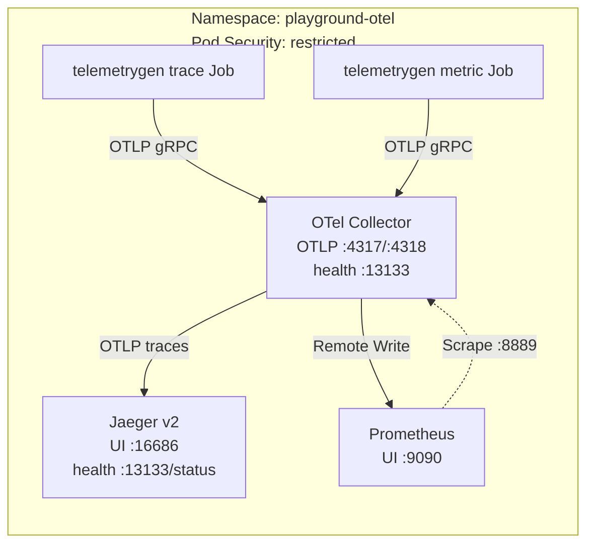

# OpenTelemetry observability stack on Kubernetes

Deploy a small trace, metric, and log learning stack on the playground's AKS user pool. The manifests mirror the [local Docker Compose stack](../otel_local/README.md) while demonstrating Kubernetes configuration, health checks, security contexts, and service discovery.

[日本語](./README.ja.md)

## Components and versions

| Component | Pinned image | Kubernetes resources | Purpose |
| --- | --- | --- | --- |
| Jaeger v2 | `jaegertracing/jaeger:2.20.0` | Deployment + Service | In-memory trace backend and UI |
| Prometheus | `prom/prometheus:v3.14.0` | ConfigMap + Deployment + Service | Scrape/Remote Write ingestion and PromQL |
| OpenTelemetry Collector Contrib | `otel/opentelemetry-collector-contrib:0.159.0` | ConfigMap + Deployment + Service | OTLP receive, batch, and export |
| telemetrygen | `ghcr.io/open-telemetry/opentelemetry-collector-contrib/telemetrygen:v0.159.0` | Two Jobs | Generates traces and metrics for five minutes |

No mutable `latest` tags are used in the manifests.

## Architecture


```mermaid
flowchart LR
    subgraph NS["Namespace: playground-otel<br/>Pod Security: restricted"]
        TJ["telemetrygen trace Job"]
        MJ["telemetrygen metric Job"]
        COL["OTel Collector<br/>OTLP :4317/:4318<br/>health :13133"]
        J["Jaeger v2<br/>UI :16686<br/>health :13133/status"]
        P["Prometheus<br/>UI :9090"]

        TJ -->|OTLP gRPC| COL
        MJ -->|OTLP gRPC| COL
        COL -->|OTLP traces| J
        COL -->|Remote Write| P
        P -.->|Scrape :8889| COL
    end
```

The metric pipeline demonstrates both pull and push. Prometheus scrapes the Collector's `:8889` endpoint and accepts Remote Write on `/api/v1/write`. For a real platform, choose an ingestion strategy that avoids duplicate series.

## Security baseline

The Namespace enforces the Kubernetes `restricted` Pod Security Standard. Every Pod:

- runs with the image-specific numeric non-root UID/GID and the runtime-default seccomp profile;
- disables privilege escalation and drops all Linux capabilities;
- uses a read-only root filesystem;
- disables automatic service account token mounting;
- declares CPU and memory requests/limits.

Writable `emptyDir` volumes are limited to the paths needed by Prometheus, Jaeger, and the Collector. Services remain `ClusterIP`; the UIs are not exposed publicly.

## Prerequisites

1. Deploy the [Azure Kubernetes Playground](../../README.md).
2. Install Azure CLI and `kubectl`.
3. Retrieve cluster credentials:

```shell
cd infra/scenarios/azure_kubernetes_playground
az aks get-credentials \
  --resource-group "$(terraform output -raw resource_group_name)" \
  --name "$(terraform output -raw aks_name)"
kubectl get nodes -L kubernetes.azure.com/mode
```

## Deploy

From the Kubernetes example directory:

```shell
cd examples/otel_k8s

# 1. Create the restricted Namespace.
kubectl apply -f namespace.yaml

# 2. Apply configuration and long-running workloads.
kubectl apply \
  -f configmap-otel-collector.yaml \
  -f configmap-prometheus.yaml \
  -f jaeger.yaml \
  -f prometheus.yaml \
  -f otel-collector.yaml

# 3. Wait until each backend can receive telemetry.
kubectl rollout status deployment/jaeger -n playground-otel --timeout=3m
kubectl rollout status deployment/prometheus -n playground-otel --timeout=3m
kubectl rollout status deployment/otel-collector -n playground-otel --timeout=3m

# 4. Start sample telemetry only after the Collector is ready.
kubectl apply \
  -f job-telemetrygen-traces.yaml \
  -f job-telemetrygen-metrics.yaml
```

Inspect the deployment:

```shell
kubectl get all,configmap -n playground-otel
kubectl get pods -n playground-otel -o wide
kubectl get events -n playground-otel --sort-by=.lastTimestamp
kubectl logs deployment/otel-collector -n playground-otel
```

The Jobs run for five minutes and have `ttlSecondsAfterFinished: 300`, so Kubernetes removes completed Job objects and Pods five minutes later.

## Access the UIs

Services are internal. Run one port-forward per terminal.

```shell
kubectl port-forward service/jaeger -n playground-otel 16686:16686
```

Open <http://localhost:16686>, select `telemetrygen`, and search for traces.

```shell
kubectl port-forward service/prometheus -n playground-otel 9090:9090
```

Open <http://localhost:9090> and try:

```promql
up{job="otel-collector"}
```

Use the expression browser to find the generated metrics.

## Verify health endpoints

The health ports are exposed only through cluster services. Port-forward them instead of installing shell tools in the application containers.

Collector, terminal 1:

```shell
kubectl port-forward service/otel-collector -n playground-otel 13133:13133
```

Collector, terminal 2:

```shell
curl --fail http://localhost:13133/
```

Jaeger v2, terminal 1:

```shell
kubectl port-forward service/jaeger -n playground-otel 13134:13133
```

Jaeger v2, terminal 2:

```shell
curl --fail http://localhost:13134/status
```

Jaeger v2 uses `/status` on port `13133`; the UI root is not the readiness endpoint.

## Send telemetry from an application

Applications in the same Namespace use short service names. Applications in other Namespaces use fully qualified service names.

| Protocol | Same Namespace | Another Namespace |
| --- | --- | --- |
| OTLP/gRPC | `http://otel-collector:4317` | `http://otel-collector.playground-otel.svc.cluster.local:4317` |
| OTLP/HTTP | `http://otel-collector:4318` | `http://otel-collector.playground-otel.svc.cluster.local:4318` |

Example environment variables:

```yaml
env:
  - name: OTEL_EXPORTER_OTLP_ENDPOINT
    value: http://otel-collector.playground-otel.svc.cluster.local:4317
  - name: OTEL_EXPORTER_OTLP_PROTOCOL
    value: grpc
  - name: OTEL_SERVICE_NAME
    value: my-application
```

The Collector sends traces to Jaeger, metrics to Prometheus, and all three telemetry signals to its `debug` exporter. Logs are visible in Collector stdout but are not persisted.

## Rerun telemetry generation

If the Jobs still exist, delete them first; then apply the pinned manifests again:

```shell
kubectl delete job telemetrygen-traces telemetrygen-metrics \
  -n playground-otel --ignore-not-found
kubectl apply \
  -f job-telemetrygen-traces.yaml \
  -f job-telemetrygen-metrics.yaml
```

Change `--duration` and `--rate` in the Job manifests to explore throughput. Keep requests/limits aligned with the generated load.

## Explore the Collector pipeline

The ConfigMap defines:

```yaml
service:
  extensions: [health_check]
  pipelines:
    traces:
      receivers: [otlp]
      processors: [batch]
      exporters: [otlp/jaeger, debug]
    metrics:
      receivers: [otlp]
      processors: [batch]
      exporters: [prometheus, prometheusremotewrite, debug]
    logs:
      receivers: [otlp]
      processors: [batch]
      exporters: [debug]
```

To experiment with batching, edit `configmap-otel-collector.yaml`, apply it, and restart the Deployment:

```shell
kubectl apply -f configmap-otel-collector.yaml
kubectl rollout restart deployment/otel-collector -n playground-otel
kubectl rollout status deployment/otel-collector -n playground-otel --timeout=3m
```

Check startup errors and exported telemetry:

```shell
kubectl logs deployment/otel-collector -n playground-otel --since=10m
```

## Files

| File | Contents |
| --- | --- |
| `namespace.yaml` | Restricted `playground-otel` Namespace |
| `configmap-otel-collector.yaml` | Collector pipelines and health extension |
| `configmap-prometheus.yaml` | Collector scrape target |
| `jaeger.yaml` | Jaeger v2 Deployment and Service |
| `prometheus.yaml` | Prometheus Deployment and Service with Remote Write receiver |
| `otel-collector.yaml` | Collector Deployment and Service, including health port |
| `job-telemetrygen-traces.yaml` | Trace generator Job |
| `job-telemetrygen-metrics.yaml` | Metric generator Job |

## Limitations

> [!CAUTION]
> This is a learning stack, not a production observability platform.

- Jaeger uses in-memory storage.
- Prometheus uses `emptyDir`; all data disappears when its Pod is replaced.
- Each Deployment has one replica and no disruption budget.
- No ingress, TLS, authentication, persistent storage, backup, NetworkPolicy, or multi-zone design is included.
- The Collector's `debug` exporter can be verbose and should not be used for high-volume production traffic.

## Clean up

Deleting the Namespace removes every example resource:

```shell
kubectl delete namespace playground-otel
```

Destroy the Azure scenario separately when no longer needed.

## References

- [OpenTelemetry Collector](https://opentelemetry.io/docs/collector/)
- [Collector configuration](https://opentelemetry.io/docs/collector/configuration/)
- [telemetrygen](https://github.com/open-telemetry/opentelemetry-collector-contrib/tree/main/cmd/telemetrygen)
- [Jaeger v2 deployment](https://www.jaegertracing.io/docs/latest/deployment/)
- [Prometheus Remote Write receiver](https://prometheus.io/docs/prometheus/latest/feature_flags/#remote-write-receiver)
- [Kubernetes Pod Security Standards](https://kubernetes.io/docs/concepts/security/pod-security-standards/)
- [Kubernetes probes](https://kubernetes.io/docs/tasks/configure-pod-container/configure-liveness-readiness-startup-probes/)
- [Kubernetes resource management](https://kubernetes.io/docs/concepts/configuration/manage-resources-containers/)
