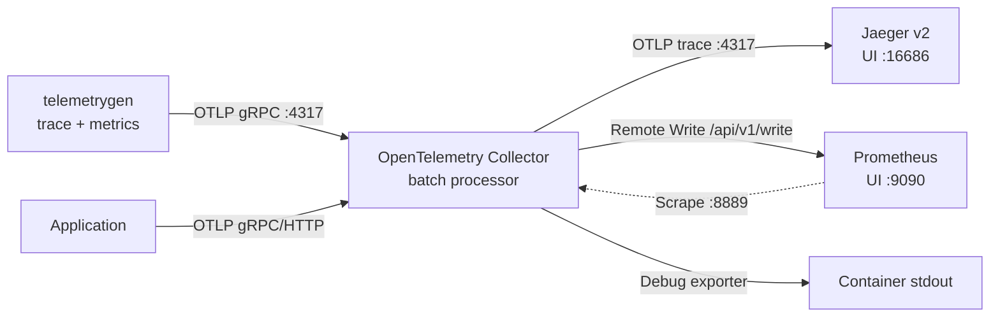

# ローカル OpenTelemetry observability stack

Azure resource をデプロイせず、Kubernetes の例と同じ基本的な telemetry flow を実行します。

[English](./README.md)

## コンポーネント

| コンポーネント | 固定した image | 役割 | Host endpoint |
| --- | --- | --- | --- |
| Jaeger v2 | `jaegertracing/jaeger:2.20.0` | In-memory trace backend と UI | UI `localhost:16686`、health `localhost:13134/status` |
| Prometheus | `prom/prometheus:v3.14.0` | Metrics ingestion、scrape、PromQL | `localhost:9090` |
| OpenTelemetry Collector Contrib | `otel/opentelemetry-collector-contrib:0.159.0` | OTLP の受信、batch、export | gRPC `localhost:4317`、HTTP `localhost:4318`、health `localhost:13133` |
| telemetrygen | `ghcr.io/open-telemetry/opentelemetry-collector-contrib/telemetrygen:v0.159.0` | Trace と metrics を 5 分間生成 | なし |

可変の `latest` tag は使用しません。

## データフロー



Metrics pipeline は Prometheus の pull (scrape) と push (Remote Write) の両方を学習用に示します。Prometheus は `--web.enable-remote-write-receiver` 付きで起動します。この flag がない場合、Collector から `/api/v1/write` への送信は拒否されます。実環境では、意図しない series 重複を避けられる ingestion path と label 設計を選択してください。

## 前提条件

- Docker Compose v2 を利用できる Docker Engine または Docker Desktop。
- ローカルの `4317`、`4318`、`9090`、`13133`、`13134`、`16686` port が未使用であること。

## 起動

リポジトリ root から実行します。

```shell
cd infra/scenarios/azure_kubernetes_playground/examples/otel_local
docker compose config --quiet
docker compose up -d
```

起動状態と health を確認します。

```shell
docker compose ps
docker compose logs --no-color otel-collector telemetrygen-traces telemetrygen-metrics
curl --fail http://localhost:13133/
curl --fail http://localhost:13134/status
curl --fail http://localhost:9090/-/ready
```

Jaeger v2 の health status は port `13133` の `/status` です。Collector の health port との競合を避けるため、Compose では host port `13134` に mapping します。

## Telemetry を確認する

1. <http://localhost:16686> で Jaeger UI を開き、`telemetrygen` service の trace を検索します。
2. <http://localhost:9090> で Prometheus を開きます。
3. `up{job="otel-collector"}` PromQL query で scrape health を確認します。
4. Prometheus expression browser で生成された metrics を検索します。
5. `docker compose logs otel-collector` で Collector の `debug` exporter 出力を確認します。

2 つの telemetry generator は 1 秒に 1 item を 5 分間送信します。次の sample window を生成するには再作成します。

```shell
docker compose up -d --force-recreate telemetrygen-traces telemetrygen-metrics
```

## Application から telemetry を送信する

| Protocol | Endpoint |
| --- | --- |
| OTLP/gRPC | `http://localhost:4317` |
| OTLP/HTTP | `http://localhost:4318` |

OTLP/gRPC の環境変数例:

```shell
export OTEL_EXPORTER_OTLP_ENDPOINT="http://localhost:4317"
export OTEL_EXPORTER_OTLP_PROTOCOL="grpc"
export OTEL_SERVICE_NAME="local-example"
```

OTLP/HTTP を使用する場合は protocol を `http/protobuf`、port を `4318` にします。

## 設定

| ファイル | 用途 |
| --- | --- |
| `compose.yaml` | 固定 version の service、port mapping、volume、telemetry generator。 |
| `otel-collector-config.yaml` | OTLP receiver、batch processor、health extension、trace/metric/log exporter。 |
| `prometheus.yaml` | `otel-collector:8889` の Collector Prometheus exporter を scrape。 |

Collector の route:

- trace は OTLP で Jaeger、および `debug` exporter へ送信。
- metrics は scrape endpoint、Prometheus Remote Write、`debug` へ送信。
- log は `debug` のみに送信。Log は永続化されません。

## 停止とクリーンアップ

```shell
docker compose down --volumes --remove-orphans
```

## 参考資料

- [OpenTelemetry Collector configuration](https://opentelemetry.io/docs/collector/configuration/)
- [OpenTelemetry Collector releases](https://github.com/open-telemetry/opentelemetry-collector-releases/releases)
- [telemetrygen](https://github.com/open-telemetry/opentelemetry-collector-contrib/tree/main/cmd/telemetrygen)
- [Jaeger v2 deployment](https://www.jaegertracing.io/docs/latest/deployment/)
- [Prometheus Remote Write receiver](https://prometheus.io/docs/prometheus/latest/feature_flags/#remote-write-receiver)
- [Docker Compose documentation](https://docs.docker.com/compose/)
