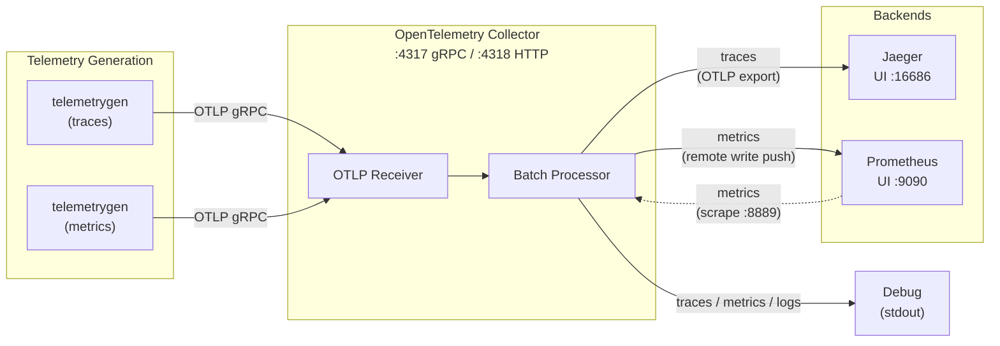

# OpenTelemetry Observability Stack

This OpenTelemetry observability stack runs with Docker Compose. It collects and visualizes traces, metrics, and logs.

## Architecture



### Components

| Component                   | Image                                           | Role                                        | Exposed port                |
|-----------------------------|-------------------------------------------------|---------------------------------------------|-----------------------------|
| **Jaeger**                  | `jaegertracing/all-in-one`                      | Distributed tracing backend and UI          | `16686` (UI)                |
| **Prometheus**              | `prom/prometheus`                               | Metrics collection and query engine         | `9090` (UI)                 |
| **OpenTelemetry Collector** | `otel/opentelemetry-collector-contrib`          | Receives, processes, and exports telemetry  | `4317` (gRPC), `4318` (HTTP) |
| **telemetrygen (traces)**   | `opentelemetry-collector-contrib/telemetrygen`  | Generates sample traces                     | -                           |
| **telemetrygen (metrics)**  | `opentelemetry-collector-contrib/telemetrygen`  | Generates sample metrics                    | -                           |

## Data Flow

### Traces

```text
Application / telemetrygen → OTLP (gRPC :4317) → OTel Collector → Jaeger
```

### Metrics

```text
Application / telemetrygen → OTLP (gRPC :4317) → OTel Collector → Prometheus (Remote Write + Scrape)
```

### Logs

```text
Application → OTLP (gRPC :4317) → OTel Collector → Debug (stdout)
```

## Usage

### Start the stack

```shell
cd src
docker compose up -d
```

### Access the UIs

| Service       | URL                      | Purpose                          |
|---------------|--------------------------|----------------------------------|
| Jaeger UI     | <http://localhost:16686> | Search and visualize traces      |
| Prometheus UI | <http://localhost:9090>  | Query metrics and display graphs |

### Verify the stack

After startup, `telemetrygen` automatically sends sample data (traces and metrics) to the OpenTelemetry Collector at a rate of 1 req/s for 5 minutes.

1. **Verify traces**: Open the [Jaeger UI](http://localhost:16686), select `telemetrygen` from the Service dropdown, and click Search.
2. **Verify metrics**: Open the [Prometheus UI](http://localhost:9090), enter `gen` in the query field, and select a metric from the suggestions.

### Send telemetry from your application

Use an OpenTelemetry SDK to send telemetry to the following endpoints.

| Protocol  | Endpoint         |
|-----------|------------------|
| OTLP gRPC | `localhost:4317` |
| OTLP HTTP | `localhost:4318` |

Example environment variables:

```shell
export OTEL_EXPORTER_OTLP_ENDPOINT="http://localhost:4317"
export OTEL_EXPORTER_OTLP_PROTOCOL="grpc"
```

### Stop the stack

```shell
docker compose down
```

## Configuration Files

| File                         | Description                                                                |
|------------------------------|----------------------------------------------------------------------------|
| `compose.yaml`               | Service definitions for Docker Compose                                     |
| `otel-collector-config.yaml` | OpenTelemetry Collector receiver, processor, and exporter configuration    |
| `prometheus.yaml`            | Prometheus scrape configuration targeting the OTel Collector on `:8889`    |

## OpenTelemetry Collector Pipeline

```text
receivers:
  otlp (gRPC + HTTP)
      │
processors:
  batch
      │
exporters:
  ├── traces  → otlp/jaeger, debug
  ├── metrics → prometheus(:8889), prometheusremotewrite, debug
  └── logs    → debug
```
