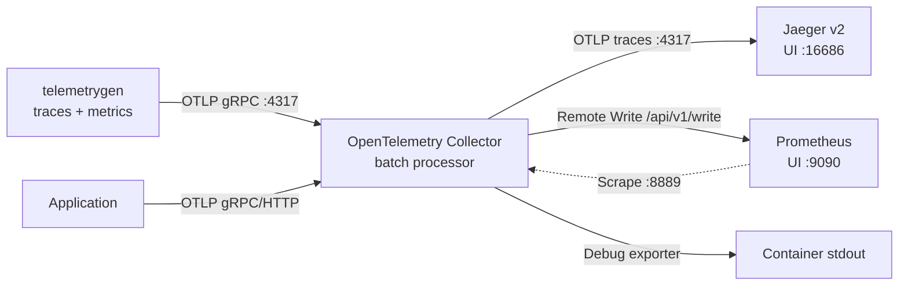

# Local OpenTelemetry observability stack

Run the same basic telemetry flow used by the Kubernetes example without deploying Azure resources.

[日本語](./README.ja.md)

## Components

| Component | Pinned image | Role | Host endpoint |
| --- | --- | --- | --- |
| Jaeger v2 | `jaegertracing/jaeger:2.20.0` | In-memory trace backend and UI | UI `localhost:16686`; health `localhost:13134/status` |
| Prometheus | `prom/prometheus:v3.14.0` | Metrics ingestion, scraping, and PromQL | `localhost:9090` |
| OpenTelemetry Collector Contrib | `otel/opentelemetry-collector-contrib:0.159.0` | OTLP receive, batch, and export | gRPC `localhost:4317`; HTTP `localhost:4318`; health `localhost:13133` |
| telemetrygen | `ghcr.io/open-telemetry/opentelemetry-collector-contrib/telemetrygen:v0.159.0` | Generates traces and metrics for five minutes | None |

No mutable `latest` tags are used.

## Data flow



The metrics pipeline deliberately demonstrates both Prometheus pull (scrape) and push (Remote Write). Prometheus is started with `--web.enable-remote-write-receiver`; without it, `/api/v1/write` rejects the Collector. In a real deployment, choose the ingestion path and label strategy that avoids unintended duplicate series.

## Prerequisites

- Docker Engine or Docker Desktop with Docker Compose v2.
- Ports `4317`, `4318`, `9090`, `13133`, `13134`, and `16686` available locally.

## Start

From the repository root:

```shell
cd infra/scenarios/azure_kubernetes_playground/examples/otel_local
docker compose config --quiet
docker compose up -d
```

Check startup and health:

```shell
docker compose ps
docker compose logs --no-color otel-collector telemetrygen-traces telemetrygen-metrics
curl --fail http://localhost:13133/
curl --fail http://localhost:13134/status
curl --fail http://localhost:9090/-/ready
```

Jaeger v2 exposes its health status at `/status` on port `13133`; Compose maps that container port to host port `13134` to avoid the Collector's health port.

## Explore telemetry

1. Open the Jaeger UI at <http://localhost:16686>, select the `telemetrygen` service, and search for traces.
2. Open Prometheus at <http://localhost:9090>.
3. Check scrape health with the `up{job="otel-collector"}` PromQL query.
4. Search available generated metrics in the Prometheus expression browser.
5. Inspect the Collector's `debug` exporter output with `docker compose logs otel-collector`.

The two telemetry generators send one item per second for five minutes. Recreate them to generate another sample window:

```shell
docker compose up -d --force-recreate telemetrygen-traces telemetrygen-metrics
```

## Send telemetry from an application

| Protocol | Endpoint |
| --- | --- |
| OTLP/gRPC | `http://localhost:4317` |
| OTLP/HTTP | `http://localhost:4318` |

Example environment variables for OTLP/gRPC:

```shell
export OTEL_EXPORTER_OTLP_ENDPOINT="http://localhost:4317"
export OTEL_EXPORTER_OTLP_PROTOCOL="grpc"
export OTEL_SERVICE_NAME="local-example"
```

For OTLP/HTTP, set the protocol to `http/protobuf` and use port `4318`.

## Configuration

| File | Purpose |
| --- | --- |
| `compose.yaml` | Pinned services, port mappings, volumes, and telemetry generators. |
| `otel-collector-config.yaml` | OTLP receiver, batch processor, health extension, and trace/metric/log exporters. |
| `prometheus.yaml` | Scrapes the Collector's Prometheus exporter on `otel-collector:8889`. |

The Collector routes:

- traces to Jaeger over OTLP and to the `debug` exporter;
- metrics to a scrape endpoint, Prometheus Remote Write, and `debug`;
- logs to `debug` only. Logs are not persisted.

## Stop and clean up

```shell
docker compose down --volumes --remove-orphans
```

## References

- [OpenTelemetry Collector configuration](https://opentelemetry.io/docs/collector/configuration/)
- [OpenTelemetry Collector releases](https://github.com/open-telemetry/opentelemetry-collector-releases/releases)
- [telemetrygen](https://github.com/open-telemetry/opentelemetry-collector-contrib/tree/main/cmd/telemetrygen)
- [Jaeger v2 deployment](https://www.jaegertracing.io/docs/latest/deployment/)
- [Prometheus Remote Write receiver](https://prometheus.io/docs/prometheus/latest/feature_flags/#remote-write-receiver)
- [Docker Compose documentation](https://docs.docker.com/compose/)
