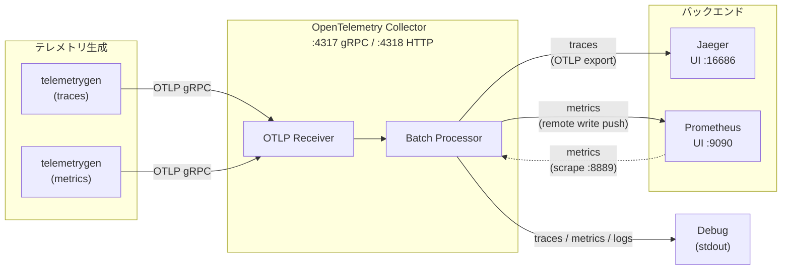

# OpenTelemetry Observability Stack

Docker Compose で構成された OpenTelemetry ベースのオブザーバビリティスタックです。トレース・メトリクス・ログの収集・可視化を行います。

## アーキテクチャ



### コンポーネント一覧

| コンポーネント | イメージ | 役割 | 公開ポート |
|---|---|---|---|
| **Jaeger** | `jaegertracing/all-in-one` | 分散トレーシングバックエンド＆UI | `16686` (UI) |
| **Prometheus** | `prom/prometheus` | メトリクス収集・クエリエンジン | `9090` (UI) |
| **OpenTelemetry Collector** | `otel/opentelemetry-collector-contrib` | テレメトリの受信・処理・エクスポート | `4317` (gRPC), `4318` (HTTP) |
| **telemetrygen (traces)** | `opentelemetry-collector-contrib/telemetrygen` | サンプルトレースを生成 | - |
| **telemetrygen (metrics)** | `opentelemetry-collector-contrib/telemetrygen` | サンプルメトリクスを生成 | - |

## データフロー

### トレース

```
アプリ / telemetrygen → OTLP (gRPC :4317) → OTel Collector → Jaeger
```

### メトリクス

```
アプリ / telemetrygen → OTLP (gRPC :4317) → OTel Collector → Prometheus (Remote Write + Scrape)
```

### ログ

```
アプリ → OTLP (gRPC :4317) → OTel Collector → Debug (stdout)
```

## 利用方法

### 起動

```shell
cd src
docker compose up -d
```

### UI へのアクセス

| サービス | URL | 用途 |
|---|---|---|
| Jaeger UI | http://localhost:16686 | トレースの検索・可視化 |
| Prometheus UI | http://localhost:9090 | メトリクスのクエリ・グラフ表示 |

### 動作確認

起動後、`telemetrygen` が自動的にサンプルデータ（トレース・メトリクス）を 5 分間、1 req/s のレートで OpenTelemetry Collector へ送信します。

1. **トレースの確認**: [Jaeger UI](http://localhost:16686) を開き、Service ドロップダウンから `telemetrygen` を選択して Search をクリック
2. **メトリクスの確認**: [Prometheus UI](http://localhost:9090) を開き、クエリ入力欄に `gen` と入力して候補からメトリクスを選択

### 自分のアプリケーションからテレメトリを送信する

OpenTelemetry SDK を使用して、以下のエンドポイントへテレメトリを送信できます。

| プロトコル | エンドポイント |
|---|---|
| OTLP gRPC | `localhost:4317` |
| OTLP HTTP | `localhost:4318` |

環境変数の設定例:

```shell
export OTEL_EXPORTER_OTLP_ENDPOINT="http://localhost:4317"
export OTEL_EXPORTER_OTLP_PROTOCOL="grpc"
```

### 停止

```shell
docker compose down
```

## 設定ファイル

| ファイル | 説明 |
|---|---|
| `compose.yaml` | Docker Compose によるサービス定義 |
| `otel-collector-config.yaml` | OpenTelemetry Collector の受信・処理・エクスポート設定 |
| `prometheus.yaml` | Prometheus のスクレイプ設定（OTel Collector の `:8889` を対象） |

## OpenTelemetry Collector パイプライン構成

```
receivers:
  otlp (gRPC + HTTP)
      │
processors:
  batch
      │
exporters:
  ├── traces  → otlp/jaeger, debug
  ├── metrics → prometheus(:8889), prometheusremotewrite, debug
  └── logs    → debug
```
