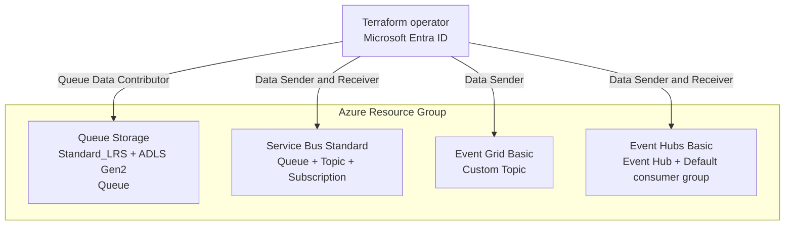

# Azure Messaging シナリオ

キューイング、Publish-Subscribe、イベント ルーティング、イベント ストリーミングを
比較検証するため、コストを抑えた Azure Messaging リソースをデプロイします。
すべての Messaging サービスは既定で無効です。

## 概要

| サービス | デプロイするリソース | 既定の層 |
| --- | --- | --- |
| Queue Storage | ADLS Gen2 Storage Account と Queue 1 個 | Standard_LRS + HNS |
| Service Bus | Namespace、Queue、Topic、Subscription | Standard |
| Event Grid | Custom Topic | Basic |
| Event Hubs | Namespace と Event Hub 1 個 | Basic、1 throughput unit |

Service Bus は Basic で利用できない Topic と Subscription を検証するため Standard を使います。
Event Hubs は低量の送受信を組み込みの `$Default` consumer group で検証できる Basic を使います。
Event Grid Custom Topic は Basic tier の push-delivery リソースであり、AzureRM に個別の
SKU 引数はありません。

Queue Storage は ADLS Gen2 に必要な階層型名前空間を既定で有効にしますが、作成する
データサービスは Queue 1 個だけです。Blob container や filesystem は作成しません。
通常の StorageV2 Account が必要な場合は `queue_storage_enable_hns = false` を指定します。

すべてのデータプレーンで local/shared-key authentication を無効化します。Terraform の
実行主体、または `operator_principal_id` で指定したプリンシパルに、検証に必要な最小限の
sender/receiver ロールを付与します。

## 前提条件

[プロバイダー認証](../../../docs/tips/provider-authentication.ja.md)、
[標準 Terraform ワークフロー](../../../docs/tips/terraform-workflow.ja.md)、
任意の [Azure Blob リモート state](../../../docs/tips/azure-blob-backend.ja.md) は
共通ガイドを参照してください。

デプロイ主体にはロール割り当てを作成する権限が必要です。リポジトリの Makefile を
使用する場合は `SCENARIO=azure_messaging` を指定します。

## アーキテクチャ



各サービスは独立しています。このシナリオでは Event Grid Subscription やサービス間接続を
作成しません。

## 使用方法

シナリオを初期化します。

```shell
make init SCENARIO=azure_messaging
```

各リソース フラグは Terraform CLI の `-var` オプションで明示的に true/false を指定できます。
次の例では、既定の ADLS Gen2 階層型名前空間を使用する Queue Storage だけをデプロイします。

```shell
terraform -chdir=infra/scenarios/azure_messaging plan \
  -var='enable_queue_storage=true' \
  -var='enable_service_bus=false' \
  -var='enable_event_grid=false' \
  -var='enable_event_hubs=false' \
  -var='queue_storage_enable_hns=true'
```

通常の StorageV2 Account を使用する場合は、HNS オプションだけを変更します。

```shell
terraform -chdir=infra/scenarios/azure_messaging plan \
  -var='enable_queue_storage=true' \
  -var='queue_storage_enable_hns=false'
```

すべての Messaging リソースを有効化します。

```shell
terraform -chdir=infra/scenarios/azure_messaging plan \
  -var='enable_queue_storage=true' \
  -var='enable_service_bus=true' \
  -var='enable_event_grid=true' \
  -var='enable_event_hubs=true'
```

plan を確認した後、同じ変数で apply します。

```shell
terraform -chdir=infra/scenarios/azure_messaging apply \
  -var='enable_queue_storage=true' \
  -var='enable_service_bus=true' \
  -var='enable_event_grid=true' \
  -var='enable_event_hubs=true'
```

`operator_principal_id` を省略すると、認証済みの Terraform 実行主体へデータプレーン ロールを
付与します。別のユーザー、サービス プリンシパル、マネージド ID を認可する場合は、その
オブジェクト ID を指定します。

```shell
terraform -chdir=infra/scenarios/azure_messaging plan \
  -var='enable_service_bus=true' \
  -var='operator_principal_id=00000000-0000-0000-0000-000000000000'
```

## Messaging の検証

リソース名と endpoint を取得します。

```shell
terraform -chdir=infra/scenarios/azure_messaging output
```

キーや接続文字列ではなく Microsoft Entra credential を使用します。Passwordless な
データプレーン クライアントは、次の公式ガイドを参照してください。

- [Azure CLI で Azure Queue Storage 操作を認可する](https://learn.microsoft.com/azure/storage/queues/authorize-data-operations-cli)
- [Passwordless 認証を使う Service Bus Queue quickstart](https://learn.microsoft.com/azure/service-bus-messaging/service-bus-python-how-to-use-queues?tabs=passwordless)
- [Microsoft Entra ID で Event Grid publishing client を認証する](https://learn.microsoft.com/azure/event-grid/authenticate-with-microsoft-entra-id)
- [Passwordless 認証を使う Event Hubs 送受信 quickstart](https://learn.microsoft.com/azure/event-hubs/event-hubs-python-get-started-send?tabs=passwordless)

Azure ロール割り当ての反映には数分かかる場合があります。apply 直後のデータプレーン操作で
認可エラーが発生した場合は、少し待ってから再試行してください。

既存デプロイで `queue_storage_enable_hns` を変更すると、Storage Account の再作成が
必要になる場合があります。適用前に Terraform plan を確認してください。

## 変数

| 名前 | 説明 | 型 | 既定値 |
| --- | --- | --- | --- |
| `name` | リソースの基本名 | `string` | `"azuremessaging"` |
| `location` | Azure リージョン | `string` | `"japaneast"` |
| `tags` | リソースに適用するタグ | `map(string)` | `variables.tf` を参照 |
| `operator_principal_id` | データプレーン ロールを付与する Object ID。省略時は Terraform 実行主体 | `string` | `null` |
| `enable_queue_storage` | Queue Storage をデプロイする | `bool` | `false` |
| `enable_service_bus` | Service Bus をデプロイする | `bool` | `false` |
| `enable_event_grid` | Event Grid Custom Topic をデプロイする | `bool` | `false` |
| `enable_event_hubs` | Event Hubs をデプロイする | `bool` | `false` |
| `queue_storage_enable_hns` | ADLS Gen2 の階層型名前空間を有効化する | `bool` | `true` |
| `queue_storage_replication_type` | Standard Storage のレプリケーション方式 | `string` | `"LRS"` |
| `service_bus_sku` | Service Bus SKU | `string` | `"Standard"` |
| `service_bus_premium_capacity` | Premium 選択時の messaging units | `number` | `1` |
| `event_grid_input_schema` | Event Grid input schema | `string` | `"EventGridSchema"` |
| `event_hubs_sku` | Event Hubs SKU | `string` | `"Basic"` |
| `event_hubs_capacity` | Event Hubs throughput units | `number` | `1` |
| `event_hubs_partition_count` | Event Hub partition 数 | `number` | `2` |
| `event_hubs_message_retention` | イベント保持日数 | `number` | `1` |

## 出力

| 名前 | 説明 |
| --- | --- |
| `resource_group_id` | Resource Group ID |
| `resource_group_name` | Resource Group 名 |
| `operator_principal_id` | Messaging データプレーン ロールを付与したプリンシパル |
| `queue_storage_account_id` | Queue Storage Account ID。無効時は `null` |
| `queue_storage_account_name` | Queue Storage Account 名。無効時は `null` |
| `queue_storage_hns_enabled` | 階層型名前空間が有効かどうか。無効時は `null` |
| `queue_storage_dfs_endpoint` | ADLS Gen2 DFS endpoint。無効時は `null` |
| `queue_storage_endpoint` | Queue endpoint。無効時は `null` |
| `queue_storage_queue_id` | Storage Queue ID。無効時は `null` |
| `queue_storage_queue_name` | Storage Queue 名。無効時は `null` |
| `service_bus_namespace_id` | Service Bus Namespace ID。無効時は `null` |
| `service_bus_namespace_name` | Service Bus Namespace 名。無効時は `null` |
| `service_bus_namespace_fqdn` | Service Bus Namespace FQDN。無効時は `null` |
| `service_bus_queue_name` | Service Bus Queue 名。無効時は `null` |
| `service_bus_topic_name` | Service Bus Topic 名。無効時は `null` |
| `service_bus_subscription_name` | Service Bus Subscription 名。無効時は `null` |
| `event_grid_topic_id` | Event Grid Custom Topic ID。無効時は `null` |
| `event_grid_topic_name` | Event Grid Custom Topic 名。無効時は `null` |
| `event_grid_topic_endpoint` | Event Grid Custom Topic endpoint。無効時は `null` |
| `event_hubs_namespace_id` | Event Hubs Namespace ID。無効時は `null` |
| `event_hubs_namespace_name` | Event Hubs Namespace 名。無効時は `null` |
| `event_hubs_namespace_fqdn` | Event Hubs Namespace FQDN。無効時は `null` |
| `event_hub_id` | Event Hub ID。無効時は `null` |
| `event_hub_name` | Event Hub 名。無効時は `null` |
| `event_hub_consumer_group_name` | 組み込み Consumer Group 名。無効時は `null` |

## セキュリティに関する注意

ローカル検証を簡単にするため、パブリック ネットワーク アクセスは有効です。データプレーンの
認証は Microsoft Entra ID のみを使用し、アクセス キーや接続文字列を output しません。
本番環境ではネットワーク制限または Private Endpoint を追加し、各プリンシパルの権限を
必要なサービスと entity のみに限定してください。
