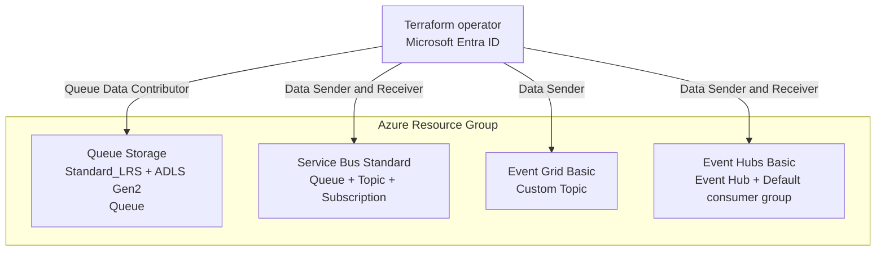

# Azure Messaging Scenario

Deploy cost-conscious Azure messaging resources for comparing queueing, publish-subscribe,
event routing, and event streaming patterns. Every messaging service is disabled by default.

## Overview

| Service | Deployed resources | Default tier |
| --- | --- | --- |
| Queue Storage | ADLS Gen2 Storage Account and one Queue | Standard_LRS + HNS |
| Service Bus | Namespace, Queue, Topic, and Subscription | Standard |
| Event Grid | Custom Topic | Basic |
| Event Hubs | Namespace and one Event Hub | Basic, 1 throughput unit |

Service Bus uses Standard because topics and subscriptions aren't available in Basic.
Event Hubs uses Basic for low-volume send/receive validation with the built-in `$Default`
consumer group. An Event Grid Custom Topic is a Basic-tier push-delivery resource and
therefore has no separate SKU argument in AzureRM.

Queue Storage enables the hierarchical namespace required by ADLS Gen2 by default while
continuing to create only one Queue. It doesn't create a Blob container or filesystem.
Set `queue_storage_enable_hns = false` when a conventional StorageV2 account is required.

All data-plane local or shared-key authentication is disabled. The Terraform operator,
or the principal selected with `operator_principal_id`, receives the least-privilege
sender and receiver roles needed for validation.

## Prerequisites

Use the shared guidance for [provider authentication](../../../docs/tips/provider-authentication.md),
the [standard Terraform workflow](../../../docs/tips/terraform-workflow.md), and optional
[Azure Blob remote state](../../../docs/tips/azure-blob-backend.md).

The deployment identity must be allowed to create role assignments. Set
`SCENARIO=azure_messaging` when using the repository Makefile.

## Architecture



The services are independent. This scenario doesn't create Event Grid subscriptions or
connect one messaging service to another.

## How to use

Initialize the scenario:

```shell
make init SCENARIO=azure_messaging
```

Each resource flag can be controlled explicitly with Terraform CLI `-var` options. For
example, deploy only Queue Storage with the default ADLS Gen2 hierarchical namespace:

```shell
terraform -chdir=infra/scenarios/azure_messaging plan \
  -var='enable_queue_storage=true' \
  -var='enable_service_bus=false' \
  -var='enable_event_grid=false' \
  -var='enable_event_hubs=false' \
  -var='queue_storage_enable_hns=true'
```

To use a conventional StorageV2 account instead, change only the HNS option:

```shell
terraform -chdir=infra/scenarios/azure_messaging plan \
  -var='enable_queue_storage=true' \
  -var='queue_storage_enable_hns=false'
```

Enable all messaging resources:

```shell
terraform -chdir=infra/scenarios/azure_messaging plan \
  -var='enable_queue_storage=true' \
  -var='enable_service_bus=true' \
  -var='enable_event_grid=true' \
  -var='enable_event_hubs=true'
```

Apply the same variables after reviewing the plan:

```shell
terraform -chdir=infra/scenarios/azure_messaging apply \
  -var='enable_queue_storage=true' \
  -var='enable_service_bus=true' \
  -var='enable_event_grid=true' \
  -var='enable_event_hubs=true'
```

When `operator_principal_id` is omitted, the authenticated Terraform principal receives
the data-plane roles. Supply an object ID to authorize another user, service principal,
or managed identity:

```shell
terraform -chdir=infra/scenarios/azure_messaging plan \
  -var='enable_service_bus=true' \
  -var='operator_principal_id=00000000-0000-0000-0000-000000000000'
```

## Validate messaging

Retrieve resource names and endpoints with:

```shell
terraform -chdir=infra/scenarios/azure_messaging output
```

Use Microsoft Entra credentials rather than keys or connection strings. The following
official guides show passwordless data-plane clients:

- [Authorize Azure Queue Storage operations with the Azure CLI](https://learn.microsoft.com/azure/storage/queues/authorize-data-operations-cli)
- [Service Bus queue quickstart with passwordless authentication](https://learn.microsoft.com/azure/service-bus-messaging/service-bus-python-how-to-use-queues?tabs=passwordless)
- [Authenticate publishing clients to Event Grid with Microsoft Entra ID](https://learn.microsoft.com/azure/event-grid/authenticate-with-microsoft-entra-id)
- [Event Hubs send and receive quickstart with passwordless authentication](https://learn.microsoft.com/azure/event-hubs/event-hubs-python-get-started-send?tabs=passwordless)

Azure role assignments can take several minutes to propagate. Retry the data-plane
operation if the first request receives an authorization error immediately after apply.

Changing `queue_storage_enable_hns` for an existing deployment can require replacing the
Storage Account. Review the Terraform plan before applying this setting.

## Variables

| Name | Description | Type | Default |
| --- | --- | --- | --- |
| `name` | Base name for resources | `string` | `"azuremessaging"` |
| `location` | Azure region | `string` | `"japaneast"` |
| `tags` | Tags applied to resources | `map(string)` | See `variables.tf` |
| `operator_principal_id` | Object ID granted data-plane roles; current Terraform principal when omitted | `string` | `null` |
| `enable_queue_storage` | Deploy Queue Storage | `bool` | `false` |
| `enable_service_bus` | Deploy Service Bus | `bool` | `false` |
| `enable_event_grid` | Deploy an Event Grid Custom Topic | `bool` | `false` |
| `enable_event_hubs` | Deploy Event Hubs | `bool` | `false` |
| `queue_storage_enable_hns` | Enable the ADLS Gen2 hierarchical namespace | `bool` | `true` |
| `queue_storage_replication_type` | Standard Storage replication type | `string` | `"LRS"` |
| `service_bus_sku` | Service Bus SKU | `string` | `"Standard"` |
| `service_bus_premium_capacity` | Premium messaging units when Premium is selected | `number` | `1` |
| `event_grid_input_schema` | Event Grid input schema | `string` | `"EventGridSchema"` |
| `event_hubs_sku` | Event Hubs SKU | `string` | `"Basic"` |
| `event_hubs_capacity` | Event Hubs throughput units | `number` | `1` |
| `event_hubs_partition_count` | Event Hub partition count | `number` | `2` |
| `event_hubs_message_retention` | Event retention in days | `number` | `1` |

## Outputs

| Name | Description |
| --- | --- |
| `resource_group_id` | Resource group ID |
| `resource_group_name` | Resource group name |
| `operator_principal_id` | Principal granted messaging data-plane roles |
| `queue_storage_account_id` | Queue Storage account ID, or `null` |
| `queue_storage_account_name` | Queue Storage account name, or `null` |
| `queue_storage_hns_enabled` | Whether hierarchical namespace is enabled, or `null` |
| `queue_storage_dfs_endpoint` | ADLS Gen2 DFS endpoint, or `null` |
| `queue_storage_endpoint` | Queue endpoint, or `null` |
| `queue_storage_queue_id` | Storage Queue ID, or `null` |
| `queue_storage_queue_name` | Storage Queue name, or `null` |
| `service_bus_namespace_id` | Service Bus namespace ID, or `null` |
| `service_bus_namespace_name` | Service Bus namespace name, or `null` |
| `service_bus_namespace_fqdn` | Service Bus namespace FQDN, or `null` |
| `service_bus_queue_name` | Service Bus Queue name, or `null` |
| `service_bus_topic_name` | Service Bus Topic name, or `null` |
| `service_bus_subscription_name` | Service Bus Subscription name, or `null` |
| `event_grid_topic_id` | Event Grid Custom Topic ID, or `null` |
| `event_grid_topic_name` | Event Grid Custom Topic name, or `null` |
| `event_grid_topic_endpoint` | Event Grid Custom Topic endpoint, or `null` |
| `event_hubs_namespace_id` | Event Hubs namespace ID, or `null` |
| `event_hubs_namespace_name` | Event Hubs namespace name, or `null` |
| `event_hubs_namespace_fqdn` | Event Hubs namespace FQDN, or `null` |
| `event_hub_id` | Event Hub ID, or `null` |
| `event_hub_name` | Event Hub name, or `null` |
| `event_hub_consumer_group_name` | Built-in consumer group name, or `null` |

## Security notice

Public network access remains enabled to simplify local validation. Microsoft Entra ID
is the only data-plane authentication method, and no access keys or connection strings
are exposed as outputs. For production, add network restrictions or private endpoints
and narrow each principal to only the service and entity it needs.
