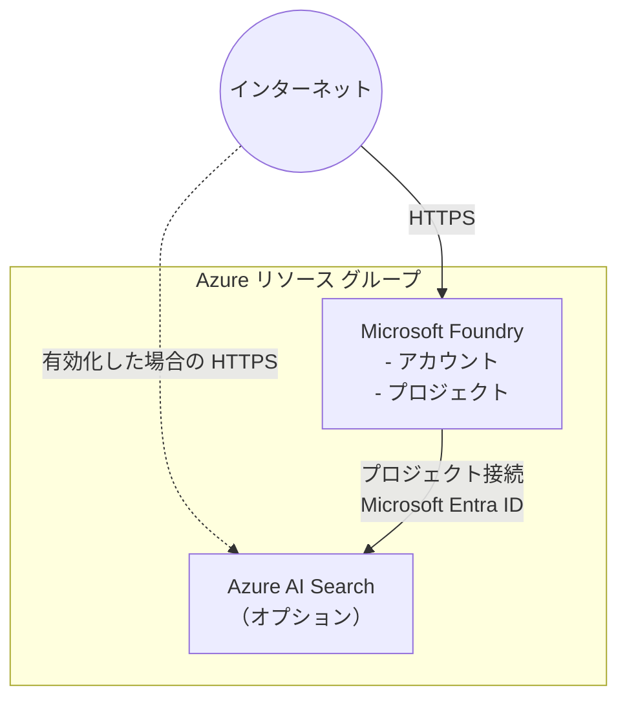

# Azure Microsoft Foundry シナリオ

このシナリオでは、Terraform を使用して Azure に Microsoft Foundry 環境をデプロイします。
Foundry IQ の検索基盤として使用する Azure AI Search サービスも必要に応じてデプロイできます。

## アーキテクチャ



## 前提条件

- Azure サブスクリプション

共通の [Azure 認証](../../../docs/tips/provider-authentication.ja.md)、
[Terraform ワークフロー](../../../docs/tips/terraform-workflow.ja.md)、および必要に応じて
[Azure Blob Storage バックエンド](../../../docs/tips/azure-blob-backend.ja.md)のガイダンスに従ってください。
リポジトリの Makefile を使用する場合は、`SCENARIO=azure_microsoft_foundry` を設定します。

## 使用方法

Azure AI Search は既定で無効です。デプロイして Microsoft Foundry プロジェクトに接続するには、
`terraform.tfvars` に次の値を追加します。

```hcl
deploy_azure_ai_search = true
azure_ai_search_sku    = "free"
```

別のサポート対象 tier を使用する場合は、`azure_ai_search_sku` に `basic`、`standard`、
`standard2`、`standard3`、`storage_optimized_l1`、または `storage_optimized_l2` を指定します。
利用可否とクォータ要件は、サブスクリプションおよびリージョンによって異なります。

> [!NOTE]
> Azure AI Search の既定 SKU には、Foundry IQ の概念実証向けに案内されている
> 最小コストの `free` を使用します。
> 詳細については、[Azure AI Search の Terraform クイックスタート](https://learn.microsoft.com/en-us/azure/search/search-get-started-terraform)、
> [Foundry IQ の概要](https://learn.microsoft.com/en-us/azure/foundry/agents/concepts/what-is-foundry-iq)、
> [Azure AI Search の stable REST API 仕様](https://github.com/Azure/azure-rest-api-specs/tree/main/specification/search/data-plane/Search/stable)、および
> [Microsoft Foundry プロジェクト接続の ARM スキーマ](https://learn.microsoft.com/en-us/azure/templates/microsoft.cognitiveservices/accounts/projects/connections)を参照してください。

有効にすると、Terraform は Microsoft Entra ID 認証を使用するプロジェクト スコープの
`CognitiveSearch` 接続を作成します。また、Foundry プロジェクトのシステム割り当てマネージド ID に、
Azure AI Search サービスの `Search Index Data Contributor` ロールと
`Search Service Contributor` ロールを付与します。この接続では、Azure AI Search の API キーを
Terraform state に保存しません。

Terraform は AzAPI を使用し、Azure Resource Manager のコントロール プレーンから接続を作成します。
[Foundry Connections API](https://ai.azure.com/api-reference/connections/list)では、作成された接続を
一覧表示および取得できますが、接続の作成はできません。

このオプションでは、ナレッジ ベース、ナレッジ ソース、インデックス、インデクサー、
またはエージェントは作成されません。

標準の Makefile によるデプロイおよび破棄コマンドには、`-parallelism=1` のオーバーライドが含まれていません。
このオーバーライドが必要な場合は、シナリオ ディレクトリから次のコマンドを直接実行します。

```bash
# デプロイを適用する
terraform apply -auto-approve -parallelism=1

# 出力を確認する
terraform output

# デプロイを破棄する
terraform destroy -auto-approve -parallelism=1
```
