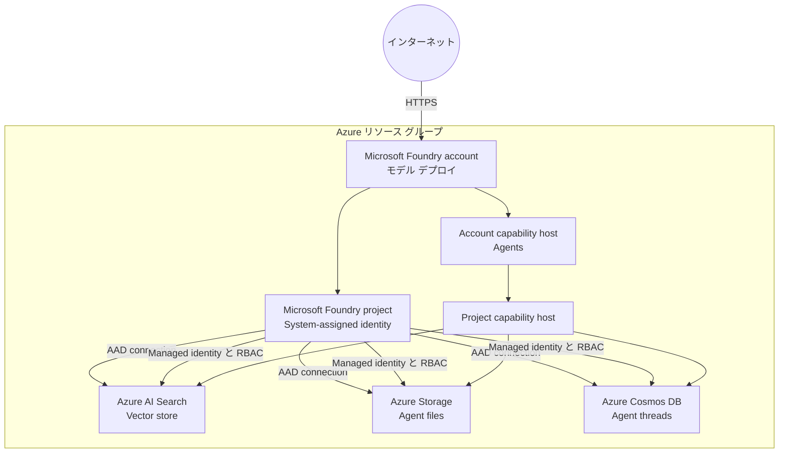

# Azure Microsoft Foundry シナリオ

このシナリオでは、Terraform を使用して Azure に Microsoft Foundry 環境をデプロイします。
Standard Agent に必要な Bring Your Own データ サービスと capability host もデプロイできます。
リソース キーは使用せず、Microsoft Entra ID と Foundry プロジェクトの managed identity を使用します。

## アーキテクチャ



## 前提条件

* Azure サブスクリプション
* 対象のサブスクリプションへサインイン済みの Azure CLI
* Terraform 1.11 以降
* デプロイ対象のデータ サービスに role assignment を作成する権限

共通の [Azure 認証](../../../docs/tips/provider-authentication.ja.md)、
[Terraform ワークフロー](../../../docs/tips/terraform-workflow.ja.md)、および必要に応じて
[Azure Blob Storage バックエンド](../../../docs/tips/azure-blob-backend.ja.md)のガイダンスに従ってください。
リポジトリの Makefile を使用する場合は、`SCENARIO=azure_microsoft_foundry` を設定します。

## 使用方法

### モデル デプロイ

既定では、Microsoft Foundry アカウントに次のモデルをデプロイします。

| デプロイ名およびモデル       | バージョン   | SKU              | Capacity |
|------------------------------|----------------|------------------|---------:|
| `gpt-5.6-luna`               | `2026-07-09`   | `GlobalStandard` |     1000 |
| `gpt-5.6-terra`              | `2026-07-09`   | `GlobalStandard` |     1000 |
| `gpt-5.6-sol`                | `2026-07-09`   | `GlobalStandard` |     1000 |
| `gpt-5.4-mini`               | `2026-03-17`   | `GlobalStandard` |     1000 |
| `text-embedding-3-large`     | `1`            | `GlobalStandard` |     3000 |
| `text-embedding-3-small`     | `1`            | `GlobalStandard` |     3000 |

適用前に `model_deployments` を確認し、対象のサブスクリプションおよびリージョンで利用できる
モデル、バージョン、capacity、クォータに合わせて上書きしてください。モデルをデプロイせずに
アカウントとプロジェクトだけを作成する場合は、空のリストを指定します。

```hcl
model_deployments = []
```

### Standard Agent リソース

`deploy_standard_agent` の既定値は `false` です。無効な場合は Foundry account、project、
model deployments のみを作成します。Standard Agent のリソース一式を有効にするには、
次の値を指定します。

```hcl
deploy_standard_agent = true
azure_ai_search_sku   = "standard"
```

リポジトリに含まれる `terraform.tfvars` ではこの構成を有効にしています。Terraform は次のリソースを
まとめて作成します。

* `standard` 以上のサポート対象 SKU を使用する Azure AI Search
* 明示的な container を管理しない Standard/ZRS Storage account
* Session consistency を使用する Agent thread 用 Azure Cosmos DB
* Search、Storage、Cosmos DB に対する project-scope の AAD connection
* stable `2025-06-01` API を使用する account および project capability host

データ サービスでは public network endpoint を使用します。AAD-only 認証では認証経路から
リソース キーを排除できますが、ネットワークは分離されません。このシナリオでは private endpoint、
private DNS zone、Search index、knowledge base、agent application code は作成しません。

### 認証と RBAC

Foundry account とすべての Standard Agent データ サービスで local authentication を無効にします。
Foundry project の system-assigned managed identity に次の role を割り当てます。

| Scope                  | Role                                | 用途                         |
|------------------------|-------------------------------------|------------------------------|
| Storage account        | Storage Blob Data Contributor       | Agent file の読み書き        |
| Azure AI Search        | Search Index Data Contributor       | Index data の読み書き        |
| Azure AI Search        | Search Service Contributor          | Search resource の管理       |
| Cosmos DB account      | Cosmos DB Operator                  | Account metadata の管理      |
| `enterprise_memory` DB | Cosmos DB Built-in Data Contributor | Thread data の読み書き       |

Terraform は control-plane role assignment の後に 60 秒待機します。その後、作成 timeout を 60 分に設定した
account capability host と project capability host を作成します。Project host が `enterprise_memory`
database を作成するため、Cosmos DB data-plane role assignment は最後に適用します。

Terraform の実行 identity には、対象 scope に対する
`Microsoft.Authorization/roleAssignments/write` が必要です。Contributor だけでは role assignment を
作成できません。Owner、必要な resource 権限と組み合わせた User Access Administrator、または必要な
action を付与した custom role を使用してください。

### 単独展開用 input からの移行

`deploy_azure_ai_search` と `deploy_blob_storage` は削除されました。3 つのデータ サービスを一つの
サポート対象構成としてデプロイするには `deploy_standard_agent` を使用します。Search の `free` と
`basic` SKU は指定できません。

> [!WARNING]
> 既存環境を移行すると、LRS Storage account から ZRS account への置換と、以前管理していた
> `default` container の削除が発生する可能性があります。apply の前に plan を確認し、必要なデータを
> 保全してください。Connection を AAD に変更すると現在の構成から key 参照はなくなりますが、過去の
> remote state version に記録された key は自動削除されません。Backend のセキュリティ ポリシーに
> 従って state history を保持、ローテーション、または削除してください。

### 破棄と purge

Microsoft Foundry アカウントを通常どおり削除すると、soft-delete されます。purge しない場合、
同じアカウント名を 48 時間再利用できません。このシナリオでは Terraform の destroy-time hook を登録し、
モデル デプロイ、プロジェクト、アカウントを削除した後、リソース グループを削除する前に
`az cognitiveservices account purge` を実行します。

> [!WARNING]
> purge は元に戻せません。アカウントに関連付けられたすべてのデータとキーが完全に削除されます。
> Terraform の実行 ID には、
> `Microsoft.CognitiveServices/locations/resourceGroups/deletedAccounts/delete` 権限が必要です。
> リソース グループ スコープの `Contributor` では不十分です。サブスクリプション スコープで
> `Cognitive Services Contributor` や `Contributor` などの適切なロールを割り当ててください。
> 詳細については、[削除された Microsoft Foundry リソースの復旧または消去](https://learn.microsoft.com/azure/ai-services/recover-purge-resources)を参照してください。

destroy の前に、purge action が Terraform state に存在する必要があります。この構成を追加または更新した後は、
最初の `terraform destroy` より前に `terraform apply` を一度実行してください。権限不足で purge に失敗した場合は、
権限を付与してから `terraform destroy` を再実行します。purge が成功するまで、アカウントは soft-delete 状態で残ります。

このシナリオのモデル デプロイでは、デプロイの競合を避けるため Terraform の処理を逐次実行する必要があります。
標準の Makefile によるデプロイおよび破棄コマンドには、`-parallelism=1` のオーバーライドが含まれていません。
`model_deployments` が空でない場合は、シナリオ ディレクトリから次のコマンドを直接実行します。

```bash
# デプロイを適用し、destroy 時の purge action を登録する
terraform apply -auto-approve -parallelism=1

# 出力を確認する
terraform output

# デプロイを破棄し、Foundry アカウントを完全に purge する
terraform destroy -auto-approve -parallelism=1
```
