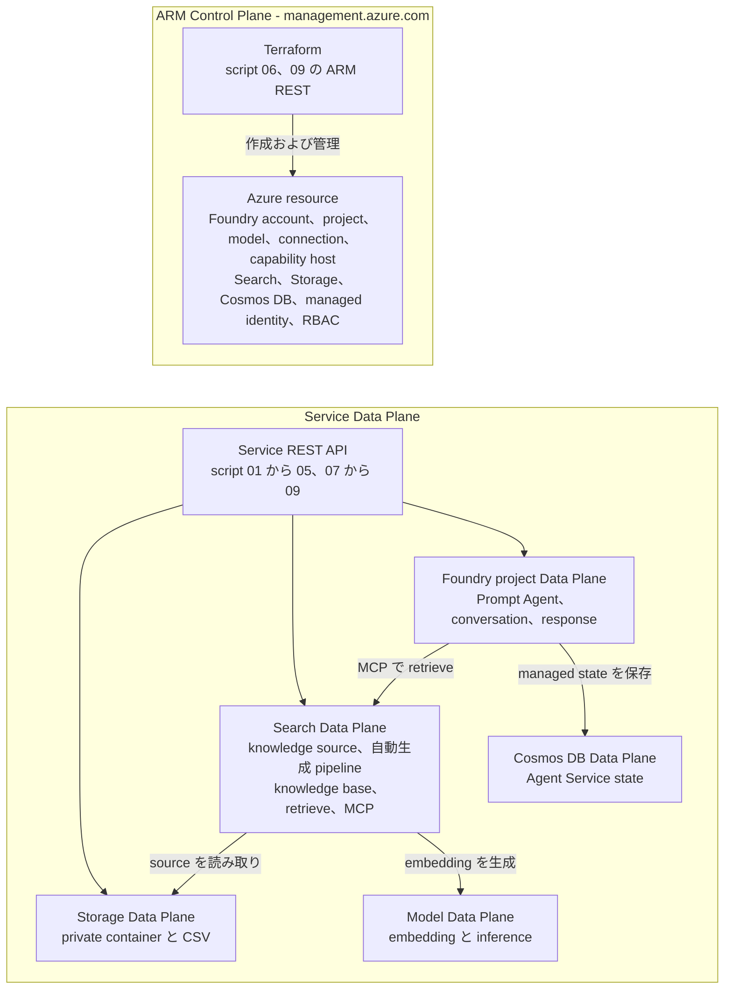
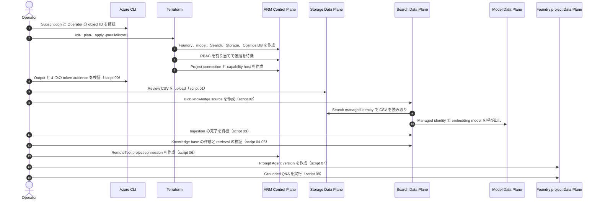
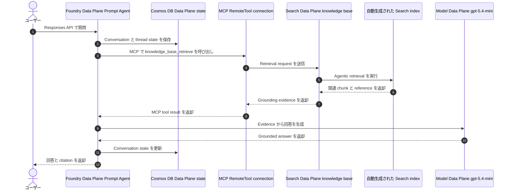

# Azure Microsoft Foundry シナリオ

このシナリオでは、Terraform を使用して Azure に Microsoft Foundry 環境をデプロイします。
Foundry Agent Service Standard setup に必要な Bring Your Own データ サービスと capability host も
デプロイできます。リソース キーは使用せず、Microsoft Entra ID と Foundry プロジェクトの managed
identity を使用します。デプロイ後は、連番の POSIX shell script を使用して架空の飲食店レビュー
データをアップロードし、Foundry IQ knowledge source と knowledge base、MCP 接続を使用する
Prompt Agent、Q&A を構築できます。

## シナリオの目的

### 「Standard Agent」の意味

Foundry Agent Service における **Standard setup は環境とデータの保存方式であり、Agent の種類、
model SKU、runtime tier ではありません**。Basic setup は Agent state を Microsoft 管理の storage に
保存します。Standard setup は Foundry project を利用者の subscription 内にある single-tenant の
リソースへ接続します。

* Azure Storage は file と upload data を保存します。
* Azure AI Search は vector store と retrieval index を保存します。
* Azure Cosmos DB は conversation、response、Agent metadata を保存します。

Account と project の capability host が、Agent Service で使用する接続済みリソースを指定します。
Script `07` が後から作成する Agent は **Prompt Agent** であり、Terraform が構築した Standard setup 上で
動作します。このシナリオは public network と Microsoft Entra による keyless 認証を使用します。
Bring Your Own VNet を使用する network-isolated Standard setup ではありません。

### このシナリオで構築するもの

Terraform phase では Foundry account と project、model deployment、利用者管理の Storage、Search、
Cosmos DB、project connection、capability host、managed identity、RBAC を作成します。その後の
post-deployment phase では、次の処理を実行します。

1. 架空の CSV を Blob Storage へ upload する
2. Foundry IQ Blob knowledge source と自動生成される Search pipeline を作成する
3. Knowledge base を作成し、Agent を介さず直接 retrieval を検証する
4. MCP を介して knowledge base を Prompt Agent へ接続する
5. Responses API で質問し、grounded output を検証する

完成するのは keyless な retrieval-grounded Prompt Agent の再現可能な学習環境です。本番 application、
Hosted Agent、user interface、private network の reference architecture ではありません。

### 得られる知識

Workflow を完了すると、次の事項を説明および実践できる状態を目指します。

* ARM resource と service Data Plane object を区別し、lifecycle ごとに tool が異なる理由を説明する
* 各 step で使用する identity、RBAC role、OAuth audience、endpoint を特定する
* Capability host が利用者管理の state service を Foundry project へ接続する仕組みを説明する
* Blob ingestion から chunking、embedding、indexing、knowledge-base retrieval、MCP tool call、
    最終回答の生成までを追跡する
* Agent layer を追加する前に ingestion と retrieval の問題を切り分ける
* Terraform state で管理する範囲と、provider が対応するまで Search または Foundry の
    Data Plane client が必要な範囲を判断する

## アーキテクチャ

次の図では、API plane と実行フローを分けて示します。最初の図は、**object が存在する場所と
このシナリオで管理する client** を表します。後続のシーケンス図は、デプロイ時とユーザーからの
request 実行時に各 surface が通信するタイミングを表します。

> [!IMPORTANT]
> この README における **ARM Control Plane** は、subscription 内のリソースを管理する Azure Resource
> Manager の操作を意味します。Agent fleet 全体の governance、inventory、observability を提供する
> 製品機能の **Microsoft Foundry Control Plane** とは異なり、後者はこのシナリオの対象外です。

### ARM Control Plane と service Data Plane

この図が示す内容は、**object が Azure resource なのか service 内の runtime object なのか、
このシナリオではどの tool が管理するのか**です。



境界は `terraform apply` の前後ではなく、使用する API で決まります。たとえば script `06` は Search
Data Plane の構築後に実行しますが、ARM で project connection を作成するため Control Plane 操作です。
Knowledge source と knowledge base は Search Service Data Plane の top-level object であり、ARM child
resource ではありません。Prompt Agent version、conversation、response は Foundry project Data Plane
の object です。

| API surface | Endpoint または token audience | このシナリオの object | 管理方法 |
| --- | --- | --- | --- |
| ARM Control Plane | `management.azure.com` | Foundry account/project、model deployment、connection、capability host、data service account、RBAC | Terraform。RemoteTool connection は script `06` が作成し、script `09` が削除 |
| Storage Data Plane | `https://storage.azure.com/.default` | Private container と review CSV | Script `01` と `09` |
| Search Data Plane | `https://search.azure.com/.default` | Knowledge source、自動生成される data source/skillset/index/indexer、knowledge base、retrieval | Script `02` から `05` と `09` |
| Foundry project Data Plane | `https://ai.azure.com/.default` | Prompt Agent version、conversation、Responses API call | Script `07` から `09` |
| Model Data Plane | Foundry OpenAI endpoint | Embedding と最終回答の生成 | Runtime の Search managed identity と Agent Service |
| Cosmos DB Data Plane | Project capability-host connection | `enterprise_memory` と Agent Service state | Agent Service。Script から Cosmos DB は直接呼び出さない |

Terraform は ARM resource lifecycle と RBAC の管理に適しています。この実装では Search と Foundry の
Data Plane object を Terraform state に保持せず、連番 script が service REST API で管理します。
Script `09` は cleanup 章に記載した永続的な named object を削除しますが、script `08` が作成する
conversation は追跡または削除しません。`terraform destroy` が ARM resource を削除します。

### Terraform と script を分ける理由

この分割は実装上の境界であり、Terraform が Data Plane を管理できないという意味ではありません。
Provider が object の CRUD、import、state を実装していれば、Terraform でも Data Plane object を
管理できます。このシナリオでは、次のように分けています。

* Terraform と `azapi_resource` は ARM resource ID を持つ object を管理する
* Search knowledge source と knowledge base は Search endpoint 内の名前で識別され、Search Service の
    ARM resource ID 配下にある child resource ではない
* 自動生成される data source、skillset、index、indexer は Blob knowledge source の固定 template が
    所有するため、独立した Terraform resource として編集または管理しない
* Prompt Agent version と conversation は Foundry project Data Plane に存在する。Script `07` は
    `POST` を使用するため、再実行すると新しい Agent version を作成する

現在の provider 構成では、これらの Search と Foundry object を state に保持しません。REST call を
`local-exec` で Terraform 内から実行しても、宣言的な diff、import、lifecycle tracking は得られません。
そこで、API が対応する object は create-or-update の `PUT` で作成し、明示的な cleanup step を提供します。
Script `06` は意図的な例外です。RemoteTool connection は ARM object ですが、MCP endpoint の作成後に
実行し、post-deployment workflow と同じ lifecycle で管理します。

### デプロイ フロー

この図が示す内容は、**環境を構築および検証する順序**です。



### Q&A 実行時フロー

この図が示す内容は、**ユーザーが質問した後に通信するサービス**です。



Blob Storage と embedding deployment が使用されるのは、デプロイ フローに示した
ingestion 時です。Q&A リクエストごとには呼び出されません。Terraform も実行時の
通信経路には含まれません。

## 前提条件と制約

### 必要なアクセス権とツール

* Azure サブスクリプション
* 対象のサブスクリプションへサインイン済みの Azure CLI 2.50 以降
* Terraform 1.11 以降
* POSIX 互換 shell、`curl`、`jq`
* Foundry Agent Service と Azure AI Search agentic retrieval をサポートする対象リージョン
* 構成したすべての model deployment に必要な quota とリージョンでの提供
* デプロイ対象のデータ サービスに role assignment を作成する権限

共通の [Azure 認証](../../../docs/tips/provider-authentication.ja.md)、
[Terraform ワークフロー](../../../docs/tips/terraform-workflow.ja.md)、および必要に応じて
[Azure Blob Storage バックエンド](../../../docs/tips/azure-blob-backend.ja.md)のガイダンスに従ってください。
リポジトリの Makefile を使用する場合は、`SCENARIO=azure_microsoft_foundry` を設定します。

### サービスと設計上の制約

| 項目 | このシナリオの境界 |
| --- | --- |
| Setup mode | Public endpoint と利用者管理の Storage、Search、Cosmos DB を使用する Standard setup。BYO VNet 版ではない |
| Project boundary | 1 つの account と project を作成する。同じ project の Agent は接続済み state service を共有する。複数 project の isolation と capacity は検証しない |
| Cosmos DB | Provisioned throughput の account を作成する。Standard setup では合計 3000 RU/s 以上を利用できる必要があり、capacity 不足では capability host の provisioning が失敗する可能性がある |
| Capability host | 設定後の capability host は update できない。接続する state service の変更では replacement または project の再作成が必要になる場合がある |
| Network security | Microsoft Entra 認証で key は排除するが traffic は分離しない。Private endpoint、private DNS、firewall policy、egress control は作成しない |
| Data authorization | Document-level ACL synchronization と end-user token passthrough は構成しない。この Agent を呼び出せる principal は同じ架空 corpus を使用する |
| API stability | Search は `2026-05-01-preview`、RemoteTool connection は `2025-10-01-preview` を使用する。Preview の動作は変更される可能性があり SLA はない |
| Data processing | 既定の model deployment は `GlobalStandard` を使用し、Azure 管理の複数 region で request が処理される場合がある。`location = "japaneast"` だけから model processing が単一 region と判断しない |
| Production readiness | Customer-managed Key Vault/CMK、private network、application UI、observability stack、evaluation suite、application 固有の Responsible AI test は含まない |
| Cost | Search、Cosmos DB、Storage、model token、agentic retrieval に料金が発生する可能性がある。デプロイ前に quota、throughput、無料枠、最新価格を確認する |

## 構成

### モデル デプロイ

既定では、Microsoft Foundry アカウントに次のモデルをデプロイします。

| デプロイ名およびモデル   | バージョン   | SKU              | Capacity |
|--------------------------|--------------|------------------|---------:|
| `gpt-5.6-luna`           | `2026-07-09` | `GlobalStandard` |     1000 |
| `gpt-5.6-terra`          | `2026-07-09` | `GlobalStandard` |     1000 |
| `gpt-5.6-sol`            | `2026-07-09` | `GlobalStandard` |     1000 |
| `gpt-5.4-mini`           | `2026-03-17` | `GlobalStandard` |     1000 |
| `text-embedding-3-large` | `1`          | `GlobalStandard` |     3000 |
| `text-embedding-3-small` | `1`          | `GlobalStandard` |     3000 |

適用前に `model_deployments` を確認し、対象のサブスクリプションおよびリージョンで利用できる
モデル、バージョン、capacity、クォータに合わせて上書きしてください。モデルをデプロイせずに
アカウントとプロジェクトだけを作成する場合は、空のリストを指定します。

```hcl
model_deployments = []
```

### Standard setup リソース

Terraform input の名前は `deploy_standard_agent` ですが、有効化するのは Standard setup の
infrastructure であり、Agent の種類を選択するものではありません。既定値は `false` です。無効な場合は
Foundry account、project、model deployment のみを作成します。利用者管理の state service と
capability host を有効にするには、次の値を指定します。

```hcl
deploy_standard_agent = true
azure_ai_search_sku   = "standard"
```

リポジトリに含まれる `terraform.tfvars` ではこの構成を有効にしています。Terraform は次のリソースを
まとめて作成します。

* `standard` 以上のサポート対象 SKU を使用する Azure AI Search
* Terraform で container を管理しない Standard/ZRS Storage account
* Session consistency を使用する Agent thread 用 Azure Cosmos DB
* Search、Storage、Cosmos DB に対する project-scope の AAD connection
* stable `2025-06-01` API を使用する account および project capability host

Standard setup だけでは restaurant knowledge source、knowledge base、MCP connection、Prompt Agent は
作成されません。このシナリオでは、同じ Storage と Search service を別の Foundry IQ pipeline にも使用し、
環境の準備後に連番 script がその pipeline を構築します。

データ サービスでは public network endpoint を使用します。AAD-only 認証では認証経路から
リソース キーを排除できますが、ネットワークは分離されません。Terraform は private endpoint、
private DNS zone、Search data-plane object、Agent version を作成しません。Terraform の完了後に
連番 script が Blob container、Search 管理の ingestion resource、Foundry IQ object、RemoteTool
connection、Prompt Agent を作成します。

### 認証と RBAC

Foundry account とすべての Standard Agent データ サービスで local authentication を無効にします。
`deploy_standard_agent` が有効な場合、Terraform は次の role assignment を作成します。

| Scope                  | Role                                | Assignee                 | 用途                                     |
|------------------------|-------------------------------------|--------------------------|------------------------------------------|
| Storage account        | Storage Blob Data Contributor       | Foundry project identity | Agent file の読み書き                    |
| Azure AI Search        | Search Index Data Contributor       | Foundry project identity | Index data の読み書き                    |
| Azure AI Search        | Search Service Contributor          | Foundry project identity | Search resource の管理                   |
| Azure AI Search        | Search Index Data Reader            | Foundry project identity | MCP 経由の knowledge retrieval           |
| Foundry account        | Foundry User                        | Foundry project identity | Foundry model と Agent へのアクセス      |
| Cosmos DB account      | Cosmos DB Operator                  | Foundry project identity | Account metadata の管理                  |
| `enterprise_memory` DB | Cosmos DB Built-in Data Contributor | Foundry project identity | Thread data の読み書き                   |
| Storage account        | Storage Blob Data Reader            | Search identity          | Review CSV の ingestion                  |
| Foundry account        | Cognitive Services User             | Search identity          | Ingestion 時の embedding 生成            |
| Storage account        | Storage Blob Data Contributor       | Operator                 | Review CSV のアップロードと削除          |
| Azure AI Search        | Search Service Contributor          | Operator                 | Knowledge object の管理                  |
| Azure AI Search        | Search Index Data Contributor       | Operator                 | 自動生成された index data の管理         |
| Azure AI Search        | Search Index Data Reader            | Operator                 | Direct retrieval test の実行             |
| Foundry account        | Foundry Project Manager             | Operator                 | Connection と Agent の作成               |

`operator_principal_id` input が `null` の場合、Terraform を実行する identity の object ID を使用します。
リポジトリに含まれる `terraform.tfvars` では object ID を明示的に指定しているため、この fallback より
優先されます。後述のデプロイ手順では、現在の Azure CLI principal を解決し、`terraform.tfvars` より
優先度が高い `-var` で渡します。Terraform と連番 script を異なる identity で実行する場合は、連番
script を実行する principal の object ID を使用してください。Azure AI role の改名移行中にも失敗しないよう、
Foundry role は role definition ID で割り当てます。

Terraform は control-plane role assignment の後に 60 秒待機します。その後、作成 timeout を 60 分に設定した
account capability host と project capability host を作成します。Project host が `enterprise_memory`
database を作成するため、Cosmos DB data-plane role assignment は最後に適用します。

Terraform の実行 identity には、対象 scope に対する
`Microsoft.Authorization/roleAssignments/write` が必要です。Contributor だけでは role assignment を
作成できません。Owner、必要な resource 権限と組み合わせた User Access Administrator、または必要な
action を付与した custom role を使用してください。

### データと API の設計

モック データは [data/restaurant_reviews.csv](data/restaurant_reviews.csv) です。明示的に架空とした
10 店舗について、30 件の英語レビューを格納しています。各行の `search_text` に店名、料理、住所、
緯度経度、営業時間、食事制限、店舗概要、評価、口コミを繰り返し記載しています。

> [!IMPORTANT]
> 選択した `azureBlob` knowledge source は、service 管理の固定 template から data source、skillset、
> vectorized index、indexer を作成します。CSV は Blob content として扱われ、その template によって
> chunking されます。CSV の各列が typed または filterable な Search field になる保証はありません。
> 行単位の filter や安定した column mapping が必要な場合は、明示的な index と `delimitedText`
> indexer を使用してください。

2 つの ID 列は source-level の業務識別子であり、Azure AI Search の document key ではありません。

| Column          | 一意性                      | 用途                                  | 例         |
|-----------------|-----------------------------|---------------------------------------|------------|
| `review_id`     | Review ごとに 1 つ          | Source dataset 内の review を追跡     | `rev-001`  |
| `restaurant_id` | Restaurant ごとに 1 つ      | Restaurant 単位で review をグループ化 | `rest-001` |

この fixture では、人が追跡しやすい既存の ID を安定して使用し、異なる record に同じ ID を再利用しません。
現在の pipeline に UUID 列を追加しても Search 上の identity は改善しません。Service 管理の Blob
knowledge source は CSV を Blob content として扱って chunking し、retrieval で使用する index key を
生成します。そのため、CSV の ID が typed、filterable、または安定した Search key field になる保証は
ありません。ID を削除すると source の追跡性だけが低下します。

本番データに永続的な source ID がない場合は、record 作成時に ID を一度生成して保存し、ingestion
ごとに新しい random UUID を生成しないでください。複数 source で namespace を共有する場合は、
source-qualified な deterministic ID または保存済みの UUID を使用します。行単位の filter、update、
または key の安定性が要件になった場合は、固定の Blob pipeline を明示的に管理する index と
`delimitedText` indexer に置き換え、parent record key と派生する chunk key を schema の一部として
定義します。

Workflow ではモデルの責務を次のように分離します。

* `text-embedding-3-large` は Blob ingestion 時に content を vectorize
* Foundry IQ は `minimal` reasoning と `extractiveData` output を使用
* `gpt-5.4-mini` Prompt Agent は取得結果から最終回答を生成

Search data-plane call では `2026-05-01-preview` API を使用します。Search resource と direct
retrieval は `knowledgebases('restaurant-reviews-kb')/retrieve` のような OData 形式の path を使用します。
MCP endpoint は異なる slash 形式の
`/knowledgebases/restaurant-reviews-kb/mcp?api-version=2026-05-01-preview` です。
RemoteTool connection では `2025-10-01-preview`、Agent では `v1` を使用します。

> [!WARNING]
> Preview API に service-level agreement はなく、本番 workload には推奨されません。本番利用前に
> Azure preview 条項、リージョン、データ境界、モデル提供状況、API の変更を確認してください。

## デプロイ

次の章を順番に実行します。各検証手順により、問題を直前に構築した layer へ切り分けられます。

### 1. サブスクリプションと Operator principal の選択

Terraform と script が使用するサブスクリプションへサインインして選択します。

```bash
az login
az account set --subscription "<subscription-name-or-id>"
az account show \
    --query "{subscriptionName:name, subscriptionId:id, tenantId:tenantId, principalType:user.type, principalName:user.name}" \
    --output table
```

対話的な user login では、サインイン中の user の Microsoft Entra object ID を取得します。

```bash
OPERATOR_PRINCIPAL_ID=$(az ad signed-in-user show --query id --output tsv)
printf 'operator_principal_id=%s\n' "$OPERATOR_PRINCIPAL_ID"
```

Service principal login では、`user.name` が application（client）ID です。この値から service
principal の object ID を取得します。

```bash
AZURE_CLIENT_ID=$(az account show --query user.name --output tsv)
OPERATOR_PRINCIPAL_ID=$(az ad sp show \
    --id "$AZURE_CLIENT_ID" \
    --query id \
    --output tsv)
printf 'operator_principal_id=%s\n' "$OPERATOR_PRINCIPAL_ID"
```

`operator_principal_id` には **object ID** を指定します。Application（client）ID、subscription ID、
tenant ID は指定しないでください。Directory lookup には principal を読み取る権限も必要です。制限された
CI tenant では、既知の service principal object ID を保護された CI variable として保存してください。

### 2. 構成の確認と plan

このシナリオの directory で `terraform.tfvars` と前述の model deployment 表を確認します。対象リージョンで
必要な model version、capacity、quota を利用できることを確認してから、初期化、検証、plan を実行します。

```bash
terraform init
terraform validate
terraform plan -var="operator_principal_id=${OPERATOR_PRINCIPAL_ID}"
```

Command-line の `-var` は、`terraform.tfvars` に含まれる object ID を意図的に上書きします。
`deploy_standard_agent` が `true` の場合、plan に Operator の role assignment が含まれることを確認します。

### 3. Terraform 管理 infrastructure のデプロイ

Model deployment は逐次作成する必要があります。Terraform の parallelism を 1 に設定して apply し、
script が使用する output を確認します。

```bash
terraform apply -parallelism=1 \
    -var="operator_principal_id=${OPERATOR_PRINCIPAL_ID}"
terraform output
```

### 4. Knowledge layer の構築と検証

各 script は自身の場所を基準に file を解決するため、呼び出し元の working directory に依存しません。
このシナリオへの絶対 path を `SCENARIO_DIR` に設定します。最初に前提条件を検証し、CSV の upload と
ingestion、knowledge base の作成、direct retrieval の検証を実行します。

```bash
SCENARIO_DIR="/path/to/template-terraform/infra/scenarios/azure_microsoft_foundry"

"${SCENARIO_DIR}/scripts/00_validate_prerequisites.sh"
"${SCENARIO_DIR}/scripts/01_upload_restaurant_reviews.sh"
"${SCENARIO_DIR}/scripts/02_create_knowledge_source.sh"
"${SCENARIO_DIR}/scripts/03_wait_for_ingestion.sh"
"${SCENARIO_DIR}/scripts/04_create_knowledge_base.sh"
"${SCENARIO_DIR}/scripts/05_retrieve_knowledge_base.sh" \
    "Which fictional restaurants offer vegan options, and what did reviewers say?"
```

Step `05` は knowledge layer の検証 gate です。関連する grounding reference が返ることを確認してから
次へ進みます。

### 5. Prompt Agent の作成と検証

RemoteTool connection と Prompt Agent を作成し、end-to-end の Q&A request を実行します。

```bash
"${SCENARIO_DIR}/scripts/06_create_project_connection.sh"
"${SCENARIO_DIR}/scripts/07_create_agent.sh"
"${SCENARIO_DIR}/scripts/08_ask_agent.sh" \
    "Which fictional restaurant is a strong choice for a vegan dinner, and why?"
```

Step `08` は runtime の検証 gate です。1 件以上の MCP event が記録され、飲食店データに grounded した
回答が返ることを確認します。

### Script 一覧

| Script | 処理 |
| --- | --- |
| `00_validate_prerequisites.sh` | Tool、output、model、login、token scope の検証 |
| `01_upload_restaurant_reviews.sh` | Private container の作成と Blob REST による CSV upload |
| `02_create_knowledge_source.sh` | Keyless Blob knowledge source と自動 index の作成 |
| `03_wait_for_ingestion.sh` | 現在の ingestion run を待機し、item error があれば失敗 |
| `04_create_knowledge_base.sh` | Minimal extractive Foundry IQ knowledge base の作成 |
| `05_retrieve_knowledge_base.sh` | Direct retrieval の検証と grounding reference の表示 |
| `06_create_project_connection.sh` | Project managed identity を使用する RemoteTool connection 作成 |
| `07_create_agent.sh` | MCP 対応 Prompt Agent の新しい version の作成 |
| `08_ask_agent.sh` | Conversation を作成して knowledge base tool call を強制 |
| `09_cleanup.sh` | 連番 script で作成した resource だけを削除 |

Step `05` の direct retrieval により、Search ingestion の問題と Agent または MCP の問題を分離できます。
Step `08` は回答、conversation ID、MCP event 数を表示します。完全な JSON response を確認する場合は
`VERBOSE_OUTPUT=true` を設定します。

## 運用

### 設定の上書き

| Environment variable             | Default                          | 用途                                 |
|----------------------------------|----------------------------------|--------------------------------------|
| `RESTAURANT_DATA_FILE`           | `data/restaurant_reviews.csv`    | Source CSV path                      |
| `CONTAINER_NAME`                 | `restaurant-reviews`             | Private Blob container               |
| `BLOB_NAME`                      | `restaurant_reviews.csv`         | Upload する Blob 名                  |
| `KNOWLEDGE_SOURCE_NAME`          | `restaurant-reviews-ks`          | Search knowledge source              |
| `KNOWLEDGE_BASE_NAME`            | `restaurant-reviews-kb`          | Search knowledge base                |
| `PROJECT_CONNECTION_NAME`        | `restaurant-reviews-kb-mcp`      | Foundry RemoteTool connection        |
| `AGENT_NAME`                     | `restaurant-qa-agent`            | Foundry Prompt Agent                 |
| `AGENT_MODEL`                    | `gpt-5.4-mini`                   | Agent model deployment               |
| `EMBEDDING_DEPLOYMENT`           | `text-embedding-3-large`         | Ingestion embedding deployment       |
| `EMBEDDING_MODEL`                | `text-embedding-3-large`         | Ingestion embedding model 名         |
| `INGESTION_TIMEOUT_SECONDS`      | `900`                            | Ingestion の最大待機時間             |
| `POLL_INTERVAL_SECONDS`          | `10`                             | Ingestion の polling 間隔            |
| `VERBOSE_OUTPUT`                 | `false`                          | 完全な REST response body の表示     |

高度なテストでは endpoint と resource の変数も Terraform output から上書きできます。Script は bearer
token、API key、connection secret を disk または標準出力へ書き込みません。

### 再実行と cleanup

Blob upload は同名の Blob を上書きします。Knowledge source、knowledge base、project connection は
create-or-update の `PUT` を使用するため、同じ名前で再実行できます。Agent の作成は `POST` であり、
再実行するたびに同名 Agent の新しい version を作成します。Agent query ごとに新しい conversation を作成します。

Cleanup は Terraform から分離されており、正確な確認値が必要です。Agent、RemoteTool connection、
knowledge base、knowledge source と自動生成された Search object、Blob、container を削除します。
Terraform 管理の infrastructure は変更しません。

```bash
CONFIRM_CLEANUP=delete-foundry-iq-resources \
    "${SCENARIO_DIR}/scripts/09_cleanup.sh"
```

### 破棄と purge

Microsoft Foundry アカウントを通常どおり削除すると、soft-delete されます。purge しない場合、
同じアカウント名を 48 時間再利用できません。このシナリオでは Terraform の destroy-time hook を登録し、
モデル デプロイ、プロジェクト、アカウントを削除した後、リソース グループを削除する前に
`az cognitiveservices account purge` を実行します。

> [!WARNING]
> purge は元に戻せません。アカウントに関連付けられたすべてのデータとキーが完全に削除されます。
> Terraform の実行 ID には、
> `Microsoft.CognitiveServices/locations/resourceGroups/deletedAccounts/delete` 権限が必要です。
> リソース グループ スコープの `Contributor` では不十分です。サブスクリプション スコープで
> `Cognitive Services Contributor` や `Contributor` などの適切なロールを割り当ててください。
> 詳細については、[削除された Microsoft Foundry リソースの復旧または消去](https://learn.microsoft.com/azure/ai-services/recover-purge-resources)を参照してください。

destroy の前に、purge action が Terraform state に存在する必要があります。この構成を追加または更新した後は、
最初の `terraform destroy` より前に `terraform apply` を一度実行してください。権限不足で purge に失敗した場合は、
権限を付与してから `terraform destroy` を再実行します。purge が成功するまで、アカウントは soft-delete 状態で残ります。

Model deployment では Terraform の処理を逐次実行する必要があります。標準の Makefile によるデプロイおよび
破棄コマンドには `-parallelism=1` が含まれていません。デプロイ章の手順で
`OPERATOR_PRINCIPAL_ID` を再取得し、シナリオ directory から次のコマンドを直接実行します。

```bash
# Destroy 時の purge action を登録するため一度 apply する
terraform apply -parallelism=1 \
    -var="operator_principal_id=${OPERATOR_PRINCIPAL_ID}"

# Output を確認する
terraform output

# Deployment を破棄し、Foundry account を完全に purge する
terraform destroy -parallelism=1 \
    -var="operator_principal_id=${OPERATOR_PRINCIPAL_ID}"
```

## トラブルシューティング

* Search の `401` または `403` では、Operator に Search Service Contributor、Search Index Data
    Contributor、Search Index Data Reader があることを確認し、role assignment の伝播を待ちます。
* Blob の `403` では、Operator の Storage Blob Data Contributor と、Search identity の Storage
    Blob Data Reader を確認します。
* Embedding error では、Search identity の Cognitive Services User と
    `text-embedding-3-large` deployment を確認します。
* Agent または connection の `403` では、Operator の Foundry Project Manager と project identity の
    Foundry User を確認します。
* Ingestion failure では step `03` が表示する error を確認します。Blob が UTF-8 CSV であることを確認し、
    source の修正後に step `01` から `03` を再実行します。
* MCP の `400` または `404` では knowledge base 名を確認し、`2026-05-01-preview` を指定した
    slash 形式の MCP endpoint を維持します。
* Semantic ranker と agentic retrieval は既定の月次無料枠から開始します。無料枠を超えると、対応する
    Standard pay-as-you-go plan を別途有効にしない限り billing error が返されます。

## 単独展開用 input からの移行

`deploy_azure_ai_search` と `deploy_blob_storage` は削除されました。3 つのデータ サービスを一つの
サポート対象構成としてデプロイするには `deploy_standard_agent` を使用します。Search の `free` と
`basic` SKU は指定できません。

> [!WARNING]
> 既存環境を移行すると、LRS Storage account から ZRS account への置換と、以前管理していた
> `default` container の削除が発生する可能性があります。apply の前に plan を確認し、必要なデータを
> 保全してください。Connection を AAD に変更すると現在の構成から key 参照はなくなりますが、過去の
> remote state version に記録された key は自動削除されません。Backend のセキュリティ ポリシーに
> 従って state history を保持、ローテーション、または削除してください。

## 参考資料

### 概念とアーキテクチャ

* [Microsoft Foundry Agent Service とは](https://learn.microsoft.com/azure/foundry/agents/overview)
* [Agent 環境の構築: Basic setup と Standard setup](https://learn.microsoft.com/azure/foundry/agents/environment-setup)
* [Standard Agent リソースの構築](https://learn.microsoft.com/azure/foundry/agents/concepts/standard-agent-setup)
* [Capability host](https://learn.microsoft.com/azure/foundry/agents/concepts/capability-hosts)
* [Microsoft Foundry architecture](https://learn.microsoft.com/azure/foundry/concepts/architecture)
* [認証と認可: Control Plane と Data Plane](https://learn.microsoft.com/azure/foundry/concepts/authentication-authorization-foundry#control-plane-and-data-plane)
* [Azure Control Plane と Data Plane](https://learn.microsoft.com/azure/azure-resource-manager/management/control-plane-and-data-plane)
* [Microsoft Foundry Control Plane](https://learn.microsoft.com/azure/foundry/control-plane/overview)
* [Foundry Agent Service の制限、quota、リージョン](https://learn.microsoft.com/azure/foundry/agents/concepts/limits-quotas-regions)
* [Foundry model deployment type とデータ処理](https://learn.microsoft.com/azure/foundry/foundry-models/concepts/deployment-types)
* [Foundry IQ とは](https://learn.microsoft.com/azure/foundry/agents/concepts/what-is-foundry-iq)
* [Foundry IQ FAQ](https://learn.microsoft.com/azure/foundry/agents/concepts/foundry-iq-faq)

### API と Data Plane の実装

* [Microsoft Foundry API reference](https://ai.azure.com/api-reference)
* [Microsoft Foundry Project REST API](https://learn.microsoft.com/rest/api/microsoft-foundry/aiproject)
* [Azure AI Search Data Plane REST API](https://learn.microsoft.com/rest/api/searchservice/)
* [Azure CLI で現在サインイン中の user を表示](https://learn.microsoft.com/cli/azure/ad/signed-in-user#az-ad-signed-in-user-show)
* [Microsoft Entra service principal を表示](https://learn.microsoft.com/cli/azure/ad/sp#az-ad-sp-show)
* [Foundry IQ knowledge base と Agent の接続](https://learn.microsoft.com/azure/foundry/agents/how-to/foundry-iq-connect?tabs=foundry%2Crest)
* [Agentic retrieval solution の構築](https://learn.microsoft.com/azure/search/agentic-retrieval-how-to-create-pipeline)
* [Blob knowledge source の作成](https://learn.microsoft.com/azure/search/agentic-knowledge-source-how-to-blob)
* [`delimitedText` による CSV Blob の index](https://learn.microsoft.com/azure/search/search-how-to-index-azure-blob-csv)
* [Indexer の field と document key の mapping](https://learn.microsoft.com/azure/search/search-indexer-field-mappings)
* [Azure AI Search 2026-05-01-preview REST specification](https://raw.githubusercontent.com/Azure/azure-rest-api-specs/refs/heads/main/specification/search/data-plane/Search/preview/2026-05-01-preview/search.json)
* [Knowledge Sources REST API](https://learn.microsoft.com/rest/api/searchservice/knowledge-sources?view=rest-searchservice-2026-04-01)
* [Knowledge Bases REST API](https://learn.microsoft.com/rest/api/searchservice/knowledge-bases?view=rest-searchservice-2026-04-01)
* [Knowledge Retrieval REST API](https://learn.microsoft.com/rest/api/searchservice/knowledge-retrieval/retrieve?view=rest-searchservice-2026-04-01&tabs=HTTP)

### 公式 sample と仕様

* [Microsoft Foundry samples](https://github.com/microsoft-foundry/foundry-samples)
* [Terraform Standard Agent setup sample](https://github.com/microsoft-foundry/foundry-samples/tree/main/infrastructure/infrastructure-setup-terraform/41-standard-agent-setup)
* [Microsoft Foundry REST quickstart sample](https://github.com/microsoft-foundry/foundry-samples/tree/main/samples/REST/quickstart)
* [Microsoft Foundry Data Plane TypeSpec](https://github.com/Azure/azure-rest-api-specs/tree/main/specification/ai-foundry/data-plane/Foundry)
* [Cognitive Services ARM Control Plane TypeSpec](https://github.com/Azure/azure-rest-api-specs/tree/main/specification/cognitiveservices/CognitiveServices.Management)
* [Azure AI Search Data Plane specification](https://github.com/Azure/azure-rest-api-specs/tree/main/specification/search/data-plane/Search)
