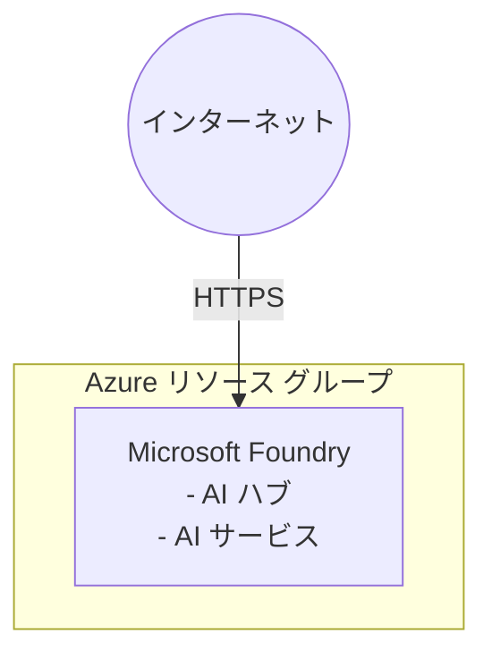

# Azure Microsoft Foundry シナリオ

このシナリオでは、Terraform を使用して Azure に Microsoft Foundry 環境をデプロイします。Microsoft Foundry ワークロードの実行に必要なインフラストラクチャ コンポーネントを構成します。

## アーキテクチャ



## 前提条件

- Azure サブスクリプション

共通の [Azure 認証](../../../docs/tips/provider-authentication.ja.md)、
[Terraform ワークフロー](../../../docs/tips/terraform-workflow.ja.md)、および必要に応じて
[Azure Blob Storage バックエンド](../../../docs/tips/azure-blob-backend.ja.md)のガイダンスに従ってください。
リポジトリの Makefile を使用する場合は、`SCENARIO=azure_microsoft_foundry` を設定します。

## 使用方法

標準の Makefile によるデプロイおよび破棄コマンドには、`-parallelism=1` のオーバーライドが含まれていません。
このオーバーライドが必要な場合は、シナリオ ディレクトリから次のコマンドを直接実行します。

```bash
# デプロイを適用する
terraform apply -auto-approve -parallelism=1

# 出力を確認する
terraform output

# デプロイを破棄する
terraform destroy -auto-approve -parallelism=1
```
