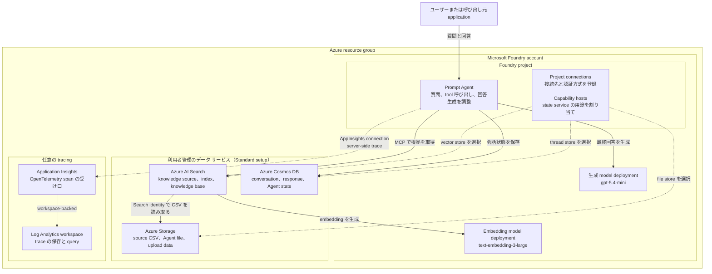

# Azure Microsoft Foundry シナリオ

このシナリオでは、Terraform を使用して Azure に Microsoft Foundry 環境をデプロイします。
Foundry Agent Service Standard setup に必要な Bring Your Own データ サービスと capability host も
デプロイできます。リソース キーは使用せず、Microsoft Entra ID と Foundry プロジェクトの managed
identity を使用します。オプションの server-side Agent tracing では、OpenTelemetry span を
workspace-based Application Insights へ送信します。デプロイ後は、連番の POSIX shell script を
使用して架空の飲食店レビュー データをアップロードし、Foundry IQ knowledge source と knowledge
base、MCP 接続を使用する Prompt Agent、Q&A を構築できます。

## この README を読むための基礎用語

この章では、Microsoft Foundry を初めて使用する場合でも後続の構成と処理を追えるように、
このシナリオで使う用語だけを先に説明します。製品名や API の object 名は公式ドキュメントと
照合できるよう英語表記を残します。

### Foundry の構成単位

| 用語 | 平易な説明 | このシナリオでの位置づけ |
| --- | --- | --- |
| [Microsoft Foundry account](https://learn.microsoft.com/azure/foundry/what-is-foundry) | Project と model deployment をまとめる親の Azure resource です。 | Terraform が 1 つ作成します。 |
| [Foundry project](https://learn.microsoft.com/azure/foundry/how-to/create-projects) | Agent、接続、会話などをまとめる workspace です。同じ project の Agent は接続済みの保存先を共有し、別 project のデータとは分離されます。 | Account 内に 1 つ作成します。 |
| [Model deployment](https://learn.microsoft.com/azure/foundry/foundry-models/concepts/deployment-types) | 選択した model と version を、名前、処理方式（SKU）、capacity とともに API から呼び出せるようにしたものです。Agent 自体ではありません。 | Terraform が `model_deployments` の指定に従って作成します。 |
| [Foundry Agent Service](https://learn.microsoft.com/azure/foundry/agents/overview) | Agent の定義、実行、会話状態を管理する Microsoft のサービスです。単独の大規模言語モデル（LLM）ではなく、model と tool を組み合わせて Agent を実行する runtime です。 | 後述の Prompt Agent を実行します。 |
| [Prompt Agent](https://learn.microsoft.com/azure/foundry/agents/quickstarts/prompt-agent) | Instructions、使用する model、tool を設定として定義し、Foundry が実行する Agent です。利用者が Agent 用の application code や container をホストする Hosted Agent とは異なります。 | Script `07` が version を作成します。 |

### Basic setup と Standard setup

ここでいう **setup** は、Agent の種類ではなく、Agent Service が状態データをどこに保存するかを決める
環境構成です。状態データには upload file、検索用の vector store、conversation、Agent definition などが
含まれます。公式の比較は
[Agent 環境の構築](https://learn.microsoft.com/azure/foundry/agents/environment-setup#choose-your-setup)を
参照してください。

| Setup | 状態データの保存先 | 利用者が管理するもの | このシナリオ |
| --- | --- | --- | --- |
| [Basic setup](https://learn.microsoft.com/azure/foundry/agents/environment-setup#choose-your-setup) | Microsoft が管理する platform 内の保存先 | Foundry account、project、model など | 使用しない |
| [Standard setup](https://learn.microsoft.com/azure/foundry/agents/concepts/standard-agent-setup) | 利用者の Azure subscription 内にある、その利用者専用の Storage、Search、Cosmos DB | Basic setup の resource に加えて 3 つの data service、接続、権限 | 使用する |
| [Standard setup with Bring Your Own（BYO）VNet](https://learn.microsoft.com/azure/foundry/agents/how-to/virtual-networks) | Standard setup と同じ利用者管理 resource。通信経路も利用者の virtual network 内に制限する | Private endpoint、DNS、network policy なども必要 | 対象外 |

したがって、**Standard はデータ保存方式の選択であり、model、model SKU、Agent の種類、推論性能を
表す名前ではありません**。このシナリオは public endpoint を使う Standard setup 上で Prompt Agent を
動かします。

### リソース接続と認証

| 用語 | この README での意味 |
| --- | --- |
| [Managed identity](https://learn.microsoft.com/entra/identity/managed-identities-azure-resources/overview) | Azure resource に割り当てる Microsoft Entra ID の identity です。Azure が credential を管理するため、code や Terraform state に password や resource key を保存せず access token を取得できます。このシナリオでは主に Foundry project identity と Search identity を使います。 |
| [Keyless 認証](https://learn.microsoft.com/azure/foundry/concepts/authentication-authorization-foundry) | Storage や Search の resource key、API key、connection string ではなく、Microsoft Entra ID が発行する短時間有効な access token で認証する方式です。「認証がない」という意味ではありません。 |
| [Azure RBAC](https://learn.microsoft.com/azure/role-based-access-control/overview) | 「どの identity が、どの scope で、何を実行できるか」を role assignment で決める認可方式です。Identity が token を取得できても、対象 resource に必要な role がなければ request は `403` になります。 |
| [Project connection](https://learn.microsoft.com/azure/foundry/how-to/connections-add) | Foundry project から外部 resource を参照するための構成 object です。対象 API の URL（endpoint）、resource ID、認証方式などを保持しますが、Storage や Search のデータ本体を複製するものではありません。 |
| [Capability host](https://learn.microsoft.com/azure/foundry/agents/concepts/capability-hosts) | Foundry account または project 配下に作る ARM の構成 object で、Agent Service が使用する connection を指定します。Application を実行する host や server ではありません。Account capability host は Agent Service を account で有効にし、project capability host は Storage、Search、Cosmos DB のどの connection を使うかを選びます。 |
| [Access token の audience](https://learn.microsoft.com/entra/identity-platform/access-tokens) | Token を受け取る API を表す識別子です。ARM、Storage、Search、Foundry は別の API なので、同じ identity を使う場合でも audience ごとに token を取得します。`https://search.azure.com/.default` などの scope は、その API 向け token を Microsoft Entra ID に要求する値です。 |

### Agent state と tracing

Agent state と observability trace には似た実行情報が含まれますが、目的と保存先が異なります。

| データ | 目的 | このシナリオでの保存先 |
| --- | --- | --- |
| Conversation、response、run state、Agent definition | Stateful な Agent 実行と multi-turn context | Cosmos DB `enterprise_memory` |
| Model call、tool call、latency、token 使用量、error の OpenTelemetry span | Debug、監視、trace を使用した分析 | Log Analytics を backing store とする Application Insights |

Tracing が無効でも、Foundry Agent Service から conversation result を確認できます。Foundry の
**Traces** 画面は、この result と取り込まれた span を並べて表示できるため、同じ保存機能に見えることが
あります。Application Insights の span が収集されるのは、`enable_tracing` によって `AppInsights`
project connection を作成した後だけです。

#### Capability host の役割と存在意義

Project connection と capability host は一緒に使いますが、役割は異なります。平易に言えば、
**connection は接続先を登録したアドレス帳、capability host は Agent Service が用途ごとにどの登録を
使うかを決める割り当て表**です。

Foundry project には、Search や Storage などへの connection を複数登録できます。しかし、connection が
存在するだけでは、Agent Service は「どれを file の保存先にするか」「どれを conversation の保存先に
するか」を判断できません。Capability host が connection に用途を割り当てることで、同じ project の
すべての Agent が同じ保存先を一貫して使用できます。Connection の再利用可能な接続情報と、Agent Service
固有の保存先設定を分離できることが capability host の存在意義です。

| 構成要素 | 担当すること | 担当しないこと |
| --- | --- | --- |
| Project connection | 対象 resource の endpoint、resource ID、認証方式を登録する | Agent Service での用途を決めない |
| Account capability host | Foundry account で Agent Service を有効にする | Project の保存先を自動的に選ばない |
| Project capability host | `storageConnections` に Storage、`vectorStoreConnections` に Search、`threadStorageConnections` に Cosmos DB の connection を割り当てる | データを自身に保存したり、request を中継したりしない |
| Managed identity と RBAC | 割り当てられた resource を実際に利用する identity と権限を提供する | 保存先の選択は行わない |

Basic setup では capability host を作成せず、Agent Service は Microsoft 管理の既定の保存先を使用します。
Standard setup では account と project の両方に capability host が必要です。実行時には Agent Service が
project capability host を読み、用途に対応する connection を解決し、managed identity と RBAC を使用して
対象の Storage、Search、Cosmos DB へアクセスします。

Capability host 自体は database、compute、network gateway ではなく、データを保持せず、権限も付与しません。
各 account と project で有効にできる capability host は 1 つだけで、保存先を変更する場合は既存のものを
削除して新しい構成で作り直します。

### Knowledge retrieval

| 用語 | この README での意味 |
| --- | --- |
| [Foundry IQ](https://learn.microsoft.com/azure/foundry/agents/concepts/what-is-foundry-iq) | Agent が独自データを検索できるようにする knowledge layer です。Azure AI Search 上の knowledge source と knowledge base をまとめて利用します。 |
| [Knowledge source](https://learn.microsoft.com/azure/search/agentic-knowledge-source-overview) | 検索対象データへの接続と取り込み方法を表す object です。このシナリオでは Blob 上の CSV を指定し、service が長い content を検索しやすい単位へ分割する chunking、embedding の生成、検索 index の作成を行う pipeline を生成します。 |
| [Embedding と vector search](https://learn.microsoft.com/azure/search/vector-search-overview) | Embedding は文章の意味を数値の並びで表現する処理です。Vector search は質問と意味が近い文章を、その数値同士の近さから探します。 |
| [Knowledge base](https://learn.microsoft.com/azure/search/agentic-retrieval-how-to-create-knowledge-base) | 1 つ以上の knowledge source と検索方法をまとめ、関連箇所を取得する retrieval API として公開する top-level object です。Index 自体や Agent と同じものではありません。 |
| [Agentic retrieval](https://learn.microsoft.com/azure/search/agentic-retrieval-overview) | 質問を必要に応じて複数の検索へ分解し、結果を再順位付けして、根拠となる情報をまとめて返す検索処理です。このシナリオの `minimal` 設定では LLM による query planning を行いません。 |
| [Model Context Protocol（MCP）](https://modelcontextprotocol.io/introduction) | AI application が外部の tool や data source を共通形式で呼ぶための open protocol です。RemoteTool connection は Search knowledge base の MCP endpoint を Prompt Agent に見せる project connection です。 |
| [Grounded answer と citation](https://learn.microsoft.com/azure/foundry/agents/concepts/what-is-foundry-iq#capabilities) | Grounded answer は取得したデータを根拠に生成した回答、citation はその根拠を追跡するための参照情報です。Model が事前学習だけから推測した回答と区別します。 |

このシナリオの処理を一文で表すと、**CSV を Blob に保存し、knowledge source が検索用 index を作り、
knowledge base が関連箇所を取得し、Prompt Agent が MCP 経由でその結果を受け取り、根拠付きの回答を
生成する**という流れです。

## シナリオの目的

### このシナリオでいう「Standard Agent」

Terraform input の `deploy_standard_agent` と一部の説明にある「Standard Agent」は、
**Standard setup 用 infrastructure 上で動く Agent** という意味です。正式な Agent 種別名ではありません。
この README では、次の 2 つを分けて扱います。

| 選択するもの | このシナリオの選択 | 何が決まるか |
| --- | --- | --- |
| Agent Service の setup | Public network を使う Standard setup | Agent state の保存先と network 構成 |
| Agent の種類 | Prompt Agent | Agent を instructions、model、tool の設定として管理する実装方式 |

Standard setup は Foundry project を利用者の subscription 内にある利用者専用の resource へ接続します。
各 resource の担当は次のとおりです。

* Azure Storage は file と upload data を保存します。
* Azure AI Search は vector store と retrieval index を保存します。
* Azure Cosmos DB は conversation、response、Agent metadata を保存します。

Account と project の capability host が、これらの接続済み resource を Agent Service に指定します。
このシナリオは Microsoft Entra ID による keyless 認証を使いますが、public network endpoint は有効です。
したがって、認証から resource key を排除しますが、通信を private network に分離する構成ではありません。

### このシナリオで構築するもの

Terraform phase では Foundry account と project、model deployment、利用者管理の Storage、Search、
Cosmos DB、project connection、capability host、managed identity、RBAC を作成します。その後の
post-deployment phase では、次の処理を実行します。

1. 架空の CSV を Blob Storage へ upload する
2. Foundry IQ Blob knowledge source と自動生成される Search pipeline を作成する
3. Knowledge base を作成し、Agent を介さず直接 retrieval を検証する
4. MCP を介して knowledge base を Prompt Agent へ接続する
5. Responses API で質問し、grounded output を検証する

完成するのは keyless な retrieval-grounded Prompt Agent の再現可能な学習環境です。本番 application、
Hosted Agent、user interface、private network の reference architecture ではありません。

### 得られる知識

Workflow を完了すると、次の事項を説明および実践できる状態を目指します。

* ARM resource と service Data Plane object を区別し、lifecycle ごとに tool が異なる理由を説明する
* 各 step で使用する identity、RBAC role、OAuth audience、endpoint を特定する
* Capability host が利用者管理の state service を Foundry project へ接続する仕組みを説明する
* Blob ingestion から chunking、embedding、indexing、knowledge-base retrieval、MCP tool call、
    最終回答の生成までを追跡する
* Agent layer を追加する前に ingestion と retrieval の問題を切り分ける
* Terraform state で管理する範囲と、provider が対応するまで Search または Foundry の
    Data Plane client が必要な範囲を判断する

## アーキテクチャ

### Azure リソースの依存関係

このシナリオの中心は **Foundry project** です。Project 内の Prompt Agent が model と
knowledge base を組み合わせ、Standard setup の 3 つのデータ サービスへ Agent の file、検索データ、
会話状態を分担して保存します。Project connection は接続先を登録し、capability host はその接続先を
Agent Service の用途へ割り当てます。

次の図は resource の作成順序ではなく、**構成上の依存関係と実行時の利用関係**を表します。点線は
connection または capability host による構成、実線はデータの読み書きまたは service の呼び出しです。



### 各リソースの目的

| 区分 | Resource または object | 存在する目的 | 主な依存関係 |
| --- | --- | --- | --- |
| 基盤 | Azure resource group | このシナリオの Azure resource をまとめる lifecycle と access scope | すべての Azure resource を包含する |
| Foundry | Microsoft Foundry account | Project と model deployment の親 resource。Foundry の model endpoint と Agent Service の基盤を提供する | Resource group に属し、project と model deployment を包含する |
| Foundry | Foundry project | Agent、connection、conversation の分離境界。Project managed identity が接続先へアクセスする | Foundry account に属し、Standard setup では 3 つのデータ サービスに依存する |
| Foundry | Prompt Agent | Instructions、生成 model、MCP tool を組み合わせて質問への回答を調整する | Project 内に存在し、生成 model、RemoteTool connection、Cosmos DB を使用する |
| Foundry | Model deployment | `text-embedding-3-large` は検索用 vector を作り、`gpt-5.4-mini` は最終回答を生成する | Foundry account 内に存在し、Search または Prompt Agent から呼び出される |
| 接続構成 | Project connection | Storage、Search、Cosmos DB、MCP endpoint、任意の Application Insights の endpoint、resource ID、認証方式を project に登録する | Project と対象 resource の両方に依存する。Connection 自体はデータも権限も保持しない |
| 接続構成 | Capability host | Account で Agent Service を有効にし、project で Storage、Search、Cosmos DB connection の用途を決める | Standard setup の 3 connection と RBAC が準備済みであることに依存する |
| データ | Azure Storage account | Agent の file と upload data、および knowledge source の元になる review CSV を保持する | Project capability host から file store に指定され、Search identity から CSV を読み取られる |
| データ | Azure AI Search | Knowledge source、自動生成 pipeline と index、knowledge base、MCP retrieval endpoint を保持する | Ingestion では Storage と embedding model、Q&A では Prompt Agent から利用される |
| データ | Azure Cosmos DB | `enterprise_memory` に conversation、response、Agent metadata を保持する | Project capability host から thread store に指定され、Agent Service が読み書きする |
| 監視 | Application Insights | Prompt Agent が出力する server-side OpenTelemetry span を受け取る | `enable_tracing` が有効な場合だけ作成され、project connection と project identity の RBAC を使用する |
| 監視 | Log Analytics workspace | Application Insights の backing store として trace を 30 日間保持し、query を提供する | Application Insights から telemetry を受け取る |

### 全体としてのつながり

* **Standard setup の結合:** Account capability host が Agent Service を有効にし、project capability host が
    Storage を file store、Search を vector store、Cosmos DB を thread store に割り当てます。Connection は
    「どこへ接続するか」、capability host は「何に使うか」、managed identity と RBAC は「接続を実行できるか」
    をそれぞれ担当します。
* **Knowledge の依存関係:** Review CSV は Storage にあり、Search の managed identity がこれを読み取ります。
    Search は Foundry account の embedding deployment を呼び出し、検索用 index と knowledge base を保持します。
    Storage と embedding deployment は knowledge の作成に必要ですが、通常の Q&A ごとには呼び出されません。
* **Q&A の依存関係:** Prompt Agent は RemoteTool connection の MCP endpoint から Search の knowledge base を
    検索し、得られた根拠を生成 model に渡します。会話と Agent state は Cosmos DB に保存されるため、検索結果の
    index と会話 state は別の resource に保持されます。
* **Tracing の依存関係:** `enable_tracing` が有効な場合だけ、Prompt Agent の span が Application Insights を
    経由して Log Analytics に保存されます。Trace は Cosmos DB の会話 state を置き換えるものではなく、
    debugging と監視のための別系統のデータです。

すべての service 間アクセスは Microsoft Entra ID の token と Azure RBAC を使用します。主に Foundry project
identity が Storage、Search、Cosmos DB、生成 model、Application Insights へアクセスし、Search identity が
Storage と embedding model へアクセスします。Connection や capability host を作成しただけでは権限は付与されず、
対応する RBAC role assignment が必要です。また、この図は論理的な依存関係を示すものであり、public endpoint を
使用する現在の構成に private network isolation があることを意味しません。

## 前提条件と制約

### 必要なアクセス権とツール

* Azure サブスクリプション
* 対象のサブスクリプションへサインイン済みの Azure CLI 2.50 以降
* Terraform 1.11 以降
* POSIX 互換 shell、`curl`、`jq`
* Foundry Agent Service と Azure AI Search agentic retrieval をサポートする対象リージョン
* 構成したすべての model deployment に必要な quota とリージョンでの提供
* デプロイ対象のデータ サービスに role assignment を作成する権限

共通の [Azure 認証](../../../docs/tips/provider-authentication.ja.md)、
[Terraform ワークフロー](../../../docs/tips/terraform-workflow.ja.md)、および必要に応じて
[Azure Blob Storage バックエンド](../../../docs/tips/azure-blob-backend.ja.md)のガイダンスに従ってください。
リポジトリの Makefile を使用する場合は、`SCENARIO=azure_microsoft_foundry` を設定します。

### サービスと設計上の制約

| 項目 | このシナリオの境界 |
| --- | --- |
| Setup mode | Public endpoint と利用者管理の Storage、Search、Cosmos DB を使用する Standard setup。BYO VNet 版ではない |
| Project boundary | 1 つの account と project を作成する。同じ project の Agent は接続済み state service を共有する。複数 project の isolation と capacity は検証しない |
| Cosmos DB | Provisioned throughput の account を作成する。Standard setup では合計 3000 RU/s 以上を利用できる必要があり、capacity 不足では capability host の provisioning が失敗する可能性がある |
| Capability host | 設定後の capability host は update できない。接続する state service の変更では replacement または project の再作成が必要になる場合がある |
| Network security | Microsoft Entra 認証で key は排除するが traffic は分離しない。Private endpoint、private DNS、firewall policy、egress control は作成しない |
| Data authorization | Document-level ACL synchronization と end-user token passthrough は構成しない。この Agent を呼び出せる principal は同じ架空 corpus を使用する |
| API stability | Search は `2026-05-01-preview`、RemoteTool connection は `2025-10-01-preview` を使用し、`ProjectManagedIdentity` trace ingestion は preview。Preview の動作は変更される可能性があり SLA はない |
| Data processing | 既定の model deployment は `GlobalStandard` を使用し、Azure 管理の複数 region で request が処理される場合がある。`location = "japaneast"` だけから model processing が単一 region と判断しない |
| Production readiness | オプションの Agent tracing は含むが、Customer-managed Key Vault/CMK、private network、application UI、alert、dashboard、evaluation suite、application 固有の Responsible AI test は含まない |
| Cost | Search、Cosmos DB、Storage、model token、agentic retrieval、オプションの Application Insights ingestion と保持に料金が発生する可能性がある。デプロイ前に quota、throughput、無料枠、保持期間、最新価格を確認する |

## 構成

### モデル デプロイ

既定では、Microsoft Foundry アカウントに次のモデルをデプロイします。

| デプロイ名およびモデル   | バージョン   | SKU              | Capacity |
|--------------------------|--------------|------------------|---------:|
| `gpt-5.6-luna`           | `2026-07-09` | `GlobalStandard` |     1000 |
| `gpt-5.6-terra`          | `2026-07-09` | `GlobalStandard` |     1000 |
| `gpt-5.6-sol`            | `2026-07-09` | `GlobalStandard` |     1000 |
| `gpt-5.4-mini`           | `2026-03-17` | `GlobalStandard` |     1000 |
| `text-embedding-3-large` | `1`          | `GlobalStandard` |     3000 |
| `text-embedding-3-small` | `1`          | `GlobalStandard` |     3000 |

適用前に `model_deployments` を確認し、対象のサブスクリプションおよびリージョンで利用できる
モデル、バージョン、capacity、クォータに合わせて上書きしてください。モデルをデプロイせずに
アカウントとプロジェクトだけを作成する場合は、空のリストを指定します。

```hcl
model_deployments = []
```

### Standard setup リソース

Terraform input の名前は `deploy_standard_agent` ですが、有効化するのは Standard setup の
infrastructure であり、Agent の種類を選択するものではありません。既定値は `false` です。無効な場合は
Foundry account、project、model deployment のみを作成します。利用者管理の state service と
capability host を有効にするには、次の値を指定します。

```hcl
deploy_standard_agent = true
azure_ai_search_sku   = "standard"
```

リポジトリに含まれる `terraform.tfvars` ではこの構成を有効にしています。Terraform は次のリソースを
まとめて作成します。

* `standard` 以上のサポート対象 SKU を使用する Azure AI Search
* Terraform で container を管理しない Standard/ZRS Storage account
* Session consistency を使用する Agent thread 用 Azure Cosmos DB
* Search、Storage、Cosmos DB に対する project-scope の AAD connection
* stable `2025-06-01` API を使用する account および project capability host

Standard setup だけでは restaurant knowledge source、knowledge base、MCP connection、Prompt Agent は
作成されません。このシナリオでは、同じ Storage と Search service を別の Foundry IQ pipeline にも使用し、
環境の準備後に連番 script がその pipeline を構築します。

データ サービスでは public network endpoint を使用します。AAD-only 認証では認証経路から
リソース キーを排除できますが、ネットワークは分離されません。Terraform は private endpoint、
private DNS zone、Search data-plane object、Agent version を作成しません。Terraform の完了後に
連番 script が Blob container、Search 管理の ingestion resource、Foundry IQ object、RemoteTool
connection、Prompt Agent を作成します。

### Agent tracing

Tracing は顧客データを収集し、Azure Monitor の料金が発生する可能性があるため、既定では無効です。
Standard setup とは独立して有効化します。

```hcl
enable_tracing = true
```

Terraform は次のリソースを作成します。

* 保持期間を 30 日に設定した Log Analytics workspace
* Sampling を 100% に設定した workspace-based Application Insights
* Project scope の `AppInsights` connection 1 つ
* Identity-based ingestion と Operator の読み取りに必要な role assignment

Application Insights resource は Microsoft Entra 認証による telemetry だけを受け入れます。Connection は
Foundry project managed identity を使用し、`credentials` block を持たず、project scope のままで、
すべての project user へ共有されません。Foundry は Prompt Agent の server-side trace を自動的に
出力するため、連番 script に client-side OpenTelemetry instrumentation は不要です。この
identity-based trace ingestion は現在 preview です。

Connection metadata には、Foundry が telemetry endpoint を解決するために provider が計算した
Application Insights connection string が含まれます。Local authentication は無効で、この値を root
output に公開せず、API key credential としても使用しません。ただし Terraform state には表現されるため、
backend とその version history を保護してください。

> [!WARNING]
> Trace には user prompt、model input/output、tool argument/result、latency、token 使用量、error が
> 含まれる可能性があります。収集について利用者へ通知し、個人データや機密データを最小化し、privacy
> および compliance 要件に従って access を制限してください。

### 認証と RBAC

Foundry account とすべての Standard Agent データ サービスで local authentication を無効にします。
`deploy_standard_agent` が有効な場合、Terraform は次の role assignment を作成します。

| Scope                  | Role                                | Assignee                 | 用途                                     |
|------------------------|-------------------------------------|--------------------------|------------------------------------------|
| Storage account        | Storage Blob Data Contributor       | Foundry project identity | Agent file の読み書き                    |
| Azure AI Search        | Search Index Data Contributor       | Foundry project identity | Index data の読み書き                    |
| Azure AI Search        | Search Service Contributor          | Foundry project identity | Search resource の管理                   |
| Azure AI Search        | Search Index Data Reader            | Foundry project identity | MCP 経由の knowledge retrieval           |
| Foundry account        | Foundry User                        | Foundry project identity | Foundry model と Agent へのアクセス      |
| Cosmos DB account      | Cosmos DB Operator                  | Foundry project identity | Account metadata の管理                  |
| `enterprise_memory` DB | Cosmos DB Built-in Data Contributor | Foundry project identity | Thread data の読み書き                   |
| Storage account        | Storage Blob Data Reader            | Search identity          | Review CSV の ingestion                  |
| Foundry account        | Cognitive Services User             | Search identity          | Ingestion 時の embedding 生成            |
| Storage account        | Storage Blob Data Contributor       | Operator                 | Review CSV のアップロードと削除          |
| Azure AI Search        | Search Service Contributor          | Operator                 | Knowledge object の管理                  |
| Azure AI Search        | Search Index Data Contributor       | Operator                 | 自動生成された index data の管理         |
| Azure AI Search        | Search Index Data Reader            | Operator                 | Direct retrieval test の実行             |
| Foundry account        | Foundry Project Manager             | Operator                 | Connection と Agent の作成               |

`operator_principal_id` input が `null` の場合、Terraform を実行する identity の object ID を使用します。
リポジトリに含まれる `terraform.tfvars` では object ID を明示的に指定しているため、この fallback より
優先されます。後述のデプロイ手順では、現在の Azure CLI principal を解決し、`terraform.tfvars` より
優先度が高い `-var` で渡します。Terraform と連番 script を異なる identity で実行する場合は、連番
script を実行する principal の object ID を使用してください。Azure AI role の改名移行中にも失敗しないよう、
Foundry role は role definition ID で割り当てます。

Terraform は control-plane role assignment の後に 60 秒待機します。その後、作成 timeout を 60 分に設定した
account capability host と project capability host を作成します。Project host が `enterprise_memory`
database を作成するため、Cosmos DB data-plane role assignment は最後に適用します。

`enable_tracing` が有効な場合、Terraform は次の role assignment も作成します。

| Scope | Role | Assignee | 用途 |
| --- | --- | --- | --- |
| Application Insights | Monitoring Metrics Publisher | Foundry project identity | すべての server-side trace telemetry の取り込み |
| Application Insights | Log Analytics Reader | Operator | Foundry と Azure Monitor で trace を表示 |

このシナリオは `Privileged Monitoring Data Reader` を割り当てません。Log Analytics table が protected
に設定され、選択した Operator に顧客コンテンツの読み取りを許可する場合だけ追加してください。

Terraform の実行 identity には、対象 scope に対する
`Microsoft.Authorization/roleAssignments/write` が必要です。Contributor だけでは role assignment を
作成できません。Owner、必要な resource 権限と組み合わせた User Access Administrator、または必要な
action を付与した custom role を使用してください。

### データと API の設計

モック データは [data/restaurant_reviews.csv](data/restaurant_reviews.csv) です。明示的に架空とした
10 店舗について、30 件の英語レビューを格納しています。各行の `search_text` に店名、料理、住所、
緯度経度、営業時間、食事制限、店舗概要、評価、口コミを繰り返し記載しています。

> [!IMPORTANT]
> 選択した `azureBlob` knowledge source は、service 管理の固定 template から data source、skillset、
> vectorized index、indexer を作成します。CSV は Blob content として扱われ、その template によって
> chunking されます。CSV の各列が typed または filterable な Search field になる保証はありません。
> 行単位の filter や安定した column mapping が必要な場合は、明示的な index と `delimitedText`
> indexer を使用してください。

2 つの ID 列は source-level の業務識別子であり、Azure AI Search の document key ではありません。

| Column          | 一意性                      | 用途                                  | 例         |
|-----------------|-----------------------------|---------------------------------------|------------|
| `review_id`     | Review ごとに 1 つ          | Source dataset 内の review を追跡     | `rev-001`  |
| `restaurant_id` | Restaurant ごとに 1 つ      | Restaurant 単位で review をグループ化 | `rest-001` |

この fixture では、人が追跡しやすい既存の ID を安定して使用し、異なる record に同じ ID を再利用しません。
現在の pipeline に UUID 列を追加しても Search 上の identity は改善しません。Service 管理の Blob
knowledge source は CSV を Blob content として扱って chunking し、retrieval で使用する index key を
生成します。そのため、CSV の ID が typed、filterable、または安定した Search key field になる保証は
ありません。ID を削除すると source の追跡性だけが低下します。

本番データに永続的な source ID がない場合は、record 作成時に ID を一度生成して保存し、ingestion
ごとに新しい random UUID を生成しないでください。複数 source で namespace を共有する場合は、
source-qualified な deterministic ID または保存済みの UUID を使用します。行単位の filter、update、
または key の安定性が要件になった場合は、固定の Blob pipeline を明示的に管理する index と
`delimitedText` indexer に置き換え、parent record key と派生する chunk key を schema の一部として
定義します。

Workflow ではモデルの責務を次のように分離します。

* `text-embedding-3-large` は Blob ingestion 時に content を vectorize
* Foundry IQ は `minimal` reasoning と `extractiveData` output を使用
* `gpt-5.4-mini` Prompt Agent は取得結果から最終回答を生成

Search data-plane call では `2026-05-01-preview` API を使用します。Search resource と direct
retrieval は `knowledgebases('restaurant-reviews-kb')/retrieve` のような OData 形式の path を使用します。
MCP endpoint は異なる slash 形式の
`/knowledgebases/restaurant-reviews-kb/mcp?api-version=2026-05-01-preview` です。
RemoteTool connection では `2025-10-01-preview`、Agent では `v1` を使用します。

> [!WARNING]
> Preview API に service-level agreement はなく、本番 workload には推奨されません。本番利用前に
> Azure preview 条項、リージョン、データ境界、モデル提供状況、API の変更を確認してください。

## デプロイ

次の章を順番に実行します。各検証手順により、問題を直前に構築した layer へ切り分けられます。

### 1. サブスクリプションと Operator principal の選択

Terraform と script が使用するサブスクリプションへサインインして選択します。

```bash
az login
az account set --subscription "<subscription-name-or-id>"
az account show \
    --query "{subscriptionName:name, subscriptionId:id, tenantId:tenantId, principalType:user.type, principalName:user.name}" \
    --output table
```

対話的な user login では、サインイン中の user の Microsoft Entra object ID を取得します。

```bash
OPERATOR_PRINCIPAL_ID=$(az ad signed-in-user show --query id --output tsv)
printf 'operator_principal_id=%s\n' "$OPERATOR_PRINCIPAL_ID"
```

Service principal login では、`user.name` が application（client）ID です。この値から service
principal の object ID を取得します。

```bash
AZURE_CLIENT_ID=$(az account show --query user.name --output tsv)
OPERATOR_PRINCIPAL_ID=$(az ad sp show \
    --id "$AZURE_CLIENT_ID" \
    --query id \
    --output tsv)
printf 'operator_principal_id=%s\n' "$OPERATOR_PRINCIPAL_ID"
```

`operator_principal_id` には **object ID** を指定します。Application（client）ID、subscription ID、
tenant ID は指定しないでください。Directory lookup には principal を読み取る権限も必要です。制限された
CI tenant では、既知の service principal object ID を保護された CI variable として保存してください。

### 2. 構成の確認と plan

このシナリオの directory で `terraform.tfvars` と前述の model deployment 表を確認します。対象リージョンで
必要な model version、capacity、quota を利用できることを確認してから、初期化、検証、plan を実行します。

```bash
terraform init
terraform validate
terraform plan -var="operator_principal_id=${OPERATOR_PRINCIPAL_ID}"
```

Command-line の `-var` は、`terraform.tfvars` に含まれる object ID を意図的に上書きします。
`deploy_standard_agent` が `true` の場合、plan に Operator の role assignment が含まれることを確認します。
Local variable file で tracing を有効にしない場合は、`plan` と `apply` の両方へ
`-var="enable_tracing=true"` を渡します。

### 3. Terraform 管理 infrastructure のデプロイ

Model deployment は逐次作成する必要があります。Terraform の parallelism を 1 に設定して apply し、
script が使用する output を確認します。

```bash
terraform apply -parallelism=1 \
    -var="operator_principal_id=${OPERATOR_PRINCIPAL_ID}"
terraform output
```

### 4. Knowledge layer の構築と検証

各 script は自身の場所を基準に file を解決するため、呼び出し元の working directory に依存しません。
このシナリオへの絶対 path を `SCENARIO_DIR` に設定します。最初に前提条件を検証し、CSV の upload と
ingestion、knowledge base の作成、direct retrieval の検証を実行します。

```bash
SCENARIO_DIR="/path/to/template-terraform/infra/scenarios/azure_microsoft_foundry"

"${SCENARIO_DIR}/scripts/00_validate_prerequisites.sh"
"${SCENARIO_DIR}/scripts/01_upload_restaurant_reviews.sh"
"${SCENARIO_DIR}/scripts/02_create_knowledge_source.sh"
"${SCENARIO_DIR}/scripts/03_wait_for_ingestion.sh"
"${SCENARIO_DIR}/scripts/04_create_knowledge_base.sh"
"${SCENARIO_DIR}/scripts/05_retrieve_knowledge_base.sh" \
    "Which fictional restaurants offer vegan options, and what did reviewers say?"
```

Step `05` は knowledge layer の検証 gate です。関連する grounding reference が返ることを確認してから
次へ進みます。

### 5. Prompt Agent の作成と検証

RemoteTool connection と Prompt Agent を作成し、end-to-end の Q&A request を実行します。

```bash
"${SCENARIO_DIR}/scripts/06_create_project_connection.sh"
"${SCENARIO_DIR}/scripts/07_create_agent.sh"
"${SCENARIO_DIR}/scripts/08_ask_agent.sh" \
    "Which fictional restaurant is a strong choice for a vegan dinner, and why?"
```

Step `08` は runtime の検証 gate です。1 件以上の MCP event が記録され、飲食店データに grounded した
回答が返ることを確認します。

Tracing が有効な場合は、step `08` の完了後 2 から 5 分待ち、project の **Agents > Traces** を開きます。
新しい trace に span 単位の時間と tool/model operation が表示されることを確認してください。同じ
telemetry は、接続された Application Insights または Log Analytics resource からも query できます。
Workspace の保持期間は 30 日です。Foundry portal の検索範囲が 90 日でも、workspace ですでに期限切れに
なったデータは返りません。

### Script 一覧

| Script | 処理 |
| --- | --- |
| `00_validate_prerequisites.sh` | Tool、output、model、login、token scope の検証 |
| `01_upload_restaurant_reviews.sh` | Private container の作成と Blob REST による CSV upload |
| `02_create_knowledge_source.sh` | Keyless Blob knowledge source と自動 index の作成 |
| `03_wait_for_ingestion.sh` | 現在の ingestion run を待機し、item error があれば失敗 |
| `04_create_knowledge_base.sh` | Minimal extractive Foundry IQ knowledge base の作成 |
| `05_retrieve_knowledge_base.sh` | Direct retrieval の検証と grounding reference の表示 |
| `06_create_project_connection.sh` | Project managed identity を使用する RemoteTool connection 作成 |
| `07_create_agent.sh` | MCP 対応 Prompt Agent の新しい version の作成 |
| `08_ask_agent.sh` | Conversation を作成して knowledge base tool call を強制 |
| `09_cleanup.sh` | 連番 script で作成した resource だけを削除 |

Step `05` の direct retrieval により、Search ingestion の問題と Agent または MCP の問題を分離できます。
Step `08` は回答、conversation ID、MCP event 数を表示します。完全な JSON response を確認する場合は
`VERBOSE_OUTPUT=true` を設定します。

## 運用

### 設定の上書き

| Environment variable             | Default                          | 用途                                 |
|----------------------------------|----------------------------------|--------------------------------------|
| `RESTAURANT_DATA_FILE`           | `data/restaurant_reviews.csv`    | Source CSV path                      |
| `CONTAINER_NAME`                 | `restaurant-reviews`             | Private Blob container               |
| `BLOB_NAME`                      | `restaurant_reviews.csv`         | Upload する Blob 名                  |
| `KNOWLEDGE_SOURCE_NAME`          | `restaurant-reviews-ks`          | Search knowledge source              |
| `KNOWLEDGE_BASE_NAME`            | `restaurant-reviews-kb`          | Search knowledge base                |
| `PROJECT_CONNECTION_NAME`        | `restaurant-reviews-kb-mcp`      | Foundry RemoteTool connection        |
| `AGENT_NAME`                     | `restaurant-qa-agent`            | Foundry Prompt Agent                 |
| `AGENT_MODEL`                    | `gpt-5.4-mini`                   | Agent model deployment               |
| `EMBEDDING_DEPLOYMENT`           | `text-embedding-3-large`         | Ingestion embedding deployment       |
| `EMBEDDING_MODEL`                | `text-embedding-3-large`         | Ingestion embedding model 名         |
| `INGESTION_TIMEOUT_SECONDS`      | `900`                            | Ingestion の最大待機時間             |
| `POLL_INTERVAL_SECONDS`          | `10`                             | Ingestion の polling 間隔            |
| `VERBOSE_OUTPUT`                 | `false`                          | 完全な REST response body の表示     |

高度なテストでは endpoint と resource の変数も Terraform output から上書きできます。Script は bearer
token、API key、connection secret を disk または標準出力へ書き込みません。

### 再実行と cleanup

Blob upload は同名の Blob を上書きします。Knowledge source、knowledge base、project connection は
create-or-update の `PUT` を使用するため、同じ名前で再実行できます。Agent の作成は `POST` であり、
再実行するたびに同名 Agent の新しい version を作成します。Agent query ごとに新しい conversation を作成します。

Cleanup は Terraform から分離されており、正確な確認値が必要です。Agent、RemoteTool connection、
knowledge base、knowledge source と自動生成された Search object、Blob、container を削除します。
Terraform 管理の infrastructure と tracing resource は変更しません。

```bash
CONFIRM_CLEANUP=delete-foundry-iq-resources \
    "${SCENARIO_DIR}/scripts/09_cleanup.sh"
```

`enable_tracing` を `true` から `false` に変更すると、App Insights connection、tracing role assignment、
Application Insights、その Log Analytics workspace が削除されます。保持されている trace data も完全に
削除されますが、Cosmos DB の conversation と response state には影響しません。必要な telemetry を
確認して保全してから、この変更を apply してください。

### 破棄と purge

Microsoft Foundry アカウントを通常どおり削除すると、soft-delete されます。purge しない場合、
同じアカウント名を 48 時間再利用できません。このシナリオでは Terraform の destroy-time hook を登録し、
モデル デプロイ、プロジェクト、アカウントを削除した後、リソース グループを削除する前に
`az cognitiveservices account purge` を実行します。

> [!WARNING]
> purge は元に戻せません。アカウントに関連付けられたすべてのデータとキーが完全に削除されます。
> Terraform の実行 ID には、
> `Microsoft.CognitiveServices/locations/resourceGroups/deletedAccounts/delete` 権限が必要です。
> リソース グループ スコープの `Contributor` では不十分です。サブスクリプション スコープで
> `Cognitive Services Contributor` や `Contributor` などの適切なロールを割り当ててください。
> 詳細については、[削除された Microsoft Foundry リソースの復旧または消去](https://learn.microsoft.com/azure/ai-services/recover-purge-resources)を参照してください。

destroy の前に、purge action が Terraform state に存在する必要があります。この構成を追加または更新した後は、
最初の `terraform destroy` より前に `terraform apply` を一度実行してください。権限不足で purge に失敗した場合は、
権限を付与してから `terraform destroy` を再実行します。purge が成功するまで、アカウントは soft-delete 状態で残ります。

Model deployment では Terraform の処理を逐次実行する必要があります。標準の Makefile によるデプロイおよび
破棄コマンドには `-parallelism=1` が含まれていません。デプロイ章の手順で
`OPERATOR_PRINCIPAL_ID` を再取得し、シナリオ directory から次のコマンドを直接実行します。

```bash
# Destroy 時の purge action を登録するため一度 apply する
terraform apply -parallelism=1 \
    -var="operator_principal_id=${OPERATOR_PRINCIPAL_ID}"

# Output を確認する
terraform output

# Deployment を破棄し、Foundry account を完全に purge する
terraform destroy -parallelism=1 \
    -var="operator_principal_id=${OPERATOR_PRINCIPAL_ID}"
```

## トラブルシューティング

* Search の `401` または `403` では、Operator に Search Service Contributor、Search Index Data
    Contributor、Search Index Data Reader があることを確認し、role assignment の伝播を待ちます。
* Blob の `403` では、Operator の Storage Blob Data Contributor と、Search identity の Storage
    Blob Data Reader を確認します。
* Embedding error では、Search identity の Cognitive Services User と
    `text-embedding-3-large` deployment を確認します。
* Agent または connection の `403` では、Operator の Foundry Project Manager と project identity の
    Foundry User を確認します。
* Ingestion failure では step `03` が表示する error を確認します。Blob が UTF-8 CSV であることを確認し、
    source の修正後に step `01` から `03` を再実行します。
* MCP の `400` または `404` では knowledge base 名を確認し、`2026-05-01-preview` を指定した
    slash 形式の MCP endpoint を維持します。
* Trace が表示されない場合は 2 から 5 分待ち、project に `ProjectManagedIdentity` を使用する
    `AppInsights` connection が 1 つあることと、project identity に Application Insights scope の
    Monitoring Metrics Publisher があることを確認します。
* Operator が trace を開けない場合は、Application Insights scope の Log Analytics Reader を確認します。
    Protected table では Privileged Monitoring Data Reader も必要ですが、このシナリオは自動割り当てしません。
* Semantic ranker と agentic retrieval は既定の月次無料枠から開始します。無料枠を超えると、対応する
    Standard pay-as-you-go plan を別途有効にしない限り billing error が返されます。

## 単独展開用 input からの移行

`deploy_azure_ai_search` と `deploy_blob_storage` は削除されました。3 つのデータ サービスを一つの
サポート対象構成としてデプロイするには `deploy_standard_agent` を使用します。Search の `free` と
`basic` SKU は指定できません。

> [!WARNING]
> 既存環境を移行すると、LRS Storage account から ZRS account への置換と、以前管理していた
> `default` container の削除が発生する可能性があります。apply の前に plan を確認し、必要なデータを
> 保全してください。Connection を AAD に変更すると現在の構成から key 参照はなくなりますが、過去の
> remote state version に記録された key は自動削除されません。Backend のセキュリティ ポリシーに
> 従って state history を保持、ローテーション、または削除してください。

## 参考資料

### 概念とアーキテクチャ

* [Microsoft Foundry とは](https://learn.microsoft.com/azure/foundry/what-is-foundry)
* [Microsoft Foundry Agent Service とは](https://learn.microsoft.com/azure/foundry/agents/overview)
* [Prompt Agent quickstart](https://learn.microsoft.com/azure/foundry/agents/quickstarts/prompt-agent)
* [Agent 環境の構築: Basic setup と Standard setup](https://learn.microsoft.com/azure/foundry/agents/environment-setup)
* [Standard Agent リソースの構築](https://learn.microsoft.com/azure/foundry/agents/concepts/standard-agent-setup)
* [Capability host](https://learn.microsoft.com/azure/foundry/agents/concepts/capability-hosts)
* [Foundry project への connection の追加](https://learn.microsoft.com/azure/foundry/how-to/connections-add)
* [Microsoft Foundry architecture](https://learn.microsoft.com/azure/foundry/concepts/architecture)
* [認証と認可: Control Plane と Data Plane](https://learn.microsoft.com/azure/foundry/concepts/authentication-authorization-foundry#control-plane-and-data-plane)
* [Azure Control Plane と Data Plane](https://learn.microsoft.com/azure/azure-resource-manager/management/control-plane-and-data-plane)
* [Azure resource の managed identity](https://learn.microsoft.com/entra/identity/managed-identities-azure-resources/overview)
* [Azure RBAC とは](https://learn.microsoft.com/azure/role-based-access-control/overview)
* [Microsoft identity platform の access token](https://learn.microsoft.com/entra/identity-platform/access-tokens)
* [Microsoft Foundry Control Plane](https://learn.microsoft.com/azure/foundry/control-plane/overview)
* [Foundry Agent Service の制限、quota、リージョン](https://learn.microsoft.com/azure/foundry/agents/concepts/limits-quotas-regions)
* [Foundry model deployment type とデータ処理](https://learn.microsoft.com/azure/foundry/foundry-models/concepts/deployment-types)
* [Microsoft Foundry で tracing を設定](https://learn.microsoft.com/azure/foundry/observability/how-to/trace-agent-setup)
* [Tracing とデータ処理](https://learn.microsoft.com/azure/foundry/observability/concepts/trace-data)
* [Trace ingestion の Microsoft Entra 認証](https://learn.microsoft.com/azure/foundry/observability/how-to/trace-ingestion-entra-authentication)
* [Foundry IQ とは](https://learn.microsoft.com/azure/foundry/agents/concepts/what-is-foundry-iq)
* [Foundry IQ FAQ](https://learn.microsoft.com/azure/foundry/agents/concepts/foundry-iq-faq)
* [Azure AI Search の vector search](https://learn.microsoft.com/azure/search/vector-search-overview)
* [Azure AI Search の agentic retrieval](https://learn.microsoft.com/azure/search/agentic-retrieval-overview)
* [Model Context Protocol の概要](https://modelcontextprotocol.io/introduction)

### API と Data Plane の実装

* [Microsoft Foundry API reference](https://ai.azure.com/api-reference)
* [Microsoft Foundry Project REST API](https://learn.microsoft.com/rest/api/microsoft-foundry/aiproject)
* [Foundry project connection ARM reference](https://learn.microsoft.com/azure/templates/microsoft.cognitiveservices/accounts/projects/connections)
* [Azure AI Search Data Plane REST API](https://learn.microsoft.com/rest/api/searchservice/)
* [Azure CLI で現在サインイン中の user を表示](https://learn.microsoft.com/cli/azure/ad/signed-in-user#az-ad-signed-in-user-show)
* [Microsoft Entra service principal を表示](https://learn.microsoft.com/cli/azure/ad/sp#az-ad-sp-show)
* [Foundry IQ knowledge base と Agent の接続](https://learn.microsoft.com/azure/foundry/agents/how-to/foundry-iq-connect?tabs=foundry%2Crest)
* [Agentic retrieval solution の構築](https://learn.microsoft.com/azure/search/agentic-retrieval-how-to-create-pipeline)
* [Blob knowledge source の作成](https://learn.microsoft.com/azure/search/agentic-knowledge-source-how-to-blob)
* [`delimitedText` による CSV Blob の index](https://learn.microsoft.com/azure/search/search-how-to-index-azure-blob-csv)
* [Indexer の field と document key の mapping](https://learn.microsoft.com/azure/search/search-indexer-field-mappings)
* [Azure AI Search 2026-05-01-preview REST specification](https://raw.githubusercontent.com/Azure/azure-rest-api-specs/refs/heads/main/specification/search/data-plane/Search/preview/2026-05-01-preview/search.json)
* [Knowledge Sources REST API](https://learn.microsoft.com/rest/api/searchservice/knowledge-sources?view=rest-searchservice-2026-04-01)
* [Knowledge Bases REST API](https://learn.microsoft.com/rest/api/searchservice/knowledge-bases?view=rest-searchservice-2026-04-01)
* [Knowledge Retrieval REST API](https://learn.microsoft.com/rest/api/searchservice/knowledge-retrieval/retrieve?view=rest-searchservice-2026-04-01&tabs=HTTP)

### 公式 sample と仕様

* [Microsoft Foundry samples](https://github.com/microsoft-foundry/foundry-samples)
* [Terraform Standard Agent setup sample](https://github.com/microsoft-foundry/foundry-samples/tree/main/infrastructure/infrastructure-setup-terraform/41-standard-agent-setup)
* [Microsoft Foundry REST quickstart sample](https://github.com/microsoft-foundry/foundry-samples/tree/main/samples/REST/quickstart)
* [Microsoft Foundry Data Plane TypeSpec](https://github.com/Azure/azure-rest-api-specs/tree/main/specification/ai-foundry/data-plane/Foundry)
* [Cognitive Services ARM Control Plane TypeSpec](https://github.com/Azure/azure-rest-api-specs/tree/main/specification/cognitiveservices/CognitiveServices.Management)
* [Azure AI Search Data Plane specification](https://github.com/Azure/azure-rest-api-specs/tree/main/specification/search/data-plane/Search)
