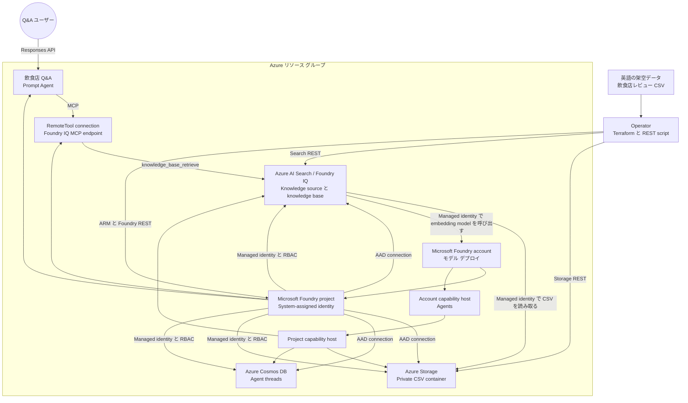

# Azure Microsoft Foundry シナリオ

このシナリオでは、Terraform を使用して Azure に Microsoft Foundry 環境をデプロイします。
Standard Agent に必要な Bring Your Own データ サービスと capability host もデプロイできます。
リソース キーは使用せず、Microsoft Entra ID と Foundry プロジェクトの managed identity を使用します。
デプロイ後は、連番の POSIX shell script を使用して架空の飲食店レビュー データをアップロードし、
Foundry IQ knowledge source と knowledge base、MCP 接続を使用する Prompt Agent、Q&A を構築できます。

## アーキテクチャ



## 前提条件

* Azure サブスクリプション
* 対象のサブスクリプションへサインイン済みの Azure CLI
* Terraform 1.11 以降
* POSIX 互換 shell、`curl`、`jq`
* デプロイ対象のデータ サービスに role assignment を作成する権限

共通の [Azure 認証](../../../docs/tips/provider-authentication.ja.md)、
[Terraform ワークフロー](../../../docs/tips/terraform-workflow.ja.md)、および必要に応じて
[Azure Blob Storage バックエンド](../../../docs/tips/azure-blob-backend.ja.md)のガイダンスに従ってください。
リポジトリの Makefile を使用する場合は、`SCENARIO=azure_microsoft_foundry` を設定します。

## 使用方法

### モデル デプロイ

既定では、Microsoft Foundry アカウントに次のモデルをデプロイします。

| デプロイ名およびモデル       | バージョン   | SKU              | Capacity |
|------------------------------|----------------|------------------|---------:|
| `gpt-5.6-luna`               | `2026-07-09`   | `GlobalStandard` |     1000 |
| `gpt-5.6-terra`              | `2026-07-09`   | `GlobalStandard` |     1000 |
| `gpt-5.6-sol`                | `2026-07-09`   | `GlobalStandard` |     1000 |
| `gpt-5.4-mini`               | `2026-03-17`   | `GlobalStandard` |     1000 |
| `text-embedding-3-large`     | `1`            | `GlobalStandard` |     3000 |
| `text-embedding-3-small`     | `1`            | `GlobalStandard` |     3000 |

適用前に `model_deployments` を確認し、対象のサブスクリプションおよびリージョンで利用できる
モデル、バージョン、capacity、クォータに合わせて上書きしてください。モデルをデプロイせずに
アカウントとプロジェクトだけを作成する場合は、空のリストを指定します。

```hcl
model_deployments = []
```

### Standard Agent リソース

`deploy_standard_agent` の既定値は `false` です。無効な場合は Foundry account、project、
model deployments のみを作成します。Standard Agent のリソース一式を有効にするには、
次の値を指定します。

```hcl
deploy_standard_agent = true
azure_ai_search_sku   = "standard"
```

リポジトリに含まれる `terraform.tfvars` ではこの構成を有効にしています。Terraform は次のリソースを
まとめて作成します。

* `standard` 以上のサポート対象 SKU を使用する Azure AI Search
* Terraform で container を管理しない Standard/ZRS Storage account
* Session consistency を使用する Agent thread 用 Azure Cosmos DB
* Search、Storage、Cosmos DB に対する project-scope の AAD connection
* stable `2025-06-01` API を使用する account および project capability host

データ サービスでは public network endpoint を使用します。AAD-only 認証では認証経路から
リソース キーを排除できますが、ネットワークは分離されません。Terraform は private endpoint、
private DNS zone、Search data-plane object、Agent version を作成しません。Terraform の完了後に
連番 script が Blob container、Search 管理の ingestion resource、Foundry IQ object、RemoteTool
connection、Prompt Agent を作成します。

### 認証と RBAC

Foundry account とすべての Standard Agent データ サービスで local authentication を無効にします。
`deploy_standard_agent` が有効な場合、Terraform は次の role assignment を作成します。

| Scope                  | Role                                | Assignee                 | 用途                                     |
|------------------------|-------------------------------------|--------------------------|------------------------------------------|
| Storage account        | Storage Blob Data Contributor       | Foundry project identity | Agent file の読み書き                    |
| Azure AI Search        | Search Index Data Contributor       | Foundry project identity | Index data の読み書き                    |
| Azure AI Search        | Search Service Contributor          | Foundry project identity | Search resource の管理                   |
| Azure AI Search        | Search Index Data Reader            | Foundry project identity | MCP 経由の knowledge retrieval           |
| Foundry account        | Foundry User                        | Foundry project identity | Foundry model と Agent へのアクセス      |
| Cosmos DB account      | Cosmos DB Operator                  | Foundry project identity | Account metadata の管理                  |
| `enterprise_memory` DB | Cosmos DB Built-in Data Contributor | Foundry project identity | Thread data の読み書き                   |
| Storage account        | Storage Blob Data Reader            | Search identity          | Review CSV の ingestion                  |
| Foundry account        | Cognitive Services User             | Search identity          | Ingestion 時の embedding 生成            |
| Storage account        | Storage Blob Data Contributor       | Operator                 | Review CSV のアップロードと削除          |
| Azure AI Search        | Search Service Contributor          | Operator                 | Knowledge object の管理                  |
| Azure AI Search        | Search Index Data Contributor       | Operator                 | 自動生成された index data の管理         |
| Azure AI Search        | Search Index Data Reader            | Operator                 | Direct retrieval test の実行             |
| Foundry account        | Foundry Project Manager             | Operator                 | Connection と Agent の作成               |

`operator_principal_id` の既定値は Terraform を実行する identity の object ID です。Terraform と
script を異なる principal で実行する場合や、CI で安定した principal が必要な場合は明示的に指定します。
Azure AI role の改名移行中にも失敗しないよう、Foundry role は role definition ID で割り当てます。

Terraform は control-plane role assignment の後に 60 秒待機します。その後、作成 timeout を 60 分に設定した
account capability host と project capability host を作成します。Project host が `enterprise_memory`
database を作成するため、Cosmos DB data-plane role assignment は最後に適用します。

Terraform の実行 identity には、対象 scope に対する
`Microsoft.Authorization/roleAssignments/write` が必要です。Contributor だけでは role assignment を
作成できません。Owner、必要な resource 権限と組み合わせた User Access Administrator、または必要な
action を付与した custom role を使用してください。

### Foundry IQ 飲食店 Q&A

#### データと API の設計

モック データは [data/restaurant_reviews.csv](data/restaurant_reviews.csv) です。明示的に架空とした
10 店舗について、30 件の英語レビューを格納しています。各行の `search_text` に店名、料理、住所、
緯度経度、営業時間、食事制限、店舗概要、評価、口コミを繰り返し記載しています。

> [!IMPORTANT]
> 選択した `azureBlob` knowledge source は、service 管理の固定 template から data source、skillset、
> vectorized index、indexer を作成します。CSV は Blob content として扱われ、その template によって
> chunking されます。CSV の各列が typed または filterable な Search field になる保証はありません。
> 行単位の filter や安定した column mapping が必要な場合は、明示的な index と `delimitedText`
> indexer を使用してください。

Workflow ではモデルの責務を次のように分離します。

* `text-embedding-3-large` は Blob ingestion 時に content を vectorize
* Foundry IQ は `minimal` reasoning と `extractiveData` output を使用
* `gpt-5.4-mini` Prompt Agent は取得結果から最終回答を生成

Search data-plane call では `2026-05-01-preview` API を使用します。Search resource と direct
retrieval は `knowledgebases('restaurant-reviews-kb')/retrieve` のような OData 形式の path を使用します。
MCP endpoint は異なる slash 形式の
`/knowledgebases/restaurant-reviews-kb/mcp?api-version=2026-05-01-preview` です。
RemoteTool connection では `2025-10-01-preview`、Agent では `v1` を使用します。

> [!WARNING]
> Preview API に service-level agreement はなく、本番 workload には推奨されません。本番利用前に
> Azure preview 条項、リージョン、データ境界、モデル提供状況、API の変更を確認してください。

#### Workflow の実行

Script を実行する前に Terraform を適用します。モデル デプロイは逐次実行する必要があります。

```bash
terraform apply -auto-approve -parallelism=1
```

各 script は自身の場所を基準に file を解決するため、呼び出し元の working directory に依存しません。
このシナリオへの絶対 path を `SCENARIO_DIR` に設定し、連番で実行します。

```bash
SCENARIO_DIR="/path/to/template-terraform/infra/scenarios/azure_microsoft_foundry"

"${SCENARIO_DIR}/scripts/00_validate_prerequisites.sh"
"${SCENARIO_DIR}/scripts/01_upload_restaurant_reviews.sh"
"${SCENARIO_DIR}/scripts/02_create_knowledge_source.sh"
"${SCENARIO_DIR}/scripts/03_wait_for_ingestion.sh"
"${SCENARIO_DIR}/scripts/04_create_knowledge_base.sh"
"${SCENARIO_DIR}/scripts/05_retrieve_knowledge_base.sh" \
    "Which fictional restaurants offer vegan options, and what did reviewers say?"
"${SCENARIO_DIR}/scripts/06_create_project_connection.sh"
"${SCENARIO_DIR}/scripts/07_create_agent.sh"
"${SCENARIO_DIR}/scripts/08_ask_agent.sh" \
    "Which fictional restaurant is a strong choice for a vegan dinner, and why?"
```

| Script                                    | 処理                                                          |
|-------------------------------------------|---------------------------------------------------------------|
| `00_validate_prerequisites.sh`            | Tool、output、model、login、token scope の検証                 |
| `01_upload_restaurant_reviews.sh`         | Private container の作成と Blob REST による CSV upload        |
| `02_create_knowledge_source.sh`           | Keyless Blob knowledge source と自動 index の作成              |
| `03_wait_for_ingestion.sh`                | 現在の ingestion run を待機し、item error があれば失敗         |
| `04_create_knowledge_base.sh`             | Minimal extractive Foundry IQ knowledge base の作成            |
| `05_retrieve_knowledge_base.sh`           | Direct retrieval の検証と grounding reference の表示          |
| `06_create_project_connection.sh`         | Project managed identity を使用する RemoteTool connection 作成 |
| `07_create_agent.sh`                      | MCP 対応 Prompt Agent の新しい version の作成                  |
| `08_ask_agent.sh`                         | Conversation を作成して knowledge base tool call を強制        |
| `09_cleanup.sh`                           | 連番 script で作成した resource だけを削除                     |

Step `05` の direct retrieval により、Search ingestion の問題と Agent または MCP の問題を分離できます。
Step `08` は回答、conversation ID、MCP event 数を表示します。完全な JSON response を確認する場合は
`VERBOSE_OUTPUT=true` を設定します。

#### 設定の上書き

| Environment variable             | Default                          | 用途                                 |
|----------------------------------|----------------------------------|--------------------------------------|
| `RESTAURANT_DATA_FILE`           | `data/restaurant_reviews.csv`    | Source CSV path                      |
| `CONTAINER_NAME`                 | `restaurant-reviews`             | Private Blob container               |
| `BLOB_NAME`                      | `restaurant_reviews.csv`         | Upload する Blob 名                  |
| `KNOWLEDGE_SOURCE_NAME`          | `restaurant-reviews-ks`          | Search knowledge source              |
| `KNOWLEDGE_BASE_NAME`            | `restaurant-reviews-kb`          | Search knowledge base                |
| `PROJECT_CONNECTION_NAME`        | `restaurant-reviews-kb-mcp`      | Foundry RemoteTool connection        |
| `AGENT_NAME`                     | `restaurant-qa-agent`            | Foundry Prompt Agent                 |
| `AGENT_MODEL`                    | `gpt-5.4-mini`                   | Agent model deployment               |
| `EMBEDDING_DEPLOYMENT`           | `text-embedding-3-large`         | Ingestion embedding deployment       |
| `EMBEDDING_MODEL`                | `text-embedding-3-large`         | Ingestion embedding model 名         |
| `INGESTION_TIMEOUT_SECONDS`      | `900`                            | Ingestion の最大待機時間             |
| `POLL_INTERVAL_SECONDS`          | `10`                             | Ingestion の polling 間隔            |
| `VERBOSE_OUTPUT`                 | `false`                          | 完全な REST response body の表示     |

高度なテストでは endpoint と resource の変数も Terraform output から上書きできます。Script は bearer
token、API key、connection secret を disk または標準出力へ書き込みません。

#### 再実行と cleanup

Blob upload は同名の Blob を上書きします。Knowledge source、knowledge base、project connection は
create-or-update の `PUT` を使用するため、同じ名前で再実行できます。Agent の作成は `POST` であり、
再実行するたびに同名 Agent の新しい version を作成します。Agent query ごとに新しい conversation を作成します。

Cleanup は Terraform から分離されており、正確な確認値が必要です。Agent、RemoteTool connection、
knowledge base、knowledge source と自動生成された Search object、Blob、container を削除します。
Terraform 管理の infrastructure は変更しません。

```bash
CONFIRM_CLEANUP=delete-foundry-iq-resources \
    "${SCENARIO_DIR}/scripts/09_cleanup.sh"
```

#### トラブルシューティング

* Search の `401` または `403` では、Operator に Search Service Contributor、Search Index Data
    Contributor、Search Index Data Reader があることを確認し、role assignment の伝播を待ちます。
* Blob の `403` では、Operator の Storage Blob Data Contributor と、Search identity の Storage
    Blob Data Reader を確認します。
* Embedding error では、Search identity の Cognitive Services User と
    `text-embedding-3-large` deployment を確認します。
* Agent または connection の `403` では、Operator の Foundry Project Manager と project identity の
    Foundry User を確認します。
* Ingestion failure では step `03` が表示する error を確認します。Blob が UTF-8 CSV であることを確認し、
    source の修正後に step `01` から `03` を再実行します。
* MCP の `400` または `404` では knowledge base 名を確認し、`2026-05-01-preview` を指定した
    slash 形式の MCP endpoint を維持します。
* Semantic ranker と agentic retrieval は既定の月次無料枠から開始します。無料枠を超えると、対応する
    Standard pay-as-you-go plan を別途有効にしない限り billing error が返されます。

#### 参考資料

* [Azure AI Search 2026-05-01-preview REST specification](https://raw.githubusercontent.com/Azure/azure-rest-api-specs/refs/heads/main/specification/search/data-plane/Search/preview/2026-05-01-preview/search.json)
* [Foundry IQ knowledge base と Agent の接続](https://learn.microsoft.com/azure/foundry/agents/how-to/foundry-iq-connect?tabs=foundry%2Crest)
* [Agentic retrieval solution の構築](https://learn.microsoft.com/azure/search/agentic-retrieval-how-to-create-pipeline)
* [Blob knowledge source の作成](https://learn.microsoft.com/azure/search/agentic-knowledge-source-how-to-blob)
* [Knowledge Sources REST API](https://learn.microsoft.com/rest/api/searchservice/knowledge-sources?view=rest-searchservice-2026-04-01)
* [Knowledge Bases REST API](https://learn.microsoft.com/rest/api/searchservice/knowledge-bases?view=rest-searchservice-2026-04-01)
* [Knowledge Retrieval REST API](https://learn.microsoft.com/rest/api/searchservice/knowledge-retrieval/retrieve?view=rest-searchservice-2026-04-01&tabs=HTTP)

### 単独展開用 input からの移行

`deploy_azure_ai_search` と `deploy_blob_storage` は削除されました。3 つのデータ サービスを一つの
サポート対象構成としてデプロイするには `deploy_standard_agent` を使用します。Search の `free` と
`basic` SKU は指定できません。

> [!WARNING]
> 既存環境を移行すると、LRS Storage account から ZRS account への置換と、以前管理していた
> `default` container の削除が発生する可能性があります。apply の前に plan を確認し、必要なデータを
> 保全してください。Connection を AAD に変更すると現在の構成から key 参照はなくなりますが、過去の
> remote state version に記録された key は自動削除されません。Backend のセキュリティ ポリシーに
> 従って state history を保持、ローテーション、または削除してください。

### 破棄と purge

Microsoft Foundry アカウントを通常どおり削除すると、soft-delete されます。purge しない場合、
同じアカウント名を 48 時間再利用できません。このシナリオでは Terraform の destroy-time hook を登録し、
モデル デプロイ、プロジェクト、アカウントを削除した後、リソース グループを削除する前に
`az cognitiveservices account purge` を実行します。

> [!WARNING]
> purge は元に戻せません。アカウントに関連付けられたすべてのデータとキーが完全に削除されます。
> Terraform の実行 ID には、
> `Microsoft.CognitiveServices/locations/resourceGroups/deletedAccounts/delete` 権限が必要です。
> リソース グループ スコープの `Contributor` では不十分です。サブスクリプション スコープで
> `Cognitive Services Contributor` や `Contributor` などの適切なロールを割り当ててください。
> 詳細については、[削除された Microsoft Foundry リソースの復旧または消去](https://learn.microsoft.com/azure/ai-services/recover-purge-resources)を参照してください。

destroy の前に、purge action が Terraform state に存在する必要があります。この構成を追加または更新した後は、
最初の `terraform destroy` より前に `terraform apply` を一度実行してください。権限不足で purge に失敗した場合は、
権限を付与してから `terraform destroy` を再実行します。purge が成功するまで、アカウントは soft-delete 状態で残ります。

このシナリオのモデル デプロイでは、デプロイの競合を避けるため Terraform の処理を逐次実行する必要があります。
標準の Makefile によるデプロイおよび破棄コマンドには、`-parallelism=1` のオーバーライドが含まれていません。
`model_deployments` が空でない場合は、シナリオ ディレクトリから次のコマンドを直接実行します。

```bash
# デプロイを適用し、destroy 時の purge action を登録する
terraform apply -auto-approve -parallelism=1

# 出力を確認する
terraform output

# デプロイを破棄し、Foundry アカウントを完全に purge する
terraform destroy -auto-approve -parallelism=1
```
