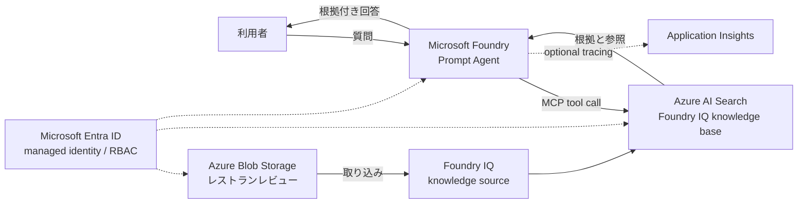
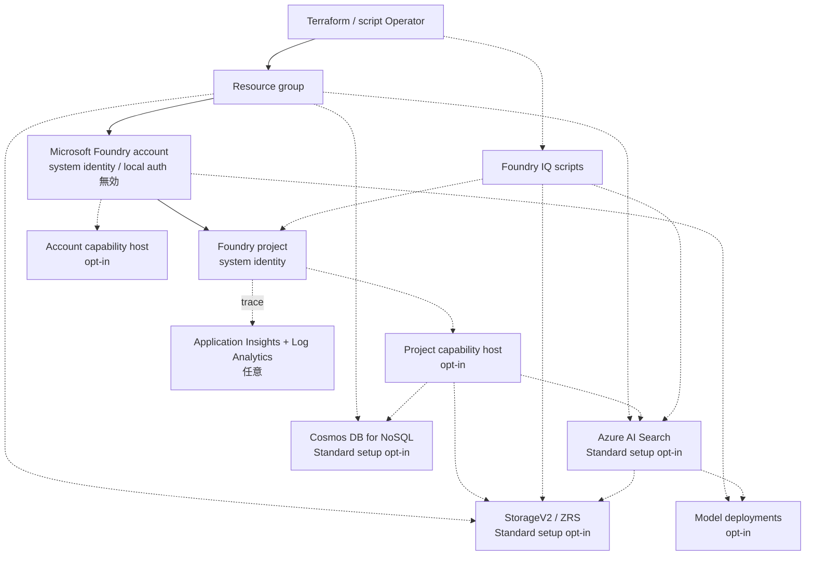

# Azure Microsoft Foundry シナリオ

## エグゼクティブサマリー

このシナリオでは、Microsoft Foundry を使った生成 AI アプリケーションの基盤を Terraform で構築し、
架空のレストランレビューに基づいて回答する Prompt Agent を実際に動かします。単にリソースを作るだけでなく、
独自データの取り込み、検索、Agent からのツール利用、根拠付き回答の確認までを一連の利用体験として学べます。

既定では、最初の学習や構成確認を低コストで始められるように、resource group、Microsoft Foundry account、
project だけをデプロイします。Foundry IQ の end-to-end workflow を試す場合は、任意の Standard setup と
model deployment を有効化します。

| 利用サービス | このシナリオでの役割 |
| --- | --- |
| Microsoft Foundry | AI project、model deployment、Prompt Agent、conversation を管理 |
| Azure Blob Storage | Agent が参照する架空のレストランレビューデータを保管 |
| Azure AI Search / Foundry IQ | Blob データを取り込み、knowledge source と knowledge base として検索可能にする |
| Model Context Protocol (MCP) | Prompt Agent から knowledge base を tool として呼び出す |
| Microsoft Entra ID / managed identity / Azure RBAC | Storage、Search、Foundry 間を local key なしで認証・認可 |
| Cosmos DB | Standard setup で Agent Service の状態を保持 |
| Application Insights（任意） | Server-side tracing を有効にした場合に OpenTelemetry span を可視化 |

このシナリオを通じて、次のことを確認できます。

- Terraform で最小構成から Foundry の data service を段階的に有効化する方法
- 独自データを knowledge source に取り込み、knowledge base から根拠付きで検索する流れ
- MCP connection を介して Prompt Agent に knowledge base を利用させる方法
- API key ではなく Microsoft Entra ID、managed identity、Azure RBAC を使う keyless 構成
- script の検証 gate と任意の tracing を使って、Agent の回答と処理経路を確認する方法


```mermaid
flowchart LR
    User[利用者] -->|質問| Agent[Microsoft Foundry<br/>Prompt Agent]
    Agent -->|MCP tool call| KB[Azure AI Search<br/>Foundry IQ knowledge base]
    Blob[Azure Blob Storage<br/>レストランレビュー] -->|取り込み| KS[Foundry IQ<br/>knowledge source]
    KS --> KB
    KB -->|根拠と参照| Agent
    Agent -->|根拠付き回答| User
    Entra[Microsoft Entra ID<br/>managed identity / RBAC] -.-> Blob
    Entra -.-> KB
    Entra -.-> Agent
    Agent -. optional tracing .-> AppInsights[Application Insights]
```

> [!IMPORTANT]
> 既定の最小構成は、後述する有料の Search、Storage、Cosmos DB、model、tracing resource を作成しません。
> 任意の end-to-end workflow は学習用であり production landing zone ではありません。有効化前に
> [境界とコスト](#境界とコスト)を確認してください。

## クイック スタート

### 前提条件

- Terraform **1.11 以降**
- Azure CLI **2.50 以降**
- Foundry account と project を作成できる Azure subscription
- 任意 workflow では `curl`、`jq`、POSIX 互換 shell、role assignment 作成権限、対応 region、
  十分な model quota

共通の [Azure 認証](../../../docs/tips/provider-authentication.ja.md)と
[Terraform workflow](../../../docs/tips/terraform-workflow.ja.md)に従ってください。既定 backend は
このリポジトリ用の Azure Blob backend です。リポジトリ外で使う場合は変更してください。

### 1. 最小 Foundry environment のデプロイ

```bash
az login
az account set --subscription "<subscription-name-or-id>"
cd infra/scenarios/azure_microsoft_foundry

terraform init
terraform validate
terraform plan
terraform apply
```

既定 plan に含まれるのは resource group、Foundry account、project、destroy-time purge hook です。
Model deployment、Standard setup、tracing resource は含まれません。

### 2. 任意: Foundry IQ workflow の有効化

デプロイする機能と model を指定する local `terraform.tfvars` を作成します。この file は repository で
ignore されます。

```hcl
enable_standard_setup = true

model_deployments = [
  {
    name     = "gpt-6-sol"
    model    = "gpt-6-sol"
    version  = "2026-09-22"
    capacity = 1000
  },
  {
    name     = "gpt-6-luna"
    model    = "gpt-6-luna"
    version  = "2026-09-22"
    capacity = 1000
  },
  {
    name     = "gpt-6-astra"
    model    = "gpt-6-astra"
    version  = "2026-09-03"
    capacity = 1000
  },
  {
    name     = "gpt-5.5"
    model    = "gpt-5.5"
    version  = "2026-04-24"
    capacity = 1000
  },
  {
    name     = "gpt-5.4-mini"
    model    = "gpt-5.4-mini"
    version  = "2026-03-17"
    capacity = 1000
  },
  {
    name     = "text-embedding-3-large"
    model    = "text-embedding-3-large"
    version  = "1"
    capacity = 3000
  },
  {
    name     = "text-embedding-3-small"
    model    = "text-embedding-3-small"
    version  = "1"
    capacity = 3000
  },
]
```

Model の提供状況、version、capacity 増分、quota は region と subscription に依存します。Apply 前に
確認してください。Capacity の単位は 1,000 token/minute です。

`operator_principal_id` は Terraform 実行 principal の object ID を既定で使用します。Script を別
principal が実行する場合だけ上書きします。

```bash
terraform plan -var="operator_principal_id=<entra-object-id>"
```

Azure model deployment は同時作成時に競合する場合があるため、Terraform を逐次実行します。

```bash
terraform apply -parallelism=1
terraform output
```

### 3. 任意の end-to-end 検証

すべての検証を順番に実行するには、次の command を実行します。

```bash
./scripts/run_all.sh
```

この command は次の gate の最初の失敗で停止します。

1. 必要な tool、Terraform output、login、token audience、model deployment が存在する
2. **新しい** Search ingestion run が 1 item 以上を処理し、失敗 0 で完了する
3. Knowledge base の direct retrieval が content と 1 件以上の grounding reference を返す
4. Prompt Agent が text と 1 件以上の MCP event を返す

各処理、呼び出し先、HTTP status などの進捗を確認するには `--verbose` を付けます。Access token や
Authorization header は表示しません。

```bash
./scripts/run_all.sh --verbose
```

個別に確認する場合は、シナリオディレクトリで次の順番に実行します。各 command に `--verbose` を付けることも
できます。

```bash
./scripts/00_validate_prerequisites.sh
./scripts/01_upload_restaurant_reviews.sh
./scripts/02_create_knowledge_source.sh
./scripts/03_wait_for_ingestion.sh
./scripts/04_create_knowledge_base.sh
./scripts/05_retrieve_knowledge_base.sh
./scripts/06_create_project_connection.sh
./scripts/07_create_agent.sh
./scripts/08_ask_agent.sh
```

質問などは環境変数で変更できます。たとえば、Prompt Agent に日本語で質問するには次を実行します。

```bash
QUESTION="ベジタリアンに向いてるレストランを教えて。" ./scripts/08_ask_agent.sh
```

既存互換の `VERBOSE_OUTPUT=true` を使うと、進捗に加えて対応している step の REST response 全体も表示します。
成功時または失敗時に script 作成データを削除する場合は次を実行します。

```bash
CLEANUP_AFTER_RUN=true ./scripts/run_all.sh
```

### 4. Cleanup

任意 script を実行した場合は、最初に script が作成した data-plane resource だけを削除します。

```bash
CONFIRM_CLEANUP=delete-foundry-iq-resources ./scripts/09_cleanup.sh
```

続いて Terraform 管理 infrastructure を破棄します。

```bash
terraform destroy -parallelism=1
```

Destroy は soft-delete された Foundry account を完全に purge します。そのため Terraform 実行 identity
には、subscription scope で
`Microsoft.CognitiveServices/locations/resourceGroups/deletedAccounts/delete` が必要です。
適切な `Cognitive Services Contributor` または `Contributor` などを使用してください。Purge は
取り消せません。

## デプロイされるもの


```mermaid
flowchart TD
    Operator["Terraform / script Operator"]
    RG["Resource group"]
    Account["Microsoft Foundry account<br/>system identity / local auth 無効"]
    Project["Foundry project<br/>system identity"]
    Models["Model deployments<br/>opt-in"]
    Search["Azure AI Search<br/>Standard setup opt-in"]
    Storage["StorageV2 / ZRS<br/>Standard setup opt-in"]
    Cosmos["Cosmos DB for NoSQL<br/>Standard setup opt-in"]
    AccountHost["Account capability host<br/>opt-in"]
    ProjectHost["Project capability host<br/>opt-in"]
    Insights["Application Insights + Log Analytics<br/>任意"]
    Scripts["Foundry IQ scripts"]

    Operator --> RG
    RG --> Account
    Account --> Project
    Account -.-> Models
    RG -.-> Search
    RG -.-> Storage
    RG -.-> Cosmos
    Account -.-> AccountHost
    Project -.-> ProjectHost
    ProjectHost -.-> Search
    ProjectHost -.-> Storage
    ProjectHost -.-> Cosmos
    Operator -.-> Scripts
    Scripts -.-> Storage
    Scripts -.-> Search
    Scripts -.-> Project
    Search -.-> Storage
    Search -.-> Models
    Project -. "trace" .-> Insights
```

実線の Foundry account/project 経路が既定です。Model deployment、点線側の data service、connection、
role、capability host、tracing は opt-in です。Script が管理するのは任意の sample Blob container/file、
Search knowledge object、RemoteTool connection、Prompt Agent version、一時 conversation だけです。

### Sample 用 model deployment 例

`model_deployments` の既定値は `[]` です。任意 workflow の quick start では次の model を例示します。

| Deployment / model | Version | SKU | Capacity | Version upgrade |
| --- | --- | --- | ---: | --- |
| `gpt-6-sol` | `2026-09-22` | `GlobalStandard` | 1000 | `NoAutoUpgrade` |
| `gpt-6-luna` | `2026-09-22` | `GlobalStandard` | 1000 | `NoAutoUpgrade` |
| `gpt-6-astra` | `2026-09-03` | `GlobalStandard` | 1000 | `NoAutoUpgrade` |
| `gpt-5.5` | `2026-04-24` | `GlobalStandard` | 1000 | `NoAutoUpgrade` |
| `gpt-5.4-mini` | `2026-03-17` | `GlobalStandard` | 1000 | `NoAutoUpgrade` |
| `text-embedding-3-large` | `1` | `GlobalStandard` | 3000 | `NoAutoUpgrade` |
| `text-embedding-3-small` | `1` | `GlobalStandard` | 3000 | `NoAutoUpgrade` |

これらは例であり暗黙の既定値ではありません。Model の提供状況、許容 capacity 増分、quota、Agent
Service 互換性は region と subscription に依存します。`GlobalStandard` は resource region 外で request
を処理する場合があります。Data residency が必要な場合は data-zone または regional deployment type を
使用してください。

### 主な input

| Input | Default | 用途 |
| --- | --- | --- |
| `location` | `japaneast` | Azure region |
| `enable_standard_setup` | `false` | 利用者管理の Search、Storage、Cosmos DB、connection、capability host を作成 |
| `azure_ai_search_sku` | `standard` | Search tier。`basic` とサポート対象の上位 tier を指定可能 |
| `enable_tracing` | `false` | Entra-only Application Insights tracing を追加 |
| `operator_principal_id` | Terraform principal | Script 実行を許可する principal |
| `enable_operator_cosmosdb_read_access` | `false` | `enterprise_memory` の read-only 調査権限を追加 |
| `model_deployments` | `[]` | 任意の model、version、SKU、capacity、upgrade 動作 |

既定では Foundry account と project だけを作成します。Standard setup、model、tracing、Operator の
Cosmos 調査権限は、それぞれ明示 input が必要です。

`deploy_standard_agent` は削除しました。既存 variable file は次のように変更してください。

```hcl
# 変更前
deploy_standard_agent = true

# 現在
enable_standard_setup = true
```

### 主な output

Script は `terraform output -json` を自動的に読み取ります。利用者が確認しやすい output は次のとおりです。

- Foundry account 名と OpenAI endpoint
- Foundry project 名、resource ID、project endpoint
- 任意の model deployment ID（既定は空）
- 任意の Search、Storage、Cosmos DB の名前と endpoint
- 任意の capability host と project connection の ID
- 任意の Log Analytics と Application Insights の ID

Endpoint は公開 resource identifier であり credential ではありません。Terraform state や診断 output 全体を
公開しないでください。

## Security と認可

このシナリオの認証経路はすべて keyless です。

- Foundry、Search、Storage、Cosmos DB の local/key authentication を無効化
- Standard store connection は `authType = "AAD"` を使用
- Foundry IQ RemoteTool connection は `ProjectManagedIdentity` を使用
- Tracing は `ProjectManagedIdentity` と local authentication 無効の Application Insights を使用
- Script は ARM、Storage、Search、Foundry ごとに Azure CLI token を取得

次の role assignment は Standard setup を有効にした場合だけ作成します。

| Assignee | Scope | Role |
| --- | --- | --- |
| Project identity | Storage account | Storage Account Contributor |
| Project identity | Project file container pattern | Storage Blob Data Contributor |
| Project identity | Project agent container pattern | Storage Blob Data Owner |
| Project identity | Search service | Search Service Contributor、Search Index Data Contributor |
| Project identity | Cosmos DB account / `enterprise_memory` | Cosmos DB Operator、Cosmos DB Built-in Data Contributor |
| Project identity | Foundry account | Foundry User |
| Search identity | Source Storage / Foundry account | Storage Blob Data Reader、Cognitive Services User |
| Operator | Sample Storage / Search | Storage Blob Data Contributor、Search Service Contributor、Search Index Data Contributor |
| Operator | Foundry account | Foundry User、Foundry Project Manager |

Storage data role は account scope で割り当てますが、Azure ABAC condition によって project 内部 workspace ID
を prefix とする service-managed container suffix だけへ制限します。Data Contributor に必要な read が
含まれるため、Search Index Data Reader は重複して追加しません。

任意の Cosmos 調査権限は account の ARM `Reader` と `enterprise_memory` だけの Cosmos DB Built-in Data
Reader です。Agent state には prompt、response、conversation state、Agent metadata が含まれる可能性が
あるため、信頼できる Operator だけに付与してください。

## Standard setup の互換性

Standard setup を有効にすると、stable ARM API `2026-07-01` の account/project capability host を
使用します。Microsoft は現在 `capabilitySettings` を推奨していますが、この preview は現時点で
UK South と Canada Central に限定されています。Japan East では capability host がサポート対象経路です。

AzAPI 2.13 は `2026-07-01` schema をまだ内蔵していないため、公式に記載されたこれらの Foundry ARM
resource だけ embedded provider validation を無効化しています。Provider schema が追従するまで Terraform
mock test で resource type と payload を検証します。

Capability host は account/project scope ごとに 1 つだけ作成でき、更新できません。Terraform は設定値が
変わると replacement し、固定 sleep の代わりに既知の一時的な authorization/provisioning error を
bounded retry します。

Project identity は次の利用者管理 resource にアクセスします。

- Agent file 用 Storage
- Vector store 用 Search
- Agent state 用 Cosmos DB `enterprise_memory`

Connection は secret を保持しないため Key Vault は作成しません。Private endpoint と BYO VNet も対象外です。

## Foundry IQ / Prompt Agent workflow

この workflow には `enable_standard_setup = true`、互換性のある chat deployment、embedding deployment が
必要です。既定の最小構成では実行できません。

### 主 command

[`scripts/run_all.sh`](./scripts/run_all.sh) は連番 script を順番に実行します。問題の切り分けや高度な設定時だけ
個別 step を実行してください。

| Script | 処理 |
| --- | --- |
| `00_validate_prerequisites.sh` | Tool、output、model、login、token audience を検証 |
| `01_upload_restaurant_reviews.sh` | Private container を作成して CSV を upload |
| `02_create_knowledge_source.sh` | Keyless Blob knowledge source を作成/更新 |
| `03_wait_for_ingestion.sh` | 新しい generated-indexer run を選択または開始して完了を検証 |
| `04_create_knowledge_base.sh` | Extractive knowledge base を作成/更新 |
| `05_retrieve_knowledge_base.sh` | Direct retrieval の grounding content/reference を必須化 |
| `06_create_project_connection.sh` | Managed identity RemoteTool connection を作成/更新 |
| `07_create_agent.sh` | MCP 対応 Prompt Agent の新 version を作成 |
| `08_ask_agent.sh` | Answer と MCP event を必須化し、一時 conversation を削除 |
| `09_cleanup.sh` | Script 作成 resource を削除し、Search の削除完了を待機 |

Blob knowledge source は sample CSV を 1 source file として扱うため、reference は CSV row 単位ではなく
file 単位です。データは架空です。

### API version

| Surface | Version |
| --- | --- |
| Foundry ARM account/project/deployment/connection/capability host | `2026-07-01` |
| Azure AI Search data plane / MCP endpoint | `2026-08-01-preview` |
| Foundry RemoteTool project connection | `2025-10-01-preview` |
| Foundry Agent Service | `v1` |
| Azure Storage data plane | `2026-04-06` |

### Script の上書き

| Environment variable | Default |
| --- | --- |
| `RESTAURANT_DATA_FILE` | `data/restaurant_reviews.csv` |
| `CONTAINER_NAME` / `BLOB_NAME` | `restaurant-reviews` / `restaurant_reviews.csv` |
| `KNOWLEDGE_SOURCE_NAME` / `KNOWLEDGE_BASE_NAME` | `restaurant-reviews-ks` / `restaurant-reviews-kb` |
| `PROJECT_CONNECTION_NAME` / `AGENT_NAME` | `restaurant-reviews-kb-mcp` / `restaurant-qa-agent` |
| `AGENT_MODEL` | `gpt-5.4-mini` |
| `EMBEDDING_DEPLOYMENT` / `EMBEDDING_MODEL` | `text-embedding-3-large` |
| `INGESTION_TIMEOUT_SECONDS` / `POLL_INTERVAL_SECONDS` | `900` / `10` |
| `CLEANUP_TIMEOUT_SECONDS` | `300` |
| `QUESTION` | Script ごとの既定の英語質問 |
| `KEEP_CONVERSATION` | `false` |
| `CLEANUP_AFTER_RUN` | `false` |
| `VERBOSE_OUTPUT` | `false` |

環境変数を command の前に指定すると、sample data、resource 名、利用 model、timeout、質問などを
Terraform-managed infrastructure を変更せずに調整できます。`05_retrieve_knowledge_base.sh` と
`08_ask_agent.sh` は positional question も引き続き利用でき、positional question は `QUESTION` より優先されます。

```bash
QUESTION="ベジタリアンに向いてるレストランを教えて。" ./scripts/08_ask_agent.sh --verbose
AGENT_MODEL="gpt-5.4-mini" ./scripts/07_create_agent.sh
POLL_INTERVAL_SECONDS=5 INGESTION_TIMEOUT_SECONDS=600 ./scripts/03_wait_for_ingestion.sh
```

Knowledge source、knowledge base、connection、Blob upload は同名で再実行できます。Agent 作成は同名 Agent の
新 version を追加します。Q&A script は既定で conversation を削除します。調査のために残す場合は
`KEEP_CONVERSATION=true` を設定し、その ID を cleanup に渡します。

```bash
KEEP_CONVERSATION=true ./scripts/08_ask_agent.sh
CONVERSATION_ID="<id>" \
  CONFIRM_CLEANUP=delete-foundry-iq-resources \
  ./scripts/09_cleanup.sh
```

## Tracing

Plan と apply の両方で tracing を有効にします。

```bash
terraform plan -var="enable_tracing=true"
terraform apply -parallelism=1 -var="enable_tracing=true"
```

Terraform は 30 日保持の Log Analytics workspace、workspace-based Application Insights、
project-scope の `AppInsights` connection、必要な role を作成します。Agent request 後 2 から 5 分待ち、
Microsoft Foundry の **Agents > Traces** を確認してください。

Identity-based trace ingestion は preview です。Trace には prompt、model input/output、tool
argument/result、latency、token 使用量、error が含まれる可能性があります。有効化前に privacy、retention、
access 要件を適用してください。

## 境界とコスト

- Foundry account/project は public endpoint を使います。任意の Standard setup service も public
  endpoint を使います。Microsoft Entra 認証は key を排除しますが network traffic を分離しません。
- Standard setup を有効にした場合、上書きしなければ Search は Standard/S1、1 replica です。Sample には
  十分ですが query SLA はありません。Public keyless path では Basic も指定できます。Private Blob
  execution に必要な S2 以上は対象外です。
- Semantic ranker と agentic retrieval は別々の月次無料枠から開始します。無料枠を超えると、それぞれの
  Standard pay-as-you-go plan を有効にしない限り billing error になります。
- 任意の Cosmos DB は provisioned throughput を使います。Microsoft の account 最低要件は 3,000 RU/s
  です。New runtime は 1,000 RU/s container を 2 つ使い、classic compatibility ではさらに 3 つ
  追加されるため、両方を使う場合は project ごとに最大 5,000 RU/s を想定します。
- 最小構成でも Foundry account/project に該当する料金が発生する場合があります。任意の Storage、Search、
  Cosmos DB、model token、trace ingestion/retention は追加料金になります。
- Private network、Key Vault/CMK、alert、dashboard、application UI、document-level ACL passthrough、
  application 固有の Responsible AI/evaluation test は対象外です。

## トラブルシューティング

- **Model deployment 失敗:** Region、version、SKU、capacity 増分、quota を確認します。
- **Capability host 失敗:** 上記 project identity role と RBAC 伝播を確認します。Retry は 30 分の create
  timeout で終了します。
- **Blob `403`:** Operator の Blob Data Contributor と Search identity の Blob Data Reader を確認します。
- **Search `401`/`403`:** Operator の Search Service Contributor と Search Index Data Contributor を確認します。
- **Ingestion 失敗:** Step `03` の item error を確認します。古い完了 run を成功扱いしません。
- **Retrieval billing error:** Semantic ranker と Knowledge retrieval の両 plan を確認します。
- **MCP `400`/`404`:** Knowledge base 名と `2026-08-01-preview` の slash-style MCP endpoint を確認します。
- **Agent/connection `403`:** Operator の Foundry User/Foundry Project Manager と project identity の
  Foundry User を確認します。
- **Trace なし:** `AppInsights` connection が 1 つであること、Monitoring Metrics Publisher、local auth
  無効、2 から 5 分の遅延を確認します。
- **Cosmos Data Explorer `403`:** 任意の read access を有効にし、Entra ID RBAC login を使用します。

## Contributor 向け検証

Repository check に Azure access は不要です。

```bash
terraform init -backend=false
terraform fmt -check
terraform validate
terraform test
./scripts/tests/test_scripts.sh
```

Offline script test は Terraform、Azure CLI、REST call を stub します。Fresh ingestion の選択、partial
retrieval、grounding/MCP gate、一時 conversation cleanup、Search cleanup polling を検証します。

## 参考資料

- [Microsoft Foundry](https://learn.microsoft.com/azure/foundry/what-is-foundry)
- [Foundry Agent Service Standard setup](https://learn.microsoft.com/azure/foundry/agents/concepts/standard-agent-setup)
- [Capability host](https://learn.microsoft.com/azure/foundry/agents/concepts/capability-hosts)
- [Capability settings](https://learn.microsoft.com/azure/foundry/how-to/configure-capability-settings)
- [Agent と Foundry IQ の接続](https://learn.microsoft.com/azure/foundry/agents/how-to/foundry-iq-connect)
- [Blob knowledge source](https://learn.microsoft.com/azure/search/agentic-knowledge-source-how-to-blob)
- [Agentic retrieval](https://learn.microsoft.com/azure/search/agentic-retrieval-overview)
- [Foundry RBAC](https://learn.microsoft.com/azure/foundry/concepts/rbac-foundry)
- [Microsoft Entra ID による trace ingestion](https://learn.microsoft.com/azure/foundry/observability/how-to/trace-ingestion-entra-authentication)
- [Foundry model deployment type](https://learn.microsoft.com/azure/foundry/foundry-models/concepts/deployment-types)
- [Azure OpenAI quota と制限](https://learn.microsoft.com/azure/foundry/openai/quotas-limits)
- [Azure AI Search API version](https://learn.microsoft.com/azure/search/search-api-versions)
- [Cosmos DB data-plane role](https://learn.microsoft.com/azure/cosmos-db/reference-data-plane-security)
