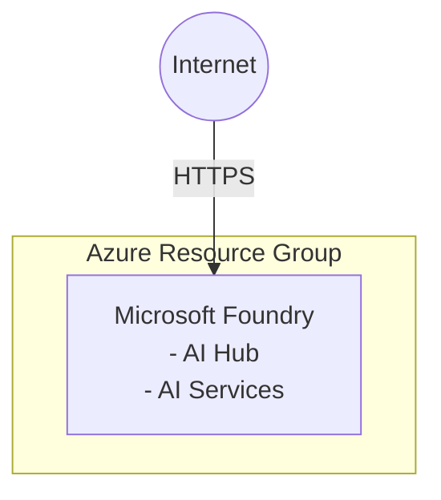

# Azure Microsoft Foundry Scenario

This scenario deploys a Microsoft Foundry environment on Azure using Terraform. It sets up the necessary infrastructure components to run Microsoft Foundry workloads.

## Architecture



## Prerequisites

- Terraform CLI installed
- Azure CLI installed
- Azure subscription

## How to use

```shell
# Log in to Azure
az login

# (Optional) Confirm the details for the currently logged-in user
az ad signed-in-user show

# Set environment variables
export ARM_SUBSCRIPTION_ID=$(az account show --query id --output tsv)

# Initialize Terraform
terraform init

# Plan the deployment
terraform plan

# Apply the deployment
terraform apply -auto-approve -parallelism=1

# Confirm the output
terraform output

# Confirm the state file
cat terraform.tfstate

# Destroy the deployment
terraform destroy -auto-approve -parallelism=1
```
