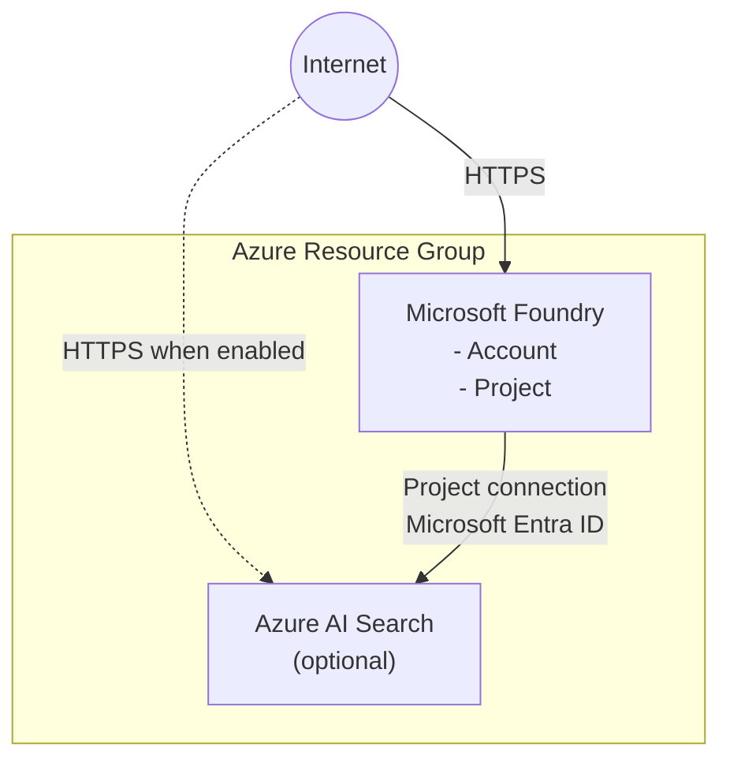

# Azure Microsoft Foundry Scenario

This scenario deploys a Microsoft Foundry environment on Azure using Terraform.
It can also deploy an Azure AI Search service for use as the retrieval
infrastructure underlying Foundry IQ.

## Architecture


```mermaid
flowchart TB
    Internet((Internet))

    subgraph Azure["Azure Resource Group"]
        MF["Microsoft Foundry<br/>- Account<br/>- Project"]
        Search["Azure AI Search<br/>(optional)"]
    end

    Internet -->|HTTPS| MF
    Internet -.->|HTTPS when enabled| Search
    MF -->|Project connection<br/>Microsoft Entra ID| Search
```

## Prerequisites

- Azure subscription

Follow the shared [Azure authentication](../../../docs/tips/provider-authentication.md),
[Terraform workflow](../../../docs/tips/terraform-workflow.md), and optional
[Azure Blob Storage backend](../../../docs/tips/azure-blob-backend.md) guidance.
Set `SCENARIO=azure_microsoft_foundry` when using the repository Makefile.

## How to use

Azure AI Search is disabled by default. Add the following values to a
`terraform.tfvars` file to deploy it and connect it to the Microsoft Foundry
project:

```hcl
deploy_azure_ai_search = true
azure_ai_search_sku    = "free"
```

Set `azure_ai_search_sku` to `basic`, `standard`, `standard2`, `standard3`,
`storage_optimized_l1`, or `storage_optimized_l2` to use another supported
tier. Availability and quota requirements vary by subscription and region.

> [!NOTE]
> The default SKU is `free`, which is the lowest-cost option recommended for a
> Foundry IQ proof of concept. See the
> [Azure AI Search Terraform quickstart](https://learn.microsoft.com/en-us/azure/search/search-get-started-terraform),
> [Foundry IQ overview](https://learn.microsoft.com/en-us/azure/foundry/agents/concepts/what-is-foundry-iq),
> [Azure AI Search stable REST API specifications](https://github.com/Azure/azure-rest-api-specs/tree/main/specification/search/data-plane/Search/stable),
> and [Microsoft Foundry project connection ARM schema](https://learn.microsoft.com/en-us/azure/templates/microsoft.cognitiveservices/accounts/projects/connections).

When enabled, Terraform creates a project-scoped `CognitiveSearch` connection
that uses Microsoft Entra ID authentication. It grants the Foundry project
system-assigned managed identity the `Search Index Data Contributor` and
`Search Service Contributor` roles on the Azure AI Search service. The
connection does not store an Azure AI Search API key in Terraform state.

Terraform provisions the connection through the Azure Resource Manager control
plane with AzAPI. The [Foundry Connections API](https://ai.azure.com/api-reference/connections/list)
can list and retrieve the resulting connection but does not create it.

This option does not create a knowledge base, knowledge source, index, indexer,
or agent.

The standard Makefile deploy and destroy commands do not include the
`-parallelism=1` override. Run these direct commands from the scenario directory
when that override is required:

```bash
# Apply the deployment
terraform apply -auto-approve -parallelism=1

# Confirm the output
terraform output

# Destroy the deployment
terraform destroy -auto-approve -parallelism=1
```
