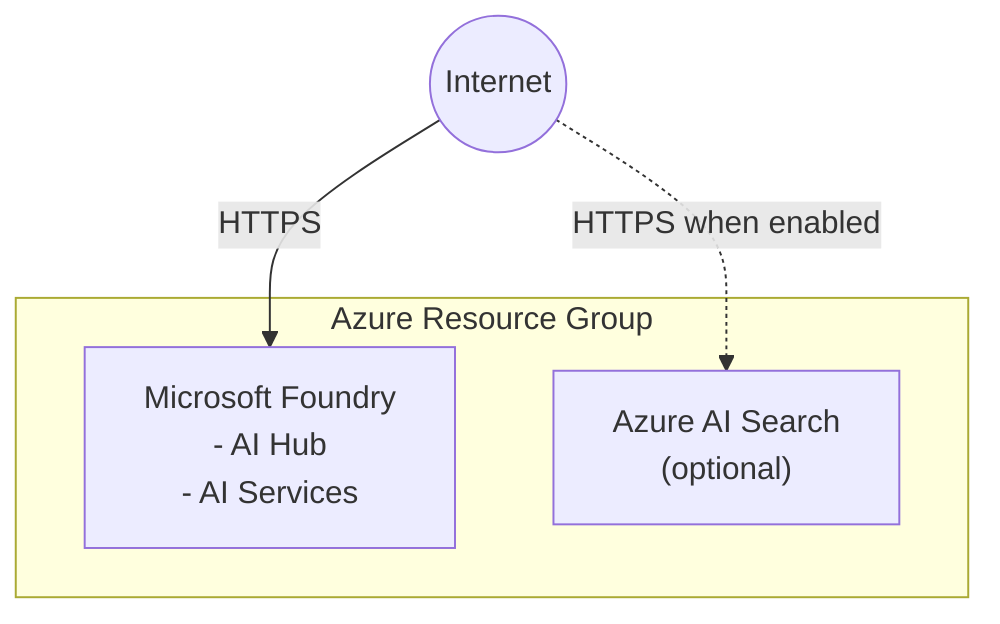

# Azure Microsoft Foundry Scenario

This scenario deploys a Microsoft Foundry environment on Azure using Terraform.
It can also deploy an Azure AI Search service for use as the retrieval
infrastructure underlying Foundry IQ.

## Architecture


```mermaid
flowchart TB
    Internet((Internet))

    subgraph Azure["Azure Resource Group"]
        MF["Microsoft Foundry<br/>- AI Hub<br/>- AI Services"]
        Search["Azure AI Search<br/>(optional)"]
    end

    Internet -->|HTTPS| MF
    Internet -.->|HTTPS when enabled| Search
```

## Prerequisites

- Azure subscription

Follow the shared [Azure authentication](../../../docs/tips/provider-authentication.md),
[Terraform workflow](../../../docs/tips/terraform-workflow.md), and optional
[Azure Blob Storage backend](../../../docs/tips/azure-blob-backend.md) guidance.
Set `SCENARIO=azure_microsoft_foundry` when using the repository Makefile.

## How to use

Azure AI Search is disabled by default. Add the following values to a
`terraform.tfvars` file to deploy it:

```hcl
deploy_azure_ai_search = true
azure_ai_search_sku    = "free"
```

Set `azure_ai_search_sku` to `basic`, `standard`, `standard2`, `standard3`,
`storage_optimized_l1`, or `storage_optimized_l2` to use another supported
tier. Availability and quota requirements vary by subscription and region.

> [!NOTE]
> The default SKU is `free`, which is the lowest-cost option recommended for a
> Foundry IQ proof of concept. See the
> [Azure AI Search Terraform quickstart](https://learn.microsoft.com/en-us/azure/search/search-get-started-terraform),
> [Foundry IQ overview](https://learn.microsoft.com/en-us/azure/foundry/agents/concepts/what-is-foundry-iq),
> and [Azure AI Search stable REST API specifications](https://github.com/Azure/azure-rest-api-specs/tree/main/specification/search/data-plane/Search/stable).

This option creates the Azure AI Search service only. It does not create a
knowledge base, knowledge source, index, indexer, role assignment, or connection
to a Foundry agent.

The standard Makefile deploy and destroy commands do not include the
`-parallelism=1` override. Run these direct commands from the scenario directory
when that override is required:

```bash
# Apply the deployment
terraform apply -auto-approve -parallelism=1

# Confirm the output
terraform output

# Destroy the deployment
terraform destroy -auto-approve -parallelism=1
```
