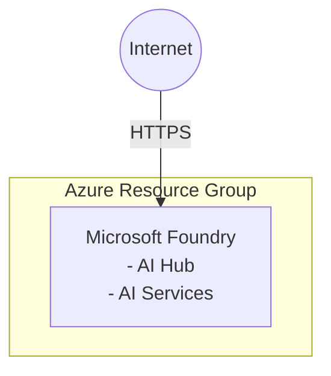

# Azure Microsoft Foundry Scenario

This scenario deploys a Microsoft Foundry environment on Azure using Terraform. It sets up the necessary infrastructure components to run Microsoft Foundry workloads.

## Architecture


```mermaid
flowchart TB
    Internet((Internet))

    subgraph Azure["Azure Resource Group"]
        MF["Microsoft Foundry<br/>- AI Hub<br/>- AI Services"]
    end

    Internet -->|HTTPS| MF
```

## Prerequisites

- Azure subscription

Follow the shared [Azure authentication](../../../docs/tips/provider-authentication.md),
[Terraform workflow](../../../docs/tips/terraform-workflow.md), and optional
[Azure Blob Storage backend](../../../docs/tips/azure-blob-backend.md) guidance.
Set `SCENARIO=azure_microsoft_foundry` when using the repository Makefile.

## How to use

The standard Makefile deploy and destroy commands do not include the
`-parallelism=1` override. Run these direct commands from the scenario directory
when that override is required:

```bash
# Apply the deployment
terraform apply -auto-approve -parallelism=1

# Confirm the output
terraform output

# Destroy the deployment
terraform destroy -auto-approve -parallelism=1
```
