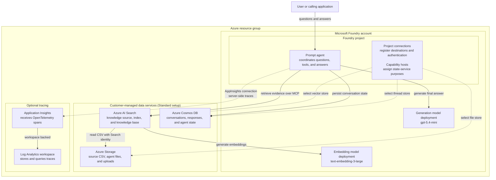

# Azure Microsoft Foundry Scenario

This scenario deploys a Microsoft Foundry environment on Azure using Terraform.
It can also deploy the bring-your-own data services and capability hosts required
for Foundry Agent Service Standard setup. Microsoft Entra ID and the Foundry
project managed identity are used instead of resource keys. Optional server-side
agent tracing sends OpenTelemetry spans to workspace-based Application Insights.
Numbered POSIX shell scripts can then upload a fictional restaurant review
dataset, create a Foundry IQ knowledge source and knowledge base, connect them to
a prompt agent over MCP, and run grounded Q&A.

## Concepts used in this README

This section defines the terms needed to follow the scenario without requiring
prior Microsoft Foundry context. Product and API object names remain in English
so that they can be matched directly to the portal and official documentation.

### Foundry building blocks

| Term | Plain-language meaning | Use in this scenario |
| --- | --- | --- |
| [Microsoft Foundry account](https://learn.microsoft.com/azure/foundry/what-is-foundry) | The parent Azure resource that groups projects and model deployments. | Terraform creates one account. |
| [Foundry project](https://learn.microsoft.com/azure/foundry/how-to/create-projects) | A workspace that groups agents, connections, and conversations. Agents in one project share its connected stores, while data is isolated from other projects. | Terraform creates one project in the account. |
| [Model deployment](https://learn.microsoft.com/azure/foundry/foundry-models/concepts/deployment-types) | A selected model and version made callable through an API under a deployment name, processing mode (SKU), and capacity. It isn't an agent. | Terraform creates the entries specified by `model_deployments`. |
| [Foundry Agent Service](https://learn.microsoft.com/azure/foundry/agents/overview) | A Microsoft service that manages agent definitions, execution, and conversation state. It isn't a large language model (LLM) by itself; it runs agents that combine models and tools. | It runs the prompt agent described below. |
| [Prompt agent](https://learn.microsoft.com/azure/foundry/agents/quickstarts/prompt-agent) | An agent defined as configuration: instructions, a model, and tools. Foundry runs it, unlike a hosted agent for which the developer supplies application code or a container. | Script `07` creates a prompt agent version. |

### Basic setup and Standard setup

A **setup** is the Agent Service environment configuration that determines where
the service stores state. State includes uploaded files, retrieval vector stores,
conversations, and agent definitions. See
[Set up your agent environment](https://learn.microsoft.com/azure/foundry/agents/environment-setup#choose-your-setup)
for the official comparison.

| Setup | Where agent state is stored | What the customer manages | Used here |
| --- | --- | --- | --- |
| [Basic setup](https://learn.microsoft.com/azure/foundry/agents/environment-setup#choose-your-setup) | Built-in, Microsoft-managed platform stores | Foundry account, project, models, and related configuration | No |
| [Standard setup](https://learn.microsoft.com/azure/foundry/agents/concepts/standard-agent-setup) | Storage, Search, and Cosmos DB resources dedicated to the customer in the customer's Azure subscription | The Basic resources plus the three data services, connections, and permissions | Yes |
| [Standard setup with Bring Your Own (BYO) virtual network](https://learn.microsoft.com/azure/foundry/agents/how-to/virtual-networks) | The same customer-managed resources as Standard setup, with traffic restricted to the customer's virtual network | Private endpoints, DNS, network policy, and related resources as well | No |

Therefore, **Standard describes the data-storage setup, not a model, model SKU,
agent type, or inference-performance tier**. This scenario runs a prompt agent on
Standard setup with public endpoints.

### Resource connections and authentication

| Term | Meaning in this README |
| --- | --- |
| [Managed identity](https://learn.microsoft.com/entra/identity/managed-identities-azure-resources/overview) | A Microsoft Entra identity assigned to an Azure resource. Azure manages its credentials, so the resource can obtain access tokens without storing passwords or resource keys in code or Terraform state. This scenario primarily uses the Foundry project identity and Search identity. |
| [Keyless authentication](https://learn.microsoft.com/azure/foundry/concepts/authentication-authorization-foundry) | Authentication with short-lived access tokens issued by Microsoft Entra ID instead of Storage or Search resource keys, API keys, or connection strings. It doesn't mean that authentication is absent. |
| [Azure RBAC](https://learn.microsoft.com/azure/role-based-access-control/overview) | Authorization through role assignments that answer "which identity can perform which actions at which scope?" An identity can obtain a token but still receive `403` if it lacks the required role on the target resource. |
| [Project connection](https://learn.microsoft.com/azure/foundry/how-to/connections-add) | A configuration object that tells a Foundry project how to refer to an external resource. It records details such as the target API URL (endpoint), resource ID, and authentication method; it doesn't copy the Storage or Search data. |
| [Capability host](https://learn.microsoft.com/azure/foundry/agents/concepts/capability-hosts) | An ARM configuration object under a Foundry account or project that tells Agent Service which connections to use. It isn't an application host or server. The account capability host enables Agent Service for the account; the project capability host selects the Storage, Search, and Cosmos DB connections for that project. |
| [Access-token audience](https://learn.microsoft.com/entra/identity-platform/access-tokens) | The identifier of the API that should accept a token. ARM, Storage, Search, and Foundry are separate APIs, so the same identity obtains a token for each audience. A scope such as `https://search.azure.com/.default` asks Microsoft Entra ID for a token intended for that API. |

### Agent state and tracing

Agent state and observability traces can show similar run details, but they have
different purposes and stores:

| Data | Purpose | Store in this scenario |
| --- | --- | --- |
| Conversation, response, run state, and agent definition | Stateful agent execution and multi-turn context | Cosmos DB `enterprise_memory` |
| OpenTelemetry spans for model calls, tool calls, latency, token use, and errors | Debugging, monitoring, and trace-based analysis | Application Insights backed by Log Analytics |

Conversation results are available from Foundry Agent Service even when tracing
is disabled. The Foundry **Traces** page can display those results alongside
ingested spans, which can make the two data sources look like one feature.
Application Insights spans are collected only after `enable_tracing` creates an
`AppInsights` project connection.

#### Why capability hosts exist

Project connections and capability hosts work together, but they have different
jobs. In plain terms, **a connection is an address-book entry for a resource; a
capability host is an assignment table that tells Agent Service which entry to
use for each purpose**.

A Foundry project can contain multiple connections to services such as Search
and Storage. The presence of a connection alone doesn't tell Agent Service which
one should store files or which one should store conversations. A capability
host assigns those purposes to connections so that every agent in the project
uses the same stores consistently. Its reason for existing is to keep reusable
connection details separate from Agent Service-specific storage configuration.

| Configuration element | What it does | What it doesn't do |
| --- | --- | --- |
| Project connection | Registers the target resource's endpoint, resource ID, and authentication method | Doesn't select its purpose in Agent Service |
| Account capability host | Enables Agent Service for the Foundry account | Doesn't automatically select stores for a project |
| Project capability host | Assigns a Storage connection to `storageConnections`, Search to `vectorStoreConnections`, and Cosmos DB to `threadStorageConnections` | Doesn't store data itself or proxy requests |
| Managed identity and RBAC | Provide the identity and permissions that can actually use the assigned resource | Don't select which store Agent Service uses |

With Basic setup, no capability hosts are created and Agent Service uses the
Microsoft-managed default stores. Standard setup requires capability hosts at
both account and project scopes. At runtime, Agent Service reads the project
capability host, resolves the connection for each purpose, and uses managed
identity and RBAC to access the target Storage, Search, or Cosmos DB service.

A capability host isn't a database, compute host, or network gateway. It holds
no agent data and grants no permissions. Only one capability host can be active
at each account or project scope; changing the selected stores requires deleting
it and recreating it with the new configuration.

### Knowledge retrieval

| Term | Meaning in this README |
| --- | --- |
| [Foundry IQ](https://learn.microsoft.com/azure/foundry/agents/concepts/what-is-foundry-iq) | A knowledge layer that lets agents search private data. It brings together knowledge sources and knowledge bases backed by Azure AI Search. |
| [Knowledge source](https://learn.microsoft.com/azure/search/agentic-knowledge-source-overview) | An object that describes where searchable data comes from and how to ingest it. Here it points to the CSV in Blob Storage, and the service generates a pipeline that splits long content into searchable passages (chunking), creates embeddings, and builds a search index. |
| [Embeddings and vector search](https://learn.microsoft.com/azure/search/vector-search-overview) | An embedding represents the meaning of text as numbers. Vector search uses the distance between those numbers to find passages whose meaning is close to a question. |
| [Knowledge base](https://learn.microsoft.com/azure/search/agentic-retrieval-how-to-create-knowledge-base) | A top-level object that combines one or more knowledge sources and search settings behind an API that retrieves relevant passages. It isn't the index itself or an agent. |
| [Agentic retrieval](https://learn.microsoft.com/azure/search/agentic-retrieval-overview) | Retrieval that can decompose a question into searches, rerank results, and return the evidence as one response. The `minimal` setting in this scenario doesn't use LLM query planning. |
| [Model Context Protocol (MCP)](https://modelcontextprotocol.io/introduction) | An open protocol through which AI applications call external tools and data sources in a common format. The RemoteTool connection exposes the Search knowledge base MCP endpoint to the prompt agent. |
| [Grounded answer and citation](https://learn.microsoft.com/azure/foundry/agents/concepts/what-is-foundry-iq#capabilities) | A grounded answer is generated from retrieved evidence. A citation identifies evidence that can be traced back to the source, distinguishing the result from an answer based only on model training. |

In one sentence, the scenario **stores a CSV in Blob Storage, lets a knowledge
source build a search index, retrieves relevant passages through a knowledge base,
passes them to a prompt agent over MCP, and generates an evidence-based answer**.

## Scenario purpose

### What "Standard Agent" means in this scenario

The Terraform input `deploy_standard_agent` and some descriptions use
"Standard Agent" as shorthand for **an agent running on Standard setup
infrastructure**. It isn't an official agent type. This README keeps two choices
separate:

| Choice | Selection in this scenario | What it determines |
| --- | --- | --- |
| Agent Service setup | Standard setup with public networking | Where agent state is stored and how the environment is networked |
| Agent type | Prompt agent | Whether the agent is managed as instructions, model, and tool configuration |

Standard setup connects a Foundry project to customer-dedicated resources in the
customer's subscription. Each resource has a distinct responsibility:

* Azure Storage stores files and uploads.
* Azure AI Search stores vector stores and retrieval indexes.
* Azure Cosmos DB stores conversations, responses, and agent metadata.

Account and project capability hosts tell Agent Service which connected
resources to use. This scenario uses keyless Microsoft Entra authentication but
keeps public network endpoints enabled. It therefore removes resource keys from
the authentication path without providing private-network isolation.

### What this scenario delivers

The Terraform phase creates a Foundry account and project, model deployments,
customer-owned Storage, Search, and Cosmos DB services, project connections,
capability hosts, managed identities, and RBAC. The post-deployment phase then:

1. Uploads a fictional CSV to Blob Storage.
2. Creates a Foundry IQ Blob knowledge source and its generated Search pipeline.
3. Creates and directly tests a knowledge base.
4. Connects the knowledge base to a prompt agent over MCP.
5. Sends a question through the Responses API and verifies grounded output.

The completed scenario is a reproducible learning environment for a keyless,
retrieval-grounded prompt agent. It is not a production application, hosted
agent, user interface, or private-network reference architecture.

### What you learn

After completing the workflow, you should be able to:

* Distinguish ARM resources from service data-plane objects and know why their
    lifecycles use different tools.
* Identify which identity, RBAC role, OAuth audience, and endpoint are used at
    each step.
* Explain how capability hosts connect customer-owned state services to a
    Foundry project.
* Trace Blob ingestion through chunking, embedding, indexing, knowledge-base
    retrieval, MCP tool invocation, and final answer generation.
* Isolate ingestion and retrieval failures before adding the agent layer.
* Decide which parts belong in Terraform state and which require a Search or
    Foundry data-plane client until provider support covers those objects.

## Architecture

### Azure resource dependency overview

The **Foundry project** is the center of this scenario. Its prompt agent combines
a model with a knowledge base, while the three Standard setup data services
divide responsibility for agent files, searchable knowledge, and conversation
state. Project connections register destinations; capability hosts assign those
destinations to Agent Service purposes.

The following diagram shows **configuration dependencies and runtime usage**, not
resource creation order. Dotted arrows represent configuration through a
connection or capability host. Solid arrows represent data access or a service
call.


```mermaid
flowchart TB
    Caller["User or calling application"]

    subgraph ResourceGroup["Azure resource group"]
        direction TB

        subgraph Foundry["Microsoft Foundry account"]
            direction TB
            subgraph Project["Foundry project"]
                direction LR
                Agent["Prompt agent<br/>coordinates questions, tools, and answers"]
                ProjectConfig["Project connections<br/>register destinations and authentication<br/><br/>Capability hosts<br/>assign state-service purposes"]
            end
            GenerationModel["Generation model deployment<br/>gpt-5.4-mini"]
            EmbeddingModel["Embedding model deployment<br/>text-embedding-3-large"]
        end

        subgraph DataServices["Customer-managed data services (Standard setup)"]
            direction LR
            Storage["Azure Storage<br/>source CSV, agent files, and uploads"]
            Search["Azure AI Search<br/>knowledge source, index, and knowledge base"]
            Cosmos["Azure Cosmos DB<br/>conversations, responses, and agent state"]
        end

        subgraph Tracing["Optional tracing"]
            direction LR
            AppInsights["Application Insights<br/>receives OpenTelemetry spans"]
            LogAnalytics["Log Analytics workspace<br/>stores and queries traces"]
        end
    end

    Caller -->|"questions and answers"| Agent
    ProjectConfig -.->|"select file store"| Storage
    ProjectConfig -.->|"select vector store"| Search
    ProjectConfig -.->|"select thread store"| Cosmos
    Search -->|"read CSV with Search identity"| Storage
    Search -->|"generate embeddings"| EmbeddingModel
    Agent -->|"retrieve evidence over MCP"| Search
    Agent -->|"generate final answer"| GenerationModel
    Agent -->|"persist conversation state"| Cosmos
    Agent -.->|"AppInsights connection<br/>server-side traces"| AppInsights
    AppInsights -->|"workspace backed"| LogAnalytics
```

### Resource purposes

| Area | Resource or object | Why it exists | Main dependency |
| --- | --- | --- | --- |
| Foundation | Azure resource group | Provides the lifecycle and access scope that groups this scenario's Azure resources | Contains every Azure resource in the scenario |
| Foundry | Microsoft Foundry account | Parents the project and model deployments and provides the Foundry model endpoint and Agent Service foundation | Belongs to the resource group and contains the project and model deployments |
| Foundry | Foundry project | Isolates agents, connections, and conversations. Its managed identity accesses connected resources | Belongs to the Foundry account and, with Standard setup, depends on all three data services |
| Foundry | Prompt agent | Combines instructions, a generation model, and an MCP tool to coordinate answers | Exists in the project and uses the generation model, RemoteTool connection, and Cosmos DB |
| Foundry | Model deployments | `text-embedding-3-large` creates search vectors; `gpt-5.4-mini` generates final answers | Exist in the Foundry account and are called by Search or the prompt agent |
| Connection configuration | Project connections | Register endpoints, resource IDs, and authentication for Storage, Search, Cosmos DB, the MCP endpoint, and optional Application Insights | Depend on both the project and target resource. Connections hold neither data nor permissions |
| Connection configuration | Capability hosts | Enable Agent Service at account scope and select the Storage, Search, and Cosmos DB connections at project scope | Depend on the three Standard setup connections and their RBAC assignments |
| Data | Azure Storage account | Stores agent files and uploads plus the review CSV used as the knowledge source | Is selected as the file store and is read by the Search identity during ingestion |
| Data | Azure AI Search | Holds the knowledge source, generated pipeline and index, knowledge base, and MCP retrieval endpoint | Uses Storage and the embedding model during ingestion and serves the prompt agent during Q&A |
| Data | Azure Cosmos DB | Stores conversations, responses, and agent metadata in `enterprise_memory` | Is selected as the thread store and is read and written by Agent Service |
| Observability | Application Insights | Receives server-side OpenTelemetry spans emitted by the prompt agent | Exists only when `enable_tracing` is enabled and uses a project connection and project-identity RBAC |
| Observability | Log Analytics workspace | Backs Application Insights, retains traces for 30 days, and provides querying | Receives telemetry through Application Insights |

### How the components fit together

* **Standard setup binding:** The account capability host enables Agent Service.
    The project capability host assigns Storage as the file store, Search as the
    vector store, and Cosmos DB as the thread store. A connection answers "where
    to connect," a capability host answers "what to use it for," and managed
    identity with RBAC answers "whether access is allowed."
* **Knowledge dependency:** The review CSV resides in Storage. The Search managed
    identity reads it and invokes the embedding deployment in the Foundry account.
    Search retains the resulting index and knowledge base. Storage and the
    embedding deployment are needed to build knowledge, but aren't called for a
    normal Q&A request.
* **Q&A dependency:** The prompt agent retrieves evidence from the Search knowledge
    base through the RemoteTool connection's MCP endpoint, then passes that evidence
    to the generation model. Cosmos DB stores conversation and agent state, keeping
    runtime state separate from the searchable index.
* **Tracing dependency:** Only when `enable_tracing` is enabled, prompt-agent spans
    flow through Application Insights into Log Analytics. Traces are a separate
    debugging and monitoring record; they don't replace conversation state in
    Cosmos DB.

All service-to-service access uses Microsoft Entra ID tokens and Azure RBAC. The
Foundry project identity primarily accesses Storage, Search, Cosmos DB, the
generation model, and Application Insights. The Search identity accesses Storage
and the embedding model. Creating a connection or capability host does not grant
access by itself; the matching RBAC role assignments are still required. The
diagram shows logical dependencies and does not imply private-network isolation;
this scenario uses public endpoints.

## Prerequisites and constraints

### Required access and tools

* Azure subscription
* Azure CLI 2.50 or later, signed in to the target subscription
* Terraform 1.11 or later
* POSIX-compatible shell, `curl`, and `jq`
* A target region that supports Foundry Agent Service and Azure AI Search
    agentic retrieval
* Quota and regional availability for every configured model deployment
* Permission to create role assignments on the deployed data services

Follow the shared [Azure authentication](../../../docs/tips/provider-authentication.md),
[Terraform workflow](../../../docs/tips/terraform-workflow.md), and optional
[Azure Blob Storage backend](../../../docs/tips/azure-blob-backend.md) guidance.
Set `SCENARIO=azure_microsoft_foundry` when using the repository Makefile.

### Service and design constraints

| Area | Boundary in this scenario |
| --- | --- |
| Setup mode | Standard setup with public endpoints and customer-owned Storage, Search, and Cosmos DB. It isn't the BYO virtual-network variant. |
| Project boundary | One account and one project are created. Agents in the project share its connected state services; this scenario doesn't test multi-project isolation or capacity. |
| Cosmos DB | The scenario creates a provisioned-throughput account. Standard setup requires capacity for at least 3000 RU/s total throughput; capability-host provisioning can fail when capacity is insufficient. |
| Capability hosts | Foundry doesn't support updating a capability host after it is set. Changing its connected state services can require replacement or project recreation. |
| Network security | Microsoft Entra authentication removes keys but doesn't isolate traffic. No private endpoints, private DNS, firewall policy, or egress controls are created. |
| Data authorization | The sample doesn't configure document-level ACL synchronization or end-user token passthrough. Any authorized caller of this agent uses the same fictional corpus. |
| API stability | Search calls use `2026-05-01-preview`, the RemoteTool connection uses `2025-10-01-preview`, and `ProjectManagedIdentity` trace ingestion is in preview. Preview behavior can change and has no SLA. |
| Data processing | Default model deployments use `GlobalStandard`, which can process requests across Azure-managed regions. Don't infer single-region model processing from `location = "japaneast"`. |
| Production readiness | Optional agent tracing is included, but no customer-managed Key Vault/CMK, private networking, application UI, alerts, dashboards, evaluation suite, or application-specific responsible AI testing is included. |
| Cost | Search, Cosmos DB, Storage, model tokens, agentic retrieval, and optional Application Insights ingestion and retention can incur charges. Review quota, throughput, free allowances, retention, and current pricing before deployment. |

## Configuration

### Model deployments

By default, the scenario creates the following model deployments in the
Microsoft Foundry account:

| Deployment and model         | Version      | SKU              | Capacity |
|------------------------------|--------------|------------------|---------:|
| `gpt-5.6-luna`               | `2026-07-09` | `GlobalStandard` |     1000 |
| `gpt-5.6-terra`              | `2026-07-09` | `GlobalStandard` |     1000 |
| `gpt-5.6-sol`                | `2026-07-09` | `GlobalStandard` |     1000 |
| `gpt-5.4-mini`               | `2026-03-17` | `GlobalStandard` |     1000 |
| `text-embedding-3-large`     | `1`          | `GlobalStandard` |     3000 |
| `text-embedding-3-small`     | `1`          | `GlobalStandard` |     3000 |

Review and override `model_deployments` before applying to match the models,
versions, capacity, and quota available in the target subscription and region.
Set it to an empty list to create the account and project without model
deployments:

```hcl
model_deployments = []
```

### Standard setup resources

The Terraform input is named `deploy_standard_agent`, but it enables Standard
setup infrastructure; it doesn't select an agent kind. The input defaults to
`false`. When disabled, the scenario creates only the Foundry account, project,
and model deployments. Enable the customer-owned state services and capability
hosts with the following values:

```hcl
deploy_standard_agent = true
azure_ai_search_sku   = "standard"
```

The checked-in `terraform.tfvars` enables this configuration. Terraform creates
the following resources together:

* Azure AI Search using `standard` or a higher supported SKU
* Standard/ZRS Storage account without a Terraform-managed container
* Azure Cosmos DB for agent threads using Session consistency
* Project-scoped AAD connections for Search, Storage, and Cosmos DB
* Account and project capability hosts using the stable `2025-06-01` API

Standard setup alone doesn't create the restaurant knowledge source, knowledge
base, MCP connection, or prompt agent. This scenario reuses the same Storage and
Search services for that separate Foundry IQ pipeline, which the numbered
scripts build after the environment is ready.

The data services use public network endpoints. AAD-only authentication removes
resource keys from the authentication path, but it does not provide network
isolation. Terraform does not create private endpoints, private DNS zones, Search
data-plane objects, or agent versions. The numbered scripts create the Blob
container, Search-managed ingestion resources, Foundry IQ objects, RemoteTool
connection, and prompt agent after Terraform has finished.

### Agent tracing

Tracing is off by default because it collects customer data and can incur Azure
Monitor charges. Enable it independently from Standard setup:

```hcl
enable_tracing = true
```

Terraform then creates:

* A Log Analytics workspace with 30-day retention
* Workspace-based Application Insights with 100% sampling
* One project-scoped `AppInsights` connection
* Identity-based ingestion and operator-read role assignments

The Application Insights resource accepts telemetry only through Microsoft
Entra authentication. The connection uses the Foundry project managed identity,
doesn't contain a `credentials` block, remains project-scoped, and isn't shared
to all project users. Foundry automatically emits server-side traces for the
prompt agent; the numbered scripts don't need client-side OpenTelemetry
instrumentation. This identity-based trace ingestion mode is currently in preview.

The connection metadata contains the provider-computed Application Insights
connection string so Foundry can resolve the telemetry endpoints. Local
authentication is disabled, the value isn't exposed as a root output, and it
isn't used as an API-key credential. It is still represented in Terraform state,
so protect the backend and its version history.

> [!WARNING]
> Traces can contain user prompts, model inputs and outputs, tool arguments and
> results, latency, token usage, and errors. Inform users about collection,
> minimize personal or sensitive data, and restrict access according to your
> privacy and compliance requirements.

### Authentication and RBAC

Local authentication is disabled for the Foundry account and all standard agent
data services. Terraform creates the following assignments when
`deploy_standard_agent` is enabled:

| Scope                  | Role                                | Assignee                 | Purpose                              |
|------------------------|-------------------------------------|--------------------------|--------------------------------------|
| Storage account        | Storage Blob Data Contributor       | Foundry project identity | Read and write agent files           |
| Azure AI Search        | Search Index Data Contributor       | Foundry project identity | Read and write index data            |
| Azure AI Search        | Search Service Contributor          | Foundry project identity | Manage Search resources              |
| Azure AI Search        | Search Index Data Reader            | Foundry project identity | Retrieve knowledge through MCP       |
| Foundry account        | Foundry User                        | Foundry project identity | Access Foundry models and agents     |
| Cosmos DB account      | Cosmos DB Operator                  | Foundry project identity | Manage account metadata              |
| `enterprise_memory` DB | Cosmos DB Built-in Data Contributor | Foundry project identity | Read and write thread data           |
| Storage account        | Storage Blob Data Reader            | Search identity          | Ingest the review CSV                |
| Foundry account        | Cognitive Services User             | Search identity          | Generate embeddings during ingestion |
| Storage account        | Storage Blob Data Contributor       | Operator                 | Upload and remove the review CSV     |
| Azure AI Search        | Search Service Contributor          | Operator                 | Manage knowledge objects             |
| Azure AI Search        | Search Index Data Contributor       | Operator                 | Manage generated index data          |
| Azure AI Search        | Search Index Data Reader            | Operator                 | Run direct retrieval tests           |
| Foundry account        | Foundry Project Manager             | Operator                 | Create the connection and agent      |

`operator_principal_id` defaults to the object ID of the identity running
Terraform when the input is `null`. The checked-in `terraform.tfvars` explicitly
sets an object ID, so it takes precedence over that fallback. The deployment
steps below resolve the current Azure CLI principal and pass it with `-var`,
which has higher precedence than the checked-in value. Use the object ID of the
principal that runs the numbered scripts if Terraform and the scripts run as
different identities. Foundry roles are assigned by role definition ID to avoid
failures while Azure AI role names are being renamed.

Terraform waits 60 seconds after the control-plane role assignments. It then
creates the account capability host and project capability host with 60-minute
create timeouts. The project host creates the `enterprise_memory` database, so
its Cosmos DB data-plane role assignment is applied last.

When `enable_tracing` is enabled, Terraform creates these additional assignments:

| Scope | Role | Assignee | Purpose |
| --- | --- | --- | --- |
| Application Insights | Monitoring Metrics Publisher | Foundry project identity | Ingest all server-side trace telemetry |
| Application Insights | Log Analytics Reader | Operator | View traces in Foundry and Azure Monitor |

This scenario doesn't assign `Privileged Monitoring Data Reader`. Add it only
when the underlying Log Analytics tables are protected and the selected operator
is approved to read their customer content.

The Terraform identity needs `Microsoft.Authorization/roleAssignments/write` at
the target scopes. Contributor alone cannot create role assignments. Use Owner,
User Access Administrator combined with the required resource permissions, or a
custom role that grants the required actions.

### Data and API design

The mock corpus is [data/restaurant_reviews.csv](data/restaurant_reviews.csv).
It contains 30 English reviews for 10 explicitly fictional restaurants. Each row
repeats the restaurant name, cuisine, address, coordinates, hours, dietary
options, overview, rating, and review in a self-contained `search_text` field.

> [!IMPORTANT]
> The selected `azureBlob` knowledge source creates its data source, skillset,
> vectorized index, and indexer from a service-managed fixed template. A CSV is
> treated as Blob content and chunked by that template. Individual CSV columns
> are not guaranteed to become typed or filterable Search fields. Use an
> explicitly managed index and a `delimitedText` indexer instead when row-level
> filters or stable column mappings are required.

The two ID columns are source-level business identifiers, not Azure AI Search
document keys:

| Column          | Uniqueness               | Purpose                              | Example    |
|-----------------|--------------------------|--------------------------------------|------------|
| `review_id`     | One value per review     | Trace a review in the source dataset | `rev-001`  |
| `restaurant_id` | One value per restaurant | Group reviews for a restaurant       | `rest-001` |

Keep these stable, human-readable IDs for this fixture and never reuse an ID for
a different record. Adding a UUID column would not improve Search identity in
the current pipeline: the service-managed Blob knowledge source treats the CSV
as Blob content, chunks it, and generates the index keys used for retrieval.
The CSV IDs are therefore not guaranteed to become typed, filterable, or stable
Search key fields. Removing them would only reduce source traceability.

For production data without a durable source ID, generate an ID once when the
record is created and persist it; do not generate a new random UUID on each
ingestion. When multiple sources share a namespace, use a source-qualified,
deterministic ID or a persisted UUID. If row-level filtering, updates, or key
stability become requirements, replace the fixed Blob pipeline with an
explicitly managed index and a `delimitedText` indexer, then define the parent
record key and any derived chunk keys as part of that schema.

The workflow uses these model responsibilities:

* `text-embedding-3-large` vectorizes content during Blob ingestion
* Foundry IQ uses `minimal` reasoning with `extractiveData` output
* `gpt-5.4-mini` generates the final grounded answer in the prompt agent

The Search data-plane calls use the `2026-05-01-preview` API. Search resources
and direct retrieval use OData-style paths such as
`knowledgebases('restaurant-reviews-kb')/retrieve`. The MCP endpoint uses the
different slash-style path
`/knowledgebases/restaurant-reviews-kb/mcp?api-version=2026-05-01-preview`.
The RemoteTool connection uses `2025-10-01-preview`, and the agent uses `v1`.

> [!WARNING]
> Preview APIs have no service-level agreement and are not recommended for
> production workloads. Review Azure preview terms, regional availability, data
> boundaries, model availability, and API changes before production use.

## Deployment

Complete these sections in order. Each verification step narrows failures to the
layer built immediately before it.

### 1. Select the subscription and operator principal

Sign in and select the subscription that Terraform and the scripts will use:

```bash
az login
az account set --subscription "<subscription-name-or-id>"
az account show \
    --query "{subscriptionName:name, subscriptionId:id, tenantId:tenantId, principalType:user.type, principalName:user.name}" \
    --output table
```

For an interactive user login, resolve the signed-in user's Microsoft Entra
object ID:

```bash
OPERATOR_PRINCIPAL_ID=$(az ad signed-in-user show --query id --output tsv)
printf 'operator_principal_id=%s\n' "$OPERATOR_PRINCIPAL_ID"
```

For a service principal login, `user.name` is its application (client) ID.
Resolve that value to the service principal object ID:

```bash
AZURE_CLIENT_ID=$(az account show --query user.name --output tsv)
OPERATOR_PRINCIPAL_ID=$(az ad sp show \
    --id "$AZURE_CLIENT_ID" \
    --query id \
    --output tsv)
printf 'operator_principal_id=%s\n' "$OPERATOR_PRINCIPAL_ID"
```

`operator_principal_id` requires the **object ID**. Do not pass the application
(client) ID, subscription ID, or tenant ID. The directory lookup also requires
permission to read the principal. In a restricted CI tenant, store the known
service principal object ID as a protected CI variable instead.

### 2. Review and plan the configuration

From this scenario directory, review `terraform.tfvars` and the model deployment
table above. Confirm that the target region has the required model versions,
capacity, and quota, then initialize, validate, and review the plan:

```bash
terraform init
terraform validate
terraform plan -var="operator_principal_id=${OPERATOR_PRINCIPAL_ID}"
```

The command-line `-var` deliberately overrides the object ID checked into
`terraform.tfvars`. The plan should include the operator role assignments when
`deploy_standard_agent` is `true`. If tracing isn't enabled in a local variable
file, pass `-var="enable_tracing=true"` to both `plan` and `apply`.

### 3. Deploy the Terraform-managed infrastructure

Model deployments must be created sequentially. Apply with Terraform
parallelism set to one, then inspect the outputs used by the scripts:

```bash
terraform apply -parallelism=1 \
    -var="operator_principal_id=${OPERATOR_PRINCIPAL_ID}"
terraform output
```

### 4. Build and verify the knowledge layer

The scripts resolve files relative to their own location, so the caller's
working directory does not matter. Set `SCENARIO_DIR` to the absolute path of
this scenario. Run validation first, then upload and ingest the CSV, create the
knowledge base, and test direct retrieval:

```bash
SCENARIO_DIR="/path/to/template-terraform/infra/scenarios/azure_microsoft_foundry"

"${SCENARIO_DIR}/scripts/00_validate_prerequisites.sh"
"${SCENARIO_DIR}/scripts/01_upload_restaurant_reviews.sh"
"${SCENARIO_DIR}/scripts/02_create_knowledge_source.sh"
"${SCENARIO_DIR}/scripts/03_wait_for_ingestion.sh"
"${SCENARIO_DIR}/scripts/04_create_knowledge_base.sh"
"${SCENARIO_DIR}/scripts/05_retrieve_knowledge_base.sh" \
    "Which fictional restaurants offer vegan options, and what did reviewers say?"
```

Step `05` is the knowledge-layer verification gate. Continue only after it
returns relevant grounding references.

### 5. Create and test the prompt agent

Create the RemoteTool connection and prompt agent, then run an end-to-end Q&A
request:

```bash
"${SCENARIO_DIR}/scripts/06_create_project_connection.sh"
"${SCENARIO_DIR}/scripts/07_create_agent.sh"
"${SCENARIO_DIR}/scripts/08_ask_agent.sh" \
    "Which fictional restaurant is a strong choice for a vegan dinner, and why?"
```

Step `08` is the runtime verification gate. It should report at least one MCP
event and return an answer grounded in the restaurant dataset.

When tracing is enabled, wait two to five minutes after step `08`, then open the
project's **Agents > Traces** page. Confirm that a new trace has span-level
timings and tool/model operations. The same telemetry can be queried from the
connected Application Insights or Log Analytics resource. The workspace retains
data for 30 days; the Foundry portal's 90-day search window can't return data
that the workspace has already expired.

### Script reference

| Script                                    | Operation                                                     |
|-------------------------------------------|---------------------------------------------------------------|
| `00_validate_prerequisites.sh`            | Validate tools, outputs, deployments, login, and token scopes |
| `01_upload_restaurant_reviews.sh`         | Create a private container and upload the CSV with Blob REST  |
| `02_create_knowledge_source.sh`           | Create the keyless Blob knowledge source and generated index  |
| `03_wait_for_ingestion.sh`                | Wait for the current ingestion run and fail on item errors    |
| `04_create_knowledge_base.sh`             | Create the minimal extractive Foundry IQ knowledge base       |
| `05_retrieve_knowledge_base.sh`           | Test direct retrieval and display grounding references        |
| `06_create_project_connection.sh`         | Create the project-managed-identity RemoteTool connection     |
| `07_create_agent.sh`                      | Create a new version of the MCP-enabled prompt agent          |
| `08_ask_agent.sh`                         | Create a conversation and force a knowledge-base tool call    |
| `09_cleanup.sh`                           | Delete only resources created by the numbered scripts         |

Direct retrieval in step `05` separates Search ingestion problems from agent
or MCP problems. Step `08` prints the answer, conversation ID, and count of MCP
events. Set `VERBOSE_OUTPUT=true` for the complete JSON response.

## Operations

### Configuration overrides

| Environment variable             | Default                          | Purpose                              |
|----------------------------------|----------------------------------|--------------------------------------|
| `RESTAURANT_DATA_FILE`           | `data/restaurant_reviews.csv`    | Source CSV path                      |
| `CONTAINER_NAME`                 | `restaurant-reviews`             | Private Blob container               |
| `BLOB_NAME`                      | `restaurant_reviews.csv`         | Uploaded Blob name                   |
| `KNOWLEDGE_SOURCE_NAME`          | `restaurant-reviews-ks`          | Search knowledge source              |
| `KNOWLEDGE_BASE_NAME`            | `restaurant-reviews-kb`          | Search knowledge base                |
| `PROJECT_CONNECTION_NAME`        | `restaurant-reviews-kb-mcp`      | Foundry RemoteTool connection        |
| `AGENT_NAME`                     | `restaurant-qa-agent`            | Foundry prompt agent                 |
| `AGENT_MODEL`                    | `gpt-5.4-mini`                   | Agent model deployment               |
| `EMBEDDING_DEPLOYMENT`           | `text-embedding-3-large`         | Ingestion embedding deployment       |
| `EMBEDDING_MODEL`                | `text-embedding-3-large`         | Ingestion embedding model name       |
| `INGESTION_TIMEOUT_SECONDS`      | `900`                            | Maximum ingestion wait               |
| `POLL_INTERVAL_SECONDS`          | `10`                             | Ingestion polling interval           |
| `VERBOSE_OUTPUT`                 | `false`                          | Print complete REST response bodies  |

Endpoint and resource variables can also override Terraform outputs for advanced
testing. The scripts never write bearer tokens, API keys, or connection secrets
to disk or standard output.

### Rerun and cleanup behavior

The Blob upload overwrites the named Blob. Knowledge source, knowledge base, and
project connection steps use create-or-update `PUT` operations and are safe to
rerun with the same names. Agent creation uses `POST`; each rerun creates another
version of the named agent. Every agent query creates a new conversation.

Cleanup is intentionally separate from Terraform and requires an exact
confirmation value. It deletes the agent, RemoteTool connection, knowledge base,
knowledge source and its generated Search objects, Blob, and container. It does
not change Terraform-managed infrastructure or tracing resources:

```bash
CONFIRM_CLEANUP=delete-foundry-iq-resources \
    "${SCENARIO_DIR}/scripts/09_cleanup.sh"
```

Changing `enable_tracing` from `true` to `false` removes the App Insights
connection, tracing role assignments, Application Insights, and its Log Analytics
workspace. This permanently removes their retained trace data; conversation and
response state in Cosmos DB is unaffected. Review and preserve required telemetry
before applying that change.

### Destroy and purge

Deleting a Microsoft Foundry account normally soft-deletes it. Without a purge,
the account name cannot be reused for 48 hours. This scenario registers a
Terraform destroy-time hook that deletes the model deployments, project, and
account, then runs `az cognitiveservices account purge` before deleting the
resource group.

> [!WARNING]
> Purging is irreversible. All data and keys associated with the account are
> permanently deleted. The identity running Terraform must have the
> `Microsoft.CognitiveServices/locations/resourceGroups/deletedAccounts/delete`
> permission. A resource-group-scoped `Contributor` assignment is not
> sufficient; use a suitable role such as `Cognitive Services Contributor` or
> `Contributor` at subscription scope. See
> [Recover or purge deleted Microsoft Foundry resources](https://learn.microsoft.com/azure/ai-services/recover-purge-resources).

The purge action must exist in Terraform state before destroy. After adding or
upgrading to this configuration, run `terraform apply` once before the first
`terraform destroy`. If the purge fails because permission is missing, grant the
permission and rerun `terraform destroy`; the account remains soft-deleted until
the purge succeeds.

Model deployments require sequential Terraform operations. The standard
Makefile deploy and destroy commands do not include the `-parallelism=1`
override. Resolve `OPERATOR_PRINCIPAL_ID` as described in the deployment section,
then run these commands directly from the scenario directory:

```bash
# Apply once to register the destroy-time purge action
terraform apply -parallelism=1 \
    -var="operator_principal_id=${OPERATOR_PRINCIPAL_ID}"

# Confirm the output
terraform output

# Destroy the deployment and permanently purge the Foundry account
terraform destroy -parallelism=1 \
    -var="operator_principal_id=${OPERATOR_PRINCIPAL_ID}"
```

## Troubleshooting

* For Search `401` or `403`, confirm the operator has Search Service Contributor,
    Search Index Data Contributor, and Search Index Data Reader, then allow time
    for role assignments to propagate.
* For Blob `403`, confirm the operator has Storage Blob Data Contributor and the
    Search identity has Storage Blob Data Reader on the storage account.
* For embedding errors, confirm the Search identity has Cognitive Services User
    on the Foundry account and `text-embedding-3-large` is deployed.
* For agent or connection `403`, confirm the operator has Foundry Project Manager
    and the project identity has Foundry User.
* For ingestion failure, inspect the errors printed by step `03`. Verify the Blob
    is UTF-8 CSV and rerun steps `01` through `03` after correcting the source.
* For an MCP `400` or `404`, confirm the knowledge base name and preserve the
    slash-style MCP endpoint with `2026-05-01-preview`.
* If traces don't appear, wait two to five minutes, confirm the project has one
    `AppInsights` connection using `ProjectManagedIdentity`, and verify the
    project identity has Monitoring Metrics Publisher on Application Insights.
* If the operator can't open traces, verify Log Analytics Reader on Application
    Insights. Protected tables also require Privileged Monitoring Data Reader,
    which this scenario doesn't assign automatically.
* Semantic ranker and agentic retrieval begin on their default monthly free
    allowances. Requests return billing errors after an allowance is exhausted
    unless the corresponding Standard pay-as-you-go plan is enabled separately.

## Migration from standalone inputs

The `deploy_azure_ai_search` and `deploy_blob_storage` inputs have been removed.
Use `deploy_standard_agent` to deploy all three data services as one supported
configuration. The Search `free` and `basic` SKUs are no longer accepted.

> [!WARNING]
> Migrating an existing deployment can replace the LRS Storage account with a
> ZRS account and remove the previously managed `default` container. Review the
> plan and preserve any required data before applying. Switching connections to
> AAD removes active key references from configuration, but keys recorded in
> earlier remote state versions are not deleted automatically. Retain, rotate,
> or remove state history according to your backend security policy.

## References

### Concepts and architecture

* [What is Microsoft Foundry?](https://learn.microsoft.com/azure/foundry/what-is-foundry)
* [What is Microsoft Foundry Agent Service?](https://learn.microsoft.com/azure/foundry/agents/overview)
* [Quickstart: Create a prompt agent](https://learn.microsoft.com/azure/foundry/agents/quickstarts/prompt-agent)
* [Set up your agent environment: Basic and Standard setup](https://learn.microsoft.com/azure/foundry/agents/environment-setup)
* [Set up Standard agent resources](https://learn.microsoft.com/azure/foundry/agents/concepts/standard-agent-setup)
* [Capability hosts](https://learn.microsoft.com/azure/foundry/agents/concepts/capability-hosts)
* [Add a connection to a Foundry project](https://learn.microsoft.com/azure/foundry/how-to/connections-add)
* [Microsoft Foundry architecture](https://learn.microsoft.com/azure/foundry/concepts/architecture)
* [Authentication and authorization: control plane and data plane](https://learn.microsoft.com/azure/foundry/concepts/authentication-authorization-foundry#control-plane-and-data-plane)
* [Azure control plane and data plane](https://learn.microsoft.com/azure/azure-resource-manager/management/control-plane-and-data-plane)
* [Managed identities for Azure resources](https://learn.microsoft.com/entra/identity/managed-identities-azure-resources/overview)
* [What is Azure RBAC?](https://learn.microsoft.com/azure/role-based-access-control/overview)
* [Access tokens in the Microsoft identity platform](https://learn.microsoft.com/entra/identity-platform/access-tokens)
* [Microsoft Foundry Control Plane](https://learn.microsoft.com/azure/foundry/control-plane/overview)
* [Foundry Agent Service limits, quotas, and regional support](https://learn.microsoft.com/azure/foundry/agents/concepts/limits-quotas-regions)
* [Foundry model deployment types and data processing](https://learn.microsoft.com/azure/foundry/foundry-models/concepts/deployment-types)
* [Set up tracing in Microsoft Foundry](https://learn.microsoft.com/azure/foundry/observability/how-to/trace-agent-setup)
* [Tracing and data handling](https://learn.microsoft.com/azure/foundry/observability/concepts/trace-data)
* [Configure Microsoft Entra authentication for trace ingestion](https://learn.microsoft.com/azure/foundry/observability/how-to/trace-ingestion-entra-authentication)
* [What is Foundry IQ?](https://learn.microsoft.com/azure/foundry/agents/concepts/what-is-foundry-iq)
* [Foundry IQ frequently asked questions](https://learn.microsoft.com/azure/foundry/agents/concepts/foundry-iq-faq)
* [Vector search in Azure AI Search](https://learn.microsoft.com/azure/search/vector-search-overview)
* [Agentic retrieval in Azure AI Search](https://learn.microsoft.com/azure/search/agentic-retrieval-overview)
* [Model Context Protocol introduction](https://modelcontextprotocol.io/introduction)

### API and data-plane implementation

* [Microsoft Foundry API reference](https://ai.azure.com/api-reference)
* [Microsoft Foundry Project REST API](https://learn.microsoft.com/rest/api/microsoft-foundry/aiproject)
* [Foundry project connection ARM reference](https://learn.microsoft.com/azure/templates/microsoft.cognitiveservices/accounts/projects/connections)
* [Azure AI Search Data Plane REST API](https://learn.microsoft.com/rest/api/searchservice/)
* [Show the current Azure CLI signed-in user](https://learn.microsoft.com/cli/azure/ad/signed-in-user#az-ad-signed-in-user-show)
* [Show a Microsoft Entra service principal](https://learn.microsoft.com/cli/azure/ad/sp#az-ad-sp-show)
* [Connect agents to Foundry IQ knowledge bases](https://learn.microsoft.com/azure/foundry/agents/how-to/foundry-iq-connect?tabs=foundry%2Crest)
* [Build an agentic retrieval solution](https://learn.microsoft.com/azure/search/agentic-retrieval-how-to-create-pipeline)
* [Create a Blob knowledge source](https://learn.microsoft.com/azure/search/agentic-knowledge-source-how-to-blob)
* [Index CSV blobs with `delimitedText`](https://learn.microsoft.com/azure/search/search-how-to-index-azure-blob-csv)
* [Map fields and document keys in indexers](https://learn.microsoft.com/azure/search/search-indexer-field-mappings)
* [Azure AI Search 2026-05-01-preview REST specification](https://raw.githubusercontent.com/Azure/azure-rest-api-specs/refs/heads/main/specification/search/data-plane/Search/preview/2026-05-01-preview/search.json)
* [Knowledge Sources REST API](https://learn.microsoft.com/rest/api/searchservice/knowledge-sources?view=rest-searchservice-2026-04-01)
* [Knowledge Bases REST API](https://learn.microsoft.com/rest/api/searchservice/knowledge-bases?view=rest-searchservice-2026-04-01)
* [Knowledge Retrieval REST API](https://learn.microsoft.com/rest/api/searchservice/knowledge-retrieval/retrieve?view=rest-searchservice-2026-04-01&tabs=HTTP)

### Official samples and specifications

* [Microsoft Foundry samples](https://github.com/microsoft-foundry/foundry-samples)
* [Terraform Standard agent setup sample](https://github.com/microsoft-foundry/foundry-samples/tree/main/infrastructure/infrastructure-setup-terraform/41-standard-agent-setup)
* [Microsoft Foundry REST quickstart sample](https://github.com/microsoft-foundry/foundry-samples/tree/main/samples/REST/quickstart)
* [Microsoft Foundry Data Plane TypeSpec](https://github.com/Azure/azure-rest-api-specs/tree/main/specification/ai-foundry/data-plane/Foundry)
* [Cognitive Services ARM Control Plane TypeSpec](https://github.com/Azure/azure-rest-api-specs/tree/main/specification/cognitiveservices/CognitiveServices.Management)
* [Azure AI Search Data Plane specification](https://github.com/Azure/azure-rest-api-specs/tree/main/specification/search/data-plane/Search)
