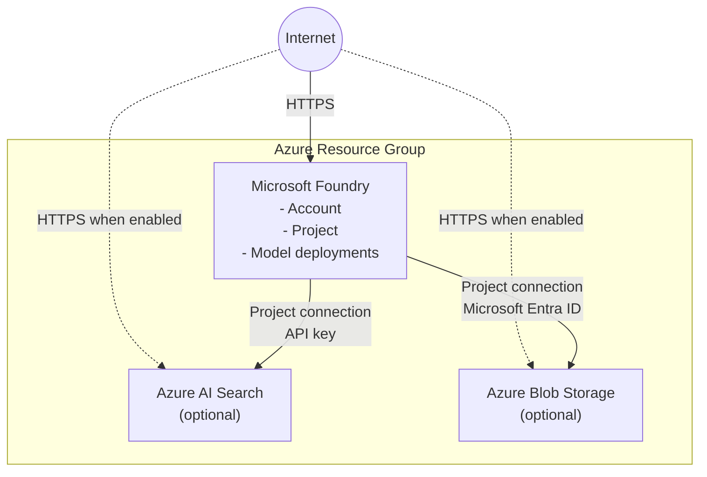

# Azure Microsoft Foundry Scenario

This scenario deploys a Microsoft Foundry environment on Azure using Terraform.
It can also deploy an Azure AI Search service for use as the retrieval
infrastructure underlying Foundry IQ and an Azure Blob Storage account connected
to the Foundry project.

## Architecture


```mermaid
flowchart TB
    Internet((Internet))

    subgraph Azure["Azure Resource Group"]
        MF["Microsoft Foundry<br/>- Account<br/>- Project<br/>- Model deployments"]
        Search["Azure AI Search<br/>(optional)"]
        Storage["Azure Blob Storage<br/>(optional)"]
    end

    Internet -->|HTTPS| MF
    Internet -.->|HTTPS when enabled| Search
    Internet -.->|HTTPS when enabled| Storage
    MF -->|Project connection<br/>API key| Search
    MF -->|Project connection<br/>Microsoft Entra ID| Storage
```

## Prerequisites

- Azure subscription
- Azure CLI signed in to the target subscription
- Terraform 1.11 or later

Follow the shared [Azure authentication](../../../docs/tips/provider-authentication.md),
[Terraform workflow](../../../docs/tips/terraform-workflow.md), and optional
[Azure Blob Storage backend](../../../docs/tips/azure-blob-backend.md) guidance.
Set `SCENARIO=azure_microsoft_foundry` when using the repository Makefile.

## How to use

### Model deployments

By default, the scenario creates the following model deployments in the
Microsoft Foundry account:

| Deployment and model | Version | SKU | Capacity |
| --- | --- | --- | ---: |
| `gpt-5.6-luna` | `2026-07-09` | `GlobalStandard` | 1000 |
| `gpt-5.6-terra` | `2026-07-09` | `GlobalStandard` | 1000 |
| `gpt-5.6-sol` | `2026-07-09` | `GlobalStandard` | 1000 |
| `gpt-5.4-mini` | `2026-03-17` | `GlobalStandard` | 1000 |
| `text-embedding-3-large` | `1` | `GlobalStandard` | 3000 |
| `text-embedding-3-small` | `1` | `GlobalStandard` | 3000 |

Review and override `model_deployments` before applying to match the models,
versions, capacity, and quota available in the target subscription and region.
Set it to an empty list to create the account and project without model
deployments:

```hcl
model_deployments = []
```

### Azure AI Search

The `deploy_azure_ai_search` input defaults to `false`. Add the following values
to an environment-specific `terraform.tfvars` file to deploy Azure AI Search and
connect it to the Microsoft Foundry project:

```hcl
deploy_azure_ai_search = true
azure_ai_search_sku    = "free"
```

Set `azure_ai_search_sku` to `basic`, `standard`, `standard2`, `standard3`,
`storage_optimized_l1`, or `storage_optimized_l2` to use another supported
tier. Availability and quota requirements vary by subscription and region.

> [!NOTE]
> The default SKU is `free`, which is the lowest-cost option recommended for a
> Foundry IQ proof of concept. See the
> [Azure AI Search Terraform quickstart](https://learn.microsoft.com/en-us/azure/search/search-get-started-terraform),
> [Foundry IQ overview](https://learn.microsoft.com/en-us/azure/foundry/agents/concepts/what-is-foundry-iq),
> [Azure AI Search stable REST API specifications](https://github.com/Azure/azure-rest-api-specs/tree/main/specification/search/data-plane/Search/stable),
> and [Microsoft Foundry project connection ARM schema](https://learn.microsoft.com/en-us/azure/templates/microsoft.cognitiveservices/accounts/projects/connections).

When enabled, Terraform creates a project-scoped `CognitiveSearch` connection
that uses the Azure AI Search primary admin key. AzAPI receives the key through
its write-only `sensitive_body`, so the connection resource does not persist
another copy in state. The AzureRM Search resource still retains its primary key
as sensitive state data. Use an encrypted remote backend and restrict state read
access to only the identities that require it.

Terraform provisions the connection through the Azure Resource Manager control
plane with AzAPI. The [Foundry Connections API](https://ai.azure.com/api-reference/connections/list)
can list and retrieve the resulting connection but does not create it.

This option does not create a knowledge base, knowledge source, index, indexer,
or agent.

### Azure Blob Storage

The `deploy_blob_storage` input defaults to `false`. Add the following value to
an environment-specific `terraform.tfvars` file to deploy an Azure Blob Storage
account and connect it to the Microsoft Foundry project:

```hcl
deploy_blob_storage = true
```

The Storage account configuration is intentionally fixed rather than exposed as
scenario inputs. It uses Standard/LRS storage with a flat namespace, a public
network endpoint, HTTPS with TLS 1.2, and no anonymous Blob access. Shared key
authentication, the Storage account managed identity, and Blob soft delete are
disabled. All Blob data-plane access must use Microsoft Entra ID.

When enabled, Terraform creates a project-scoped `AzureStorageAccount`
connection with `AAD` authentication and grants the Foundry project's
system-assigned managed identity the `Storage Blob Data Contributor` role at the
Storage account scope. The connection does not contain an account key or another
stored credential. AzAPI provisions it through the same Azure Resource Manager
control plane used for the Azure AI Search connection.

> [!IMPORTANT]
> The identity running Terraform needs the
> `Microsoft.Authorization/roleAssignments/write` permission at the Storage
> account scope. The `Contributor` role does not include this permission. Assign
> a role such as `Role Based Access Control Administrator` or `User Access
> Administrator` at an appropriate scope. See
> [Assign Azure roles using Terraform](https://learn.microsoft.com/en-us/azure/role-based-access-control/role-assignments-terraform)
> and [Storage Blob Data Contributor](https://learn.microsoft.com/en-us/azure/role-based-access-control/built-in-roles/storage#storage-blob-data-contributor).

This option does not create a Blob container, queue, private endpoint, or private
DNS zone. Use the shared Storage module in a network-enabled scenario when those
resources or a private network path are required.

### Destroy and purge

Deleting a Microsoft Foundry account normally soft-deletes it. Without a purge,
the account name cannot be reused for 48 hours. This scenario registers a
Terraform destroy-time hook that deletes the model deployments, project, and
account, then runs `az cognitiveservices account purge` before deleting the
resource group.

> [!WARNING]
> Purging is irreversible. All data and keys associated with the account are
> permanently deleted. The identity running Terraform must have the
> `Microsoft.CognitiveServices/locations/resourceGroups/deletedAccounts/delete`
> permission. A resource-group-scoped `Contributor` assignment is not
> sufficient; use a suitable role such as `Cognitive Services Contributor` or
> `Contributor` at subscription scope. See
> [Recover or purge deleted Microsoft Foundry resources](https://learn.microsoft.com/azure/ai-services/recover-purge-resources).

The purge action must exist in Terraform state before destroy. After adding or
upgrading to this configuration, run `terraform apply` once before the first
`terraform destroy`. If the purge fails because permission is missing, grant the
permission and rerun `terraform destroy`; the account remains soft-deleted until
the purge succeeds.

Model deployments in this scenario require sequential Terraform operations to
avoid deployment conflicts. The standard Makefile deploy and destroy commands
do not include the `-parallelism=1` override. When `model_deployments` is not
empty, run these direct commands from the scenario directory:

```bash
# Apply the deployment and register the destroy-time purge action
terraform apply -auto-approve -parallelism=1

# Confirm the output
terraform output

# Destroy the deployment and permanently purge the Foundry account
terraform destroy -auto-approve -parallelism=1
```
