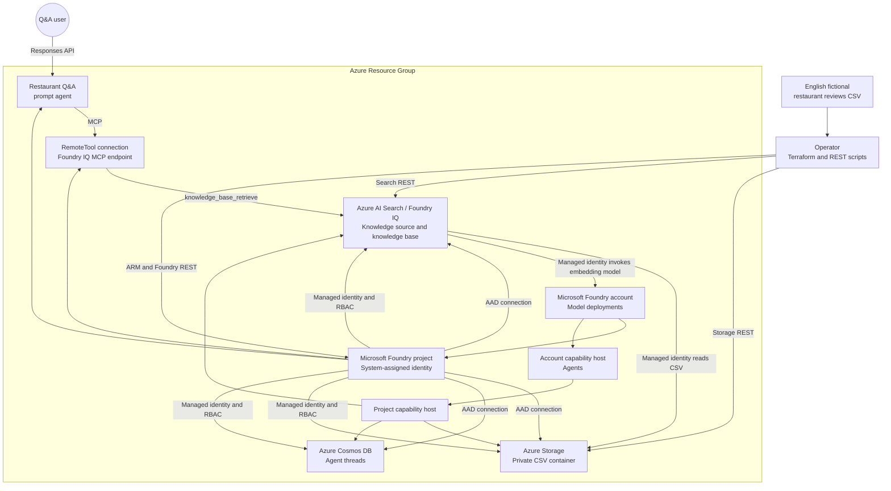

# Azure Microsoft Foundry Scenario

This scenario deploys a Microsoft Foundry environment on Azure using Terraform.
It can also deploy the bring-your-own data services and capability hosts required
for a standard agent. Microsoft Entra ID and the Foundry project managed identity
are used instead of resource keys. Numbered POSIX shell scripts can then upload a
fictional restaurant review dataset, create a Foundry IQ knowledge source and
knowledge base, connect them to a prompt agent over MCP, and run grounded Q&A.

## Architecture


```mermaid
flowchart TB
    User((Q&A user))
    Operator["Operator<br/>Terraform and REST scripts"]
    CSV["English fictional<br/>restaurant reviews CSV"]

    subgraph Azure["Azure Resource Group"]
        Account["Microsoft Foundry account<br/>Model deployments"]
        Project["Microsoft Foundry project<br/>System-assigned identity"]
        Agent["Restaurant Q&A<br/>prompt agent"]
        RemoteTool["RemoteTool connection<br/>Foundry IQ MCP endpoint"]
        AccountHost["Account capability host<br/>Agents"]
        ProjectHost["Project capability host"]
        Search["Azure AI Search / Foundry IQ<br/>Knowledge source and knowledge base"]
        Storage["Azure Storage<br/>Private CSV container"]
        Cosmos["Azure Cosmos DB<br/>Agent threads"]
    end

    CSV --> Operator
    Operator -->|Storage REST| Storage
    Operator -->|Search REST| Search
    Operator -->|ARM and Foundry REST| Project
    Account --> Project
    Account --> AccountHost --> ProjectHost
    Project --> Agent
    Project --> RemoteTool
    User -->|Responses API| Agent
    Agent -->|MCP| RemoteTool
    RemoteTool -->|knowledge_base_retrieve| Search
    Search -->|Managed identity reads CSV| Storage
    Search -->|Managed identity invokes embedding model| Account
    Project -->|AAD connection| Search
    Project -->|AAD connection| Storage
    Project -->|AAD connection| Cosmos
    Project -->|Managed identity and RBAC| Search
    Project -->|Managed identity and RBAC| Storage
    Project -->|Managed identity and RBAC| Cosmos
    ProjectHost --> Search
    ProjectHost --> Storage
    ProjectHost --> Cosmos
```

## Prerequisites

* Azure subscription
* Azure CLI signed in to the target subscription
* Terraform 1.11 or later
* POSIX-compatible shell, `curl`, and `jq`
* Permission to create role assignments on the deployed data services

Follow the shared [Azure authentication](../../../docs/tips/provider-authentication.md),
[Terraform workflow](../../../docs/tips/terraform-workflow.md), and optional
[Azure Blob Storage backend](../../../docs/tips/azure-blob-backend.md) guidance.
Set `SCENARIO=azure_microsoft_foundry` when using the repository Makefile.

## How to use

### Model deployments

By default, the scenario creates the following model deployments in the
Microsoft Foundry account:

| Deployment and model         | Version      | SKU              | Capacity |
|------------------------------|--------------|------------------|---------:|
| `gpt-5.6-luna`               | `2026-07-09` | `GlobalStandard` |     1000 |
| `gpt-5.6-terra`              | `2026-07-09` | `GlobalStandard` |     1000 |
| `gpt-5.6-sol`                | `2026-07-09` | `GlobalStandard` |     1000 |
| `gpt-5.4-mini`               | `2026-03-17` | `GlobalStandard` |     1000 |
| `text-embedding-3-large`     | `1`          | `GlobalStandard` |     3000 |
| `text-embedding-3-small`     | `1`          | `GlobalStandard` |     3000 |

Review and override `model_deployments` before applying to match the models,
versions, capacity, and quota available in the target subscription and region.
Set it to an empty list to create the account and project without model
deployments:

```hcl
model_deployments = []
```

### Standard Agent resources

The `deploy_standard_agent` input defaults to `false`. When disabled, the
scenario creates only the Foundry account, project, and model deployments. Enable
the complete standard agent resource set with the following values:

```hcl
deploy_standard_agent = true
azure_ai_search_sku   = "standard"
```

The checked-in `terraform.tfvars` enables this configuration. Terraform creates
the following resources together:

* Azure AI Search using `standard` or a higher supported SKU
* Standard/ZRS Storage account without a Terraform-managed container
* Azure Cosmos DB for agent threads using Session consistency
* Project-scoped AAD connections for Search, Storage, and Cosmos DB
* Account and project capability hosts using the stable `2025-06-01` API

The data services use public network endpoints. AAD-only authentication removes
resource keys from the authentication path, but it does not provide network
isolation. Terraform does not create private endpoints, private DNS zones, Search
data-plane objects, or agent versions. The numbered scripts create the Blob
container, Search-managed ingestion resources, Foundry IQ objects, RemoteTool
connection, and prompt agent after Terraform has finished.

### Authentication and RBAC

Local authentication is disabled for the Foundry account and all standard agent
data services. Terraform creates the following assignments when
`deploy_standard_agent` is enabled:

| Scope                  | Role                                | Assignee                 | Purpose                              |
|------------------------|-------------------------------------|--------------------------|--------------------------------------|
| Storage account        | Storage Blob Data Contributor       | Foundry project identity | Read and write agent files           |
| Azure AI Search        | Search Index Data Contributor       | Foundry project identity | Read and write index data            |
| Azure AI Search        | Search Service Contributor          | Foundry project identity | Manage Search resources              |
| Azure AI Search        | Search Index Data Reader            | Foundry project identity | Retrieve knowledge through MCP       |
| Foundry account        | Foundry User                        | Foundry project identity | Access Foundry models and agents     |
| Cosmos DB account      | Cosmos DB Operator                  | Foundry project identity | Manage account metadata              |
| `enterprise_memory` DB | Cosmos DB Built-in Data Contributor | Foundry project identity | Read and write thread data           |
| Storage account        | Storage Blob Data Reader            | Search identity          | Ingest the review CSV                |
| Foundry account        | Cognitive Services User             | Search identity          | Generate embeddings during ingestion |
| Storage account        | Storage Blob Data Contributor       | Operator                 | Upload and remove the review CSV     |
| Azure AI Search        | Search Service Contributor          | Operator                 | Manage knowledge objects             |
| Azure AI Search        | Search Index Data Contributor       | Operator                 | Manage generated index data          |
| Azure AI Search        | Search Index Data Reader            | Operator                 | Run direct retrieval tests           |
| Foundry account        | Foundry Project Manager             | Operator                 | Create the connection and agent      |

`operator_principal_id` defaults to the object ID of the identity running
Terraform. Set it explicitly when Terraform and the scripts run as different
principals or when a stable principal is required in CI. Foundry roles are
assigned by role definition ID to avoid failures while Azure AI role names are
being renamed.

Terraform waits 60 seconds after the control-plane role assignments. It then
creates the account capability host and project capability host with 60-minute
create timeouts. The project host creates the `enterprise_memory` database, so
its Cosmos DB data-plane role assignment is applied last.

The Terraform identity needs `Microsoft.Authorization/roleAssignments/write` at
the target scopes. Contributor alone cannot create role assignments. Use Owner,
User Access Administrator combined with the required resource permissions, or a
custom role that grants the required actions.

### Foundry IQ restaurant Q&A

#### Data and API design

The mock corpus is [data/restaurant_reviews.csv](data/restaurant_reviews.csv).
It contains 30 English reviews for 10 explicitly fictional restaurants. Each row
repeats the restaurant name, cuisine, address, coordinates, hours, dietary
options, overview, rating, and review in a self-contained `search_text` field.

> [!IMPORTANT]
> The selected `azureBlob` knowledge source creates its data source, skillset,
> vectorized index, and indexer from a service-managed fixed template. A CSV is
> treated as Blob content and chunked by that template. Individual CSV columns
> are not guaranteed to become typed or filterable Search fields. Use an
> explicitly managed index and a `delimitedText` indexer instead when row-level
> filters or stable column mappings are required.

The workflow uses these model responsibilities:

* `text-embedding-3-large` vectorizes content during Blob ingestion
* Foundry IQ uses `minimal` reasoning with `extractiveData` output
* `gpt-5.4-mini` generates the final grounded answer in the prompt agent

The Search data-plane calls use the `2026-05-01-preview` API. Search resources
and direct retrieval use OData-style paths such as
`knowledgebases('restaurant-reviews-kb')/retrieve`. The MCP endpoint uses the
different slash-style path
`/knowledgebases/restaurant-reviews-kb/mcp?api-version=2026-05-01-preview`.
The RemoteTool connection uses `2025-10-01-preview`, and the agent uses `v1`.

> [!WARNING]
> Preview APIs have no service-level agreement and are not recommended for
> production workloads. Review Azure preview terms, regional availability, data
> boundaries, model availability, and API changes before production use.

#### Run the workflow

Apply Terraform before running the scripts. Model deployments must be created
sequentially:

```bash
terraform apply -auto-approve -parallelism=1
```

The scripts resolve all files relative to their own location, so the caller's
working directory does not matter. Set `SCENARIO_DIR` to the absolute path of
this scenario and run each numbered step:

```bash
SCENARIO_DIR="/path/to/template-terraform/infra/scenarios/azure_microsoft_foundry"

"${SCENARIO_DIR}/scripts/00_validate_prerequisites.sh"
"${SCENARIO_DIR}/scripts/01_upload_restaurant_reviews.sh"
"${SCENARIO_DIR}/scripts/02_create_knowledge_source.sh"
"${SCENARIO_DIR}/scripts/03_wait_for_ingestion.sh"
"${SCENARIO_DIR}/scripts/04_create_knowledge_base.sh"
"${SCENARIO_DIR}/scripts/05_retrieve_knowledge_base.sh" \
    "Which fictional restaurants offer vegan options, and what did reviewers say?"
"${SCENARIO_DIR}/scripts/06_create_project_connection.sh"
"${SCENARIO_DIR}/scripts/07_create_agent.sh"
"${SCENARIO_DIR}/scripts/08_ask_agent.sh" \
    "Which fictional restaurant is a strong choice for a vegan dinner, and why?"
```

| Script                                    | Operation                                                     |
|-------------------------------------------|---------------------------------------------------------------|
| `00_validate_prerequisites.sh`            | Validate tools, outputs, deployments, login, and token scopes |
| `01_upload_restaurant_reviews.sh`         | Create a private container and upload the CSV with Blob REST  |
| `02_create_knowledge_source.sh`           | Create the keyless Blob knowledge source and generated index  |
| `03_wait_for_ingestion.sh`                | Wait for the current ingestion run and fail on item errors    |
| `04_create_knowledge_base.sh`             | Create the minimal extractive Foundry IQ knowledge base       |
| `05_retrieve_knowledge_base.sh`           | Test direct retrieval and display grounding references        |
| `06_create_project_connection.sh`         | Create the project-managed-identity RemoteTool connection     |
| `07_create_agent.sh`                      | Create a new version of the MCP-enabled prompt agent          |
| `08_ask_agent.sh`                         | Create a conversation and force a knowledge-base tool call    |
| `09_cleanup.sh`                           | Delete only resources created by the numbered scripts         |

Direct retrieval in step `05` separates Search ingestion problems from agent
or MCP problems. Step `08` prints the answer, conversation ID, and count of MCP
events. Set `VERBOSE_OUTPUT=true` for the complete JSON response.

#### Configuration overrides

| Environment variable             | Default                          | Purpose                              |
|----------------------------------|----------------------------------|--------------------------------------|
| `RESTAURANT_DATA_FILE`           | `data/restaurant_reviews.csv`    | Source CSV path                      |
| `CONTAINER_NAME`                 | `restaurant-reviews`             | Private Blob container               |
| `BLOB_NAME`                      | `restaurant_reviews.csv`         | Uploaded Blob name                   |
| `KNOWLEDGE_SOURCE_NAME`          | `restaurant-reviews-ks`          | Search knowledge source              |
| `KNOWLEDGE_BASE_NAME`            | `restaurant-reviews-kb`          | Search knowledge base                |
| `PROJECT_CONNECTION_NAME`        | `restaurant-reviews-kb-mcp`      | Foundry RemoteTool connection        |
| `AGENT_NAME`                     | `restaurant-qa-agent`            | Foundry prompt agent                 |
| `AGENT_MODEL`                    | `gpt-5.4-mini`                   | Agent model deployment               |
| `EMBEDDING_DEPLOYMENT`           | `text-embedding-3-large`         | Ingestion embedding deployment       |
| `EMBEDDING_MODEL`                | `text-embedding-3-large`         | Ingestion embedding model name       |
| `INGESTION_TIMEOUT_SECONDS`      | `900`                            | Maximum ingestion wait               |
| `POLL_INTERVAL_SECONDS`          | `10`                             | Ingestion polling interval           |
| `VERBOSE_OUTPUT`                 | `false`                          | Print complete REST response bodies  |

Endpoint and resource variables can also override Terraform outputs for advanced
testing. The scripts never write bearer tokens, API keys, or connection secrets
to disk or standard output.

#### Rerun and cleanup behavior

The Blob upload overwrites the named Blob. Knowledge source, knowledge base, and
project connection steps use create-or-update `PUT` operations and are safe to
rerun with the same names. Agent creation uses `POST`; each rerun creates another
version of the named agent. Every agent query creates a new conversation.

Cleanup is intentionally separate from Terraform and requires an exact
confirmation value. It deletes the agent, RemoteTool connection, knowledge base,
knowledge source and its generated Search objects, Blob, and container. It does
not change Terraform-managed infrastructure:

```bash
CONFIRM_CLEANUP=delete-foundry-iq-resources \
    "${SCENARIO_DIR}/scripts/09_cleanup.sh"
```

#### Troubleshooting

* For Search `401` or `403`, confirm the operator has Search Service Contributor,
    Search Index Data Contributor, and Search Index Data Reader, then allow time
    for role assignments to propagate.
* For Blob `403`, confirm the operator has Storage Blob Data Contributor and the
    Search identity has Storage Blob Data Reader on the storage account.
* For embedding errors, confirm the Search identity has Cognitive Services User
    on the Foundry account and `text-embedding-3-large` is deployed.
* For agent or connection `403`, confirm the operator has Foundry Project Manager
    and the project identity has Foundry User.
* For ingestion failure, inspect the errors printed by step `03`. Verify the Blob
    is UTF-8 CSV and rerun steps `01` through `03` after correcting the source.
* For an MCP `400` or `404`, confirm the knowledge base name and preserve the
    slash-style MCP endpoint with `2026-05-01-preview`.
* Semantic ranker and agentic retrieval begin on their default monthly free
    allowances. Requests return billing errors after an allowance is exhausted
    unless the corresponding Standard pay-as-you-go plan is enabled separately.

#### References

* [Azure AI Search 2026-05-01-preview REST specification](https://raw.githubusercontent.com/Azure/azure-rest-api-specs/refs/heads/main/specification/search/data-plane/Search/preview/2026-05-01-preview/search.json)
* [Connect agents to Foundry IQ knowledge bases](https://learn.microsoft.com/azure/foundry/agents/how-to/foundry-iq-connect?tabs=foundry%2Crest)
* [Build an agentic retrieval solution](https://learn.microsoft.com/azure/search/agentic-retrieval-how-to-create-pipeline)
* [Create a Blob knowledge source](https://learn.microsoft.com/azure/search/agentic-knowledge-source-how-to-blob)
* [Knowledge Sources REST API](https://learn.microsoft.com/rest/api/searchservice/knowledge-sources?view=rest-searchservice-2026-04-01)
* [Knowledge Bases REST API](https://learn.microsoft.com/rest/api/searchservice/knowledge-bases?view=rest-searchservice-2026-04-01)
* [Knowledge Retrieval REST API](https://learn.microsoft.com/rest/api/searchservice/knowledge-retrieval/retrieve?view=rest-searchservice-2026-04-01&tabs=HTTP)

### Migration from standalone inputs

The `deploy_azure_ai_search` and `deploy_blob_storage` inputs have been removed.
Use `deploy_standard_agent` to deploy all three data services as one supported
configuration. The Search `free` and `basic` SKUs are no longer accepted.

> [!WARNING]
> Migrating an existing deployment can replace the LRS Storage account with a
> ZRS account and remove the previously managed `default` container. Review the
> plan and preserve any required data before applying. Switching connections to
> AAD removes active key references from configuration, but keys recorded in
> earlier remote state versions are not deleted automatically. Retain, rotate,
> or remove state history according to your backend security policy.

### Destroy and purge

Deleting a Microsoft Foundry account normally soft-deletes it. Without a purge,
the account name cannot be reused for 48 hours. This scenario registers a
Terraform destroy-time hook that deletes the model deployments, project, and
account, then runs `az cognitiveservices account purge` before deleting the
resource group.

> [!WARNING]
> Purging is irreversible. All data and keys associated with the account are
> permanently deleted. The identity running Terraform must have the
> `Microsoft.CognitiveServices/locations/resourceGroups/deletedAccounts/delete`
> permission. A resource-group-scoped `Contributor` assignment is not
> sufficient; use a suitable role such as `Cognitive Services Contributor` or
> `Contributor` at subscription scope. See
> [Recover or purge deleted Microsoft Foundry resources](https://learn.microsoft.com/azure/ai-services/recover-purge-resources).

The purge action must exist in Terraform state before destroy. After adding or
upgrading to this configuration, run `terraform apply` once before the first
`terraform destroy`. If the purge fails because permission is missing, grant the
permission and rerun `terraform destroy`; the account remains soft-deleted until
the purge succeeds.

Model deployments in this scenario require sequential Terraform operations to
avoid deployment conflicts. The standard Makefile deploy and destroy commands
do not include the `-parallelism=1` override. When `model_deployments` is not
empty, run these direct commands from the scenario directory:

```bash
# Apply the deployment and register the destroy-time purge action
terraform apply -auto-approve -parallelism=1

# Confirm the output
terraform output

# Destroy the deployment and permanently purge the Foundry account
terraform destroy -auto-approve -parallelism=1
```
