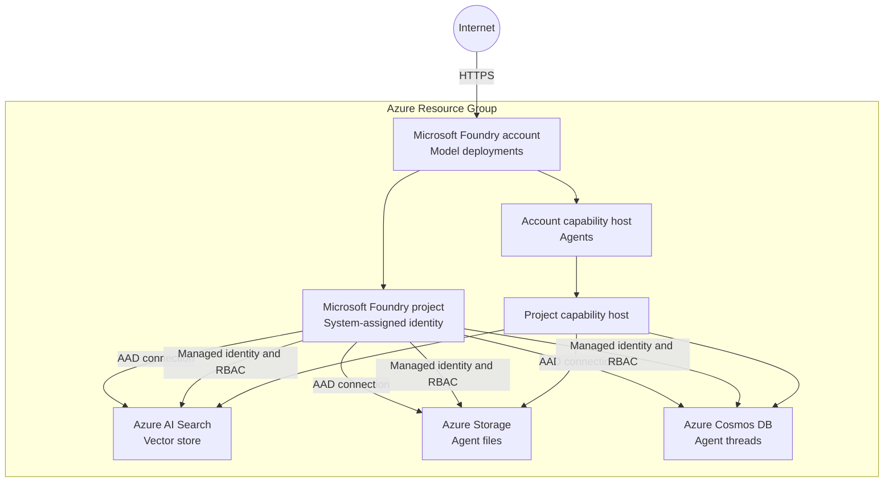

# Azure Microsoft Foundry Scenario

This scenario deploys a Microsoft Foundry environment on Azure using Terraform.
It can also deploy the bring-your-own data services and capability hosts required
for a standard agent. Microsoft Entra ID and the Foundry project managed identity
are used instead of resource keys.

## Architecture


```mermaid
flowchart TB
    Internet((Internet))

    subgraph Azure["Azure Resource Group"]
        Account["Microsoft Foundry account<br/>Model deployments"]
        Project["Microsoft Foundry project<br/>System-assigned identity"]
        AccountHost["Account capability host<br/>Agents"]
        ProjectHost["Project capability host"]
        Search["Azure AI Search<br/>Vector store"]
        Storage["Azure Storage<br/>Agent files"]
        Cosmos["Azure Cosmos DB<br/>Agent threads"]
    end

    Internet -->|HTTPS| Account
    Account --> Project
    Account --> AccountHost --> ProjectHost
    Project -->|AAD connection| Search
    Project -->|AAD connection| Storage
    Project -->|AAD connection| Cosmos
    Project -->|Managed identity and RBAC| Search
    Project -->|Managed identity and RBAC| Storage
    Project -->|Managed identity and RBAC| Cosmos
    ProjectHost --> Search
    ProjectHost --> Storage
    ProjectHost --> Cosmos
```

## Prerequisites

* Azure subscription
* Azure CLI signed in to the target subscription
* Terraform 1.11 or later
* Permission to create role assignments on the deployed data services

Follow the shared [Azure authentication](../../../docs/tips/provider-authentication.md),
[Terraform workflow](../../../docs/tips/terraform-workflow.md), and optional
[Azure Blob Storage backend](../../../docs/tips/azure-blob-backend.md) guidance.
Set `SCENARIO=azure_microsoft_foundry` when using the repository Makefile.

## How to use

### Model deployments

By default, the scenario creates the following model deployments in the
Microsoft Foundry account:

| Deployment and model         | Version      | SKU              | Capacity |
|------------------------------|--------------|------------------|---------:|
| `gpt-5.6-luna`               | `2026-07-09` | `GlobalStandard` |     1000 |
| `gpt-5.6-terra`              | `2026-07-09` | `GlobalStandard` |     1000 |
| `gpt-5.6-sol`                | `2026-07-09` | `GlobalStandard` |     1000 |
| `gpt-5.4-mini`               | `2026-03-17` | `GlobalStandard` |     1000 |
| `text-embedding-3-large`     | `1`          | `GlobalStandard` |     3000 |
| `text-embedding-3-small`     | `1`          | `GlobalStandard` |     3000 |

Review and override `model_deployments` before applying to match the models,
versions, capacity, and quota available in the target subscription and region.
Set it to an empty list to create the account and project without model
deployments:

```hcl
model_deployments = []
```

### Standard Agent resources

The `deploy_standard_agent` input defaults to `false`. When disabled, the
scenario creates only the Foundry account, project, and model deployments. Enable
the complete standard agent resource set with the following values:

```hcl
deploy_standard_agent = true
azure_ai_search_sku   = "standard"
```

The checked-in `terraform.tfvars` enables this configuration. Terraform creates
the following resources together:

* Azure AI Search using `standard` or a higher supported SKU
* Standard/ZRS Storage account without an explicitly managed container
* Azure Cosmos DB for agent threads using Session consistency
* Project-scoped AAD connections for Search, Storage, and Cosmos DB
* Account and project capability hosts using the stable `2025-06-01` API

The data services use public network endpoints. AAD-only authentication removes
resource keys from the authentication path, but it does not provide network
isolation. This scenario does not create private endpoints, private DNS zones,
Search indexes, knowledge bases, or agent application code.

### Authentication and RBAC

Local authentication is disabled for the Foundry account and all standard agent
data services. The Foundry project system-assigned managed identity receives the
following roles:

| Scope                  | Role                                | Purpose                    |
|------------------------|-------------------------------------|----------------------------|
| Storage account        | Storage Blob Data Contributor       | Read and write agent files |
| Azure AI Search        | Search Index Data Contributor       | Read and write index data  |
| Azure AI Search        | Search Service Contributor          | Manage Search resources    |
| Cosmos DB account      | Cosmos DB Operator                  | Manage account metadata    |
| `enterprise_memory` DB | Cosmos DB Built-in Data Contributor | Read and write thread data |

Terraform waits 60 seconds after the control-plane role assignments. It then
creates the account capability host and project capability host with 60-minute
create timeouts. The project host creates the `enterprise_memory` database, so
its Cosmos DB data-plane role assignment is applied last.

The Terraform identity needs `Microsoft.Authorization/roleAssignments/write` at
the target scopes. Contributor alone cannot create role assignments. Use Owner,
User Access Administrator combined with the required resource permissions, or a
custom role that grants the required actions.

### Migration from standalone inputs

The `deploy_azure_ai_search` and `deploy_blob_storage` inputs have been removed.
Use `deploy_standard_agent` to deploy all three data services as one supported
configuration. The Search `free` and `basic` SKUs are no longer accepted.

> [!WARNING]
> Migrating an existing deployment can replace the LRS Storage account with a
> ZRS account and remove the previously managed `default` container. Review the
> plan and preserve any required data before applying. Switching connections to
> AAD removes active key references from configuration, but keys recorded in
> earlier remote state versions are not deleted automatically. Retain, rotate,
> or remove state history according to your backend security policy.

### Destroy and purge

Deleting a Microsoft Foundry account normally soft-deletes it. Without a purge,
the account name cannot be reused for 48 hours. This scenario registers a
Terraform destroy-time hook that deletes the model deployments, project, and
account, then runs `az cognitiveservices account purge` before deleting the
resource group.

> [!WARNING]
> Purging is irreversible. All data and keys associated with the account are
> permanently deleted. The identity running Terraform must have the
> `Microsoft.CognitiveServices/locations/resourceGroups/deletedAccounts/delete`
> permission. A resource-group-scoped `Contributor` assignment is not
> sufficient; use a suitable role such as `Cognitive Services Contributor` or
> `Contributor` at subscription scope. See
> [Recover or purge deleted Microsoft Foundry resources](https://learn.microsoft.com/azure/ai-services/recover-purge-resources).

The purge action must exist in Terraform state before destroy. After adding or
upgrading to this configuration, run `terraform apply` once before the first
`terraform destroy`. If the purge fails because permission is missing, grant the
permission and rerun `terraform destroy`; the account remains soft-deleted until
the purge succeeds.

Model deployments in this scenario require sequential Terraform operations to
avoid deployment conflicts. The standard Makefile deploy and destroy commands
do not include the `-parallelism=1` override. When `model_deployments` is not
empty, run these direct commands from the scenario directory:

```bash
# Apply the deployment and register the destroy-time purge action
terraform apply -auto-approve -parallelism=1

# Confirm the output
terraform output

# Destroy the deployment and permanently purge the Foundry account
terraform destroy -auto-approve -parallelism=1
```
