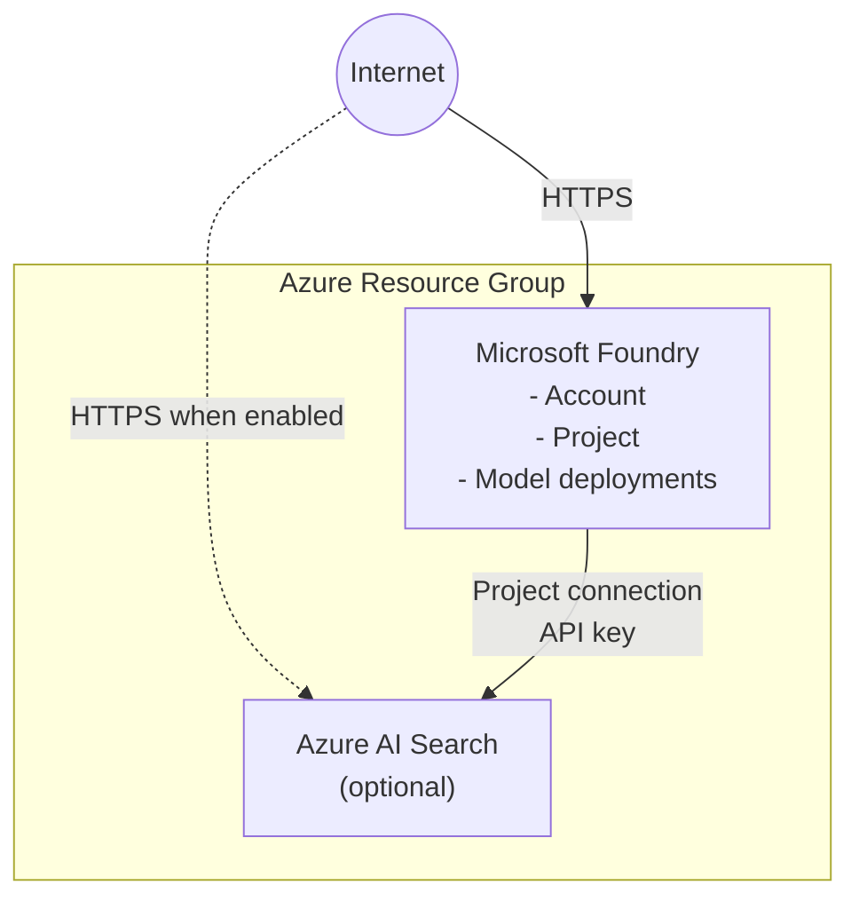

# Azure Microsoft Foundry Scenario

This scenario deploys a Microsoft Foundry environment on Azure using Terraform.
It can also deploy an Azure AI Search service for use as the retrieval
infrastructure underlying Foundry IQ.

## Architecture


```mermaid
flowchart TB
    Internet((Internet))

    subgraph Azure["Azure Resource Group"]
        MF["Microsoft Foundry<br/>- Account<br/>- Project<br/>- Model deployments"]
        Search["Azure AI Search<br/>(optional)"]
    end

    Internet -->|HTTPS| MF
    Internet -.->|HTTPS when enabled| Search
    MF -->|Project connection<br/>API key| Search
```

## Prerequisites

- Azure subscription
- Terraform 1.11 or later

Follow the shared [Azure authentication](../../../docs/tips/provider-authentication.md),
[Terraform workflow](../../../docs/tips/terraform-workflow.md), and optional
[Azure Blob Storage backend](../../../docs/tips/azure-blob-backend.md) guidance.
Set `SCENARIO=azure_microsoft_foundry` when using the repository Makefile.

## How to use

### Model deployments

By default, the scenario creates the following model deployments in the
Microsoft Foundry account:

| Deployment and model | Version | SKU | Capacity |
| --- | --- | --- | ---: |
| `gpt-5.6-luna` | `2026-07-09` | `GlobalStandard` | 1000 |
| `gpt-5.6-terra` | `2026-07-09` | `GlobalStandard` | 1000 |
| `gpt-5.6-sol` | `2026-07-09` | `GlobalStandard` | 1000 |
| `gpt-5.4-mini` | `2026-03-17` | `GlobalStandard` | 1000 |
| `text-embedding-3-large` | `1` | `GlobalStandard` | 3000 |
| `text-embedding-3-small` | `1` | `GlobalStandard` | 3000 |

Review and override `model_deployments` before applying to match the models,
versions, capacity, and quota available in the target subscription and region.
Set it to an empty list to create the account and project without model
deployments:

```hcl
model_deployments = []
```

### Azure AI Search

The `deploy_azure_ai_search` input defaults to `false`. Add the following values
to an environment-specific `terraform.tfvars` file to deploy Azure AI Search and
connect it to the Microsoft Foundry project:

```hcl
deploy_azure_ai_search = true
azure_ai_search_sku    = "free"
```

Set `azure_ai_search_sku` to `basic`, `standard`, `standard2`, `standard3`,
`storage_optimized_l1`, or `storage_optimized_l2` to use another supported
tier. Availability and quota requirements vary by subscription and region.

> [!NOTE]
> The default SKU is `free`, which is the lowest-cost option recommended for a
> Foundry IQ proof of concept. See the
> [Azure AI Search Terraform quickstart](https://learn.microsoft.com/en-us/azure/search/search-get-started-terraform),
> [Foundry IQ overview](https://learn.microsoft.com/en-us/azure/foundry/agents/concepts/what-is-foundry-iq),
> [Azure AI Search stable REST API specifications](https://github.com/Azure/azure-rest-api-specs/tree/main/specification/search/data-plane/Search/stable),
> and [Microsoft Foundry project connection ARM schema](https://learn.microsoft.com/en-us/azure/templates/microsoft.cognitiveservices/accounts/projects/connections).

When enabled, Terraform creates a project-scoped `CognitiveSearch` connection
that uses the Azure AI Search primary admin key and shares the connection with
all project users. AzAPI receives the key through its write-only
`sensitive_body`, so the connection resource does not persist another copy in
state. The AzureRM Search resource still retains its primary key as sensitive
state data. Use an encrypted remote backend and restrict state read access to
only the identities that require it.

Terraform provisions the connection through the Azure Resource Manager control
plane with AzAPI. The [Foundry Connections API](https://ai.azure.com/api-reference/connections/list)
can list and retrieve the resulting connection but does not create it.

This option does not create a knowledge base, knowledge source, index, indexer,
or agent.

Model deployments in this scenario require sequential Terraform operations to
avoid deployment conflicts. The standard Makefile deploy and destroy commands
do not include the `-parallelism=1` override. When `model_deployments` is not
empty, run these direct commands from the scenario directory:

```bash
# Apply the deployment
terraform apply -auto-approve -parallelism=1

# Confirm the output
terraform output

# Destroy the deployment
terraform destroy -auto-approve -parallelism=1
```
