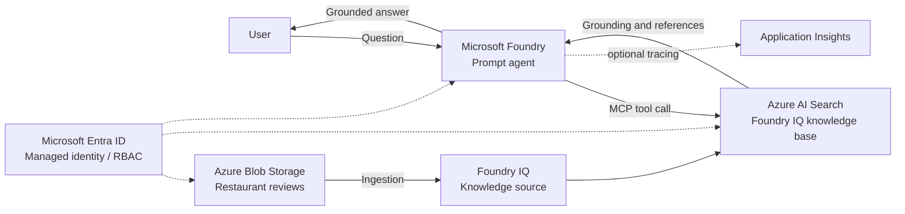
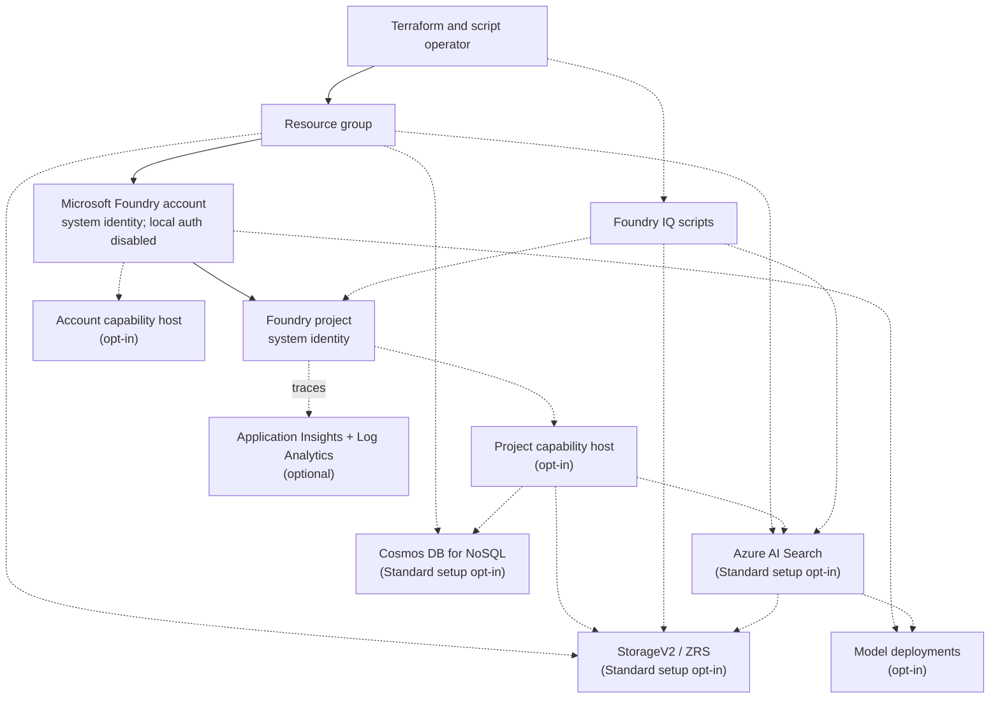

# Azure Microsoft Foundry scenario

## Executive summary

This scenario uses Terraform to build a Microsoft Foundry foundation and run a prompt agent that
answers questions from fictional restaurant reviews. It goes beyond resource provisioning: you can
experience the complete path from ingesting your own data through search and agent tool use to
verifying a grounded answer.

By default, the scenario deploys only a resource group, Microsoft Foundry account, and project so
you can begin learning and reviewing the architecture with a smaller cost footprint. Enable the
optional Standard setup and model deployments when you want to run the end-to-end Foundry IQ
workflow.

| Service | Role in this scenario |
| --- | --- |
| Microsoft Foundry | Manages the AI project, model deployments, prompt agent, and conversations |
| Azure Blob Storage | Stores fictional restaurant reviews for the agent to reference |
| Azure AI Search / Foundry IQ | Ingests Blob data and exposes it through a knowledge source and knowledge base |
| Model Context Protocol (MCP) | Lets the prompt agent call the knowledge base as a tool |
| Microsoft Entra ID / managed identity / Azure RBAC | Authenticates and authorizes Storage, Search, and Foundry without local keys |
| Cosmos DB | Stores Agent Service state in the Standard setup |
| Application Insights (optional) | Visualizes OpenTelemetry spans when server-side tracing is enabled |

By completing the scenario, you can learn how to:

- progressively enable Foundry data services from a minimal Terraform deployment;
- ingest custom data and retrieve grounded content and references from a knowledge base;
- connect a prompt agent to a knowledge base through an MCP connection;
- use Microsoft Entra ID, managed identities, and Azure RBAC instead of API keys; and
- verify the agent response path with script gates and optional tracing.


```mermaid
flowchart LR
    User[User] -->|Question| Agent[Microsoft Foundry<br/>Prompt agent]
    Agent -->|MCP tool call| KB[Azure AI Search<br/>Foundry IQ knowledge base]
    Blob[Azure Blob Storage<br/>Restaurant reviews] -->|Ingestion| KS[Foundry IQ<br/>Knowledge source]
    KS --> KB
    KB -->|Grounding and references| Agent
    Agent -->|Grounded answer| User
    Entra[Microsoft Entra ID<br/>Managed identity / RBAC] -.-> Blob
    Entra -.-> KB
    Entra -.-> Agent
    Agent -. optional tracing .-> AppInsights[Application Insights]
```

> [!IMPORTANT]
> The default minimal deployment doesn't create the chargeable Search, Storage, Cosmos DB, model,
> or tracing resources described below. The optional end-to-end workflow is a learning scenario,
> not a production landing zone; review [boundaries and cost](#boundaries-and-cost) before enabling
> it.

## Quick start

### Prerequisites

- Terraform **1.11 or later**
- Azure CLI **2.50 or later**
- An Azure subscription in which you can create the Foundry account and project
- For the optional workflow: `curl`, `jq`, a POSIX-compatible shell, role-assignment permissions,
  a supported region, and sufficient model quota

Use the common [Azure authentication](../../../docs/tips/provider-authentication.md) and
[Terraform workflow](../../../docs/tips/terraform-workflow.md) guidance. The default backend is the
repository's Azure Blob backend; adapt it before use outside this repository.

### 1. Deploy the minimal Foundry environment

```bash
az login
az account set --subscription "<subscription-name-or-id>"
cd infra/scenarios/azure_microsoft_foundry

terraform init
terraform validate
terraform plan
terraform apply
```

The default plan contains the resource group, Foundry account, project, and destroy-time purge
hook. Model deployments and all Standard setup/tracing resources are absent.

### 2. Optional: enable the Foundry IQ workflow

Create a local `terraform.tfvars` (ignored by this repository) with the features and models you
intend to deploy:

```hcl
enable_standard_setup = true

model_deployments = [
  {
    name     = "gpt-6-sol"
    model    = "gpt-6-sol"
    version  = "2026-09-22"
    capacity = 1000
  },
  {
    name     = "gpt-6-luna"
    model    = "gpt-6-luna"
    version  = "2026-09-22"
    capacity = 1000
  },
  {
    name     = "gpt-6-astra"
    model    = "gpt-6-astra"
    version  = "2026-09-03"
    capacity = 1000
  },
  {
    name     = "gpt-5.5"
    model    = "gpt-5.5"
    version  = "2026-04-24"
    capacity = 1000
  },
  {
    name     = "gpt-5.4-mini"
    model    = "gpt-5.4-mini"
    version  = "2026-03-17"
    capacity = 1000
  },
  {
    name     = "text-embedding-3-large"
    model    = "text-embedding-3-large"
    version  = "1"
    capacity = 3000
  },
  {
    name     = "text-embedding-3-small"
    model    = "text-embedding-3-small"
    version  = "1"
    capacity = 3000
  },
]
```

Model availability, versions, capacity increments, and quota vary by region and subscription.
Review these values before applying. Capacity is measured in thousands of tokens per minute.

`operator_principal_id` defaults to the object ID used by Terraform. Override it only when the
principal running the scripts is different:

```bash
terraform plan -var="operator_principal_id=<entra-object-id>"
```

Azure model deployments can conflict when created concurrently, so serialize Terraform operations:

```bash
terraform apply -parallelism=1
terraform output
```

### 3. Run the optional end-to-end verification

Run every verification step in order with:

```bash
./scripts/run_all.sh
```

The command stops at the first failed gate:

1. required tools, Terraform outputs, login, token audiences, and model deployments exist;
2. a **fresh** Search ingestion run completes with at least one processed item and no failures;
3. direct knowledge-base retrieval returns content and at least one grounding reference;
4. the prompt agent returns text and records at least one MCP event.

Add `--verbose` to report each operation, target, and HTTP status. Access tokens and Authorization
headers aren't printed.

```bash
./scripts/run_all.sh --verbose
```

To inspect each step separately, run these commands in order from the scenario directory. You can
also add `--verbose` to any command:

```bash
./scripts/00_validate_prerequisites.sh
./scripts/01_upload_restaurant_reviews.sh
./scripts/02_create_knowledge_source.sh
./scripts/03_wait_for_ingestion.sh
./scripts/04_create_knowledge_base.sh
./scripts/05_retrieve_knowledge_base.sh
./scripts/06_create_project_connection.sh
./scripts/07_create_agent.sh
./scripts/08_ask_agent.sh
```

Environment variables customize the workflow. For example, ask the prompt agent a custom
question with:

```bash
QUESTION="Which restaurants are suitable for vegetarians?" ./scripts/08_ask_agent.sh
```

The backward-compatible `VERBOSE_OUTPUT=true` setting prints progress plus complete REST responses
for the steps that support them. To remove script-created data after a successful or failed run:

```bash
CLEANUP_AFTER_RUN=true ./scripts/run_all.sh
```

### 4. Clean up

If you ran the optional scripts, remove only their data-plane resources first:

```bash
CONFIRM_CLEANUP=delete-foundry-iq-resources ./scripts/09_cleanup.sh
```

Then destroy Terraform-managed infrastructure:

```bash
terraform destroy -parallelism=1
```

Destroy permanently purges the soft-deleted Foundry account. The Terraform identity therefore needs
`Microsoft.CognitiveServices/locations/resourceGroups/deletedAccounts/delete` at subscription scope,
for example through a suitable `Cognitive Services Contributor` or `Contributor` assignment. Purge
is irreversible.

## What is deployed


```mermaid
flowchart TD
    Operator["Terraform and script operator"]
    RG["Resource group"]
    Account["Microsoft Foundry account<br/>system identity; local auth disabled"]
    Project["Foundry project<br/>system identity"]
    Models["Model deployments<br/>(opt-in)"]
    Search["Azure AI Search<br/>(Standard setup opt-in)"]
    Storage["StorageV2 / ZRS<br/>(Standard setup opt-in)"]
    Cosmos["Cosmos DB for NoSQL<br/>(Standard setup opt-in)"]
    AccountHost["Account capability host<br/>(opt-in)"]
    ProjectHost["Project capability host<br/>(opt-in)"]
    Insights["Application Insights + Log Analytics<br/>(optional)"]
    Scripts["Foundry IQ scripts"]

    Operator --> RG
    RG --> Account
    Account --> Project
    Account -.-> Models
    RG -.-> Search
    RG -.-> Storage
    RG -.-> Cosmos
    Account -.-> AccountHost
    Project -.-> ProjectHost
    ProjectHost -.-> Search
    ProjectHost -.-> Storage
    ProjectHost -.-> Cosmos
    Operator -.-> Scripts
    Scripts -.-> Storage
    Scripts -.-> Search
    Scripts -.-> Project
    Search -.-> Storage
    Search -.-> Models
    Project -. "traces" .-> Insights
```

The solid Foundry account/project path is the default. Model deployments, dashed data-service path,
connections, roles, capability hosts, and tracing are opt-in. The scripts manage only the optional
sample Blob container and file, Search knowledge objects, RemoteTool connection, prompt-agent
versions, and transient conversations.

### Suggested sample model deployments

`model_deployments` defaults to `[]`. The optional workflow quick start illustrates:

| Deployment/model | Version | SKU | Capacity | Version upgrades |
| --- | --- | --- | ---: | --- |
| `gpt-6-sol` | `2026-09-22` | `GlobalStandard` | 1000 | `NoAutoUpgrade` |
| `gpt-6-luna` | `2026-09-22` | `GlobalStandard` | 1000 | `NoAutoUpgrade` |
| `gpt-6-astra` | `2026-09-03` | `GlobalStandard` | 1000 | `NoAutoUpgrade` |
| `gpt-5.5` | `2026-04-24` | `GlobalStandard` | 1000 | `NoAutoUpgrade` |
| `gpt-5.4-mini` | `2026-03-17` | `GlobalStandard` | 1000 | `NoAutoUpgrade` |
| `text-embedding-3-large` | `1` | `GlobalStandard` | 3000 | `NoAutoUpgrade` |
| `text-embedding-3-small` | `1` | `GlobalStandard` | 3000 | `NoAutoUpgrade` |

These are examples, not implicit defaults. Model availability, allowed capacity increments, quota,
and Agent Service compatibility vary by region and subscription. `GlobalStandard` can process
requests outside the resource region; use a data-zone or regional deployment type when residency
requirements demand it.

### Main inputs

| Input | Default | Purpose |
| --- | --- | --- |
| `location` | `japaneast` | Azure region |
| `enable_standard_setup` | `false` | Deploy customer-managed Search, Storage, Cosmos DB, connections, and capability hosts |
| `azure_ai_search_sku` | `standard` | Search tier; `basic` and supported higher tiers are accepted |
| `enable_tracing` | `false` | Add Entra-only Application Insights tracing |
| `operator_principal_id` | Terraform principal | Principal authorized to run the scripts |
| `enable_operator_cosmosdb_read_access` | `false` | Add read-only inspection of `enterprise_memory` |
| `model_deployments` | `[]` | Optional models, versions, SKUs, capacities, and upgrade behavior |

The default creates only the Foundry account and project. Standard setup, models, tracing, and
operator Cosmos inspection each require an explicit input.

`deploy_standard_agent` was removed. Existing variable files must rename it:

```hcl
# Before
deploy_standard_agent = true

# Now
enable_standard_setup = true
```

### Useful outputs

The scripts read `terraform output -json` automatically. The most useful human-facing outputs are:

- Foundry account name and OpenAI endpoint
- Foundry project name, resource ID, and project endpoint
- optional model deployment IDs (empty by default)
- optional Search, Storage, and Cosmos DB names/endpoints
- optional capability-host and project-connection IDs
- optional Log Analytics and Application Insights IDs

Endpoints are public resource identifiers, not credentials. Do not publish Terraform state or full
diagnostic output.

## Security and authorization

All scenario authentication paths are keyless:

- Foundry, Search, Storage, and Cosmos DB local/key authentication is disabled.
- Standard-store connections use `authType = "AAD"`.
- The Foundry IQ RemoteTool connection uses `ProjectManagedIdentity`.
- Tracing uses `ProjectManagedIdentity` and Application Insights with local authentication disabled.
- Scripts acquire separate Azure CLI tokens for ARM, Storage, Search, and Foundry audiences.

The following role assignments are created only when Standard setup is enabled:

| Assignee | Scope | Role |
| --- | --- | --- |
| Project identity | Storage account | Storage Account Contributor |
| Project identity | Project file container pattern | Storage Blob Data Contributor |
| Project identity | Project agent container pattern | Storage Blob Data Owner |
| Project identity | Search service | Search Service Contributor; Search Index Data Contributor |
| Project identity | Cosmos DB account / `enterprise_memory` | Cosmos DB Operator; Cosmos DB Built-in Data Contributor |
| Project identity | Foundry account | Foundry User |
| Search identity | Source Storage / Foundry account | Storage Blob Data Reader; Cognitive Services User |
| Operator | Sample Storage / Search | Storage Blob Data Contributor; Search Service Contributor; Search Index Data Contributor |
| Operator | Foundry account | Foundry User; Foundry Project Manager |

The Storage data roles are assigned at account scope with Azure ABAC conditions that restrict access
to containers prefixed by the project's internal workspace ID and the service-managed container
suffixes. Search Index Data Reader is not added separately because Data Contributor already includes
the required reads.

Optional Cosmos inspection adds ARM `Reader` on the account and Cosmos DB Built-in Data Reader only
on `enterprise_memory`. Agent state can contain prompts, responses, conversation state, and agent
metadata; grant this access only to trusted operators.

## Standard setup compatibility

When Standard setup is enabled, this scenario uses account and project capability hosts with stable
ARM API `2026-07-01`. Microsoft now recommends `capabilitySettings`, but that preview is currently
limited to UK South and Canada Central. Capability hosts remain the supported path for Japan East.

AzAPI 2.13 doesn't yet embed the `2026-07-01` schemas, so embedded provider validation is disabled
only for these documented Foundry ARM resources. Terraform mock tests assert their expected types
and payloads until the provider schema catches up.

Capability hosts are immutable and limited to one per account/project scope. Terraform replaces
them when configured properties change and retries known transient authorization/provisioning
errors instead of relying on a fixed sleep.

The project identity receives access to:

- customer-owned Storage for agent files,
- customer-owned Search for vector stores,
- customer-owned Cosmos DB database `enterprise_memory` for agent state.

The scenario doesn't create Key Vault because these connections contain no stored secrets. It also
doesn't create private endpoints or a BYO VNet.

## Foundry IQ and prompt-agent workflow

This workflow requires `enable_standard_setup = true`, one compatible chat deployment, and one
embedding deployment. It isn't available in the default minimal deployment.

### Primary command

[`scripts/run_all.sh`](./scripts/run_all.sh) runs the numbered scripts in order. Run an individual
step only when diagnosing or customizing the workflow:

| Script | Operation |
| --- | --- |
| `00_validate_prerequisites.sh` | Validate tools, outputs, models, login, and token audiences |
| `01_upload_restaurant_reviews.sh` | Create a private container and upload the CSV |
| `02_create_knowledge_source.sh` | Create/update a keyless Blob knowledge source |
| `03_wait_for_ingestion.sh` | Select or start a fresh generated-indexer run and verify completion |
| `04_create_knowledge_base.sh` | Create/update an extractive knowledge base |
| `05_retrieve_knowledge_base.sh` | Require grounding content and references from direct retrieval |
| `06_create_project_connection.sh` | Create/update the managed-identity RemoteTool connection |
| `07_create_agent.sh` | Create a new version of the MCP-enabled prompt agent |
| `08_ask_agent.sh` | Require an answer and MCP event, then delete the transient conversation |
| `09_cleanup.sh` | Delete script-created resources and wait for Search cleanup |

The Blob knowledge source treats the sample CSV as a single source file, so references are
file-level rather than one citation per CSV row. The data is fictional.

### API versions

| Surface | Version |
| --- | --- |
| Foundry ARM account/project/deployment/connections/capability hosts | `2026-07-01` |
| Azure AI Search data plane and MCP endpoint | `2026-08-01-preview` |
| Foundry RemoteTool project connection | `2025-10-01-preview` |
| Foundry Agent Service | `v1` |
| Azure Storage data plane | `2026-04-06` |

### Script overrides

| Environment variable | Default |
| --- | --- |
| `RESTAURANT_DATA_FILE` | `data/restaurant_reviews.csv` |
| `CONTAINER_NAME` / `BLOB_NAME` | `restaurant-reviews` / `restaurant_reviews.csv` |
| `KNOWLEDGE_SOURCE_NAME` / `KNOWLEDGE_BASE_NAME` | `restaurant-reviews-ks` / `restaurant-reviews-kb` |
| `PROJECT_CONNECTION_NAME` / `AGENT_NAME` | `restaurant-reviews-kb-mcp` / `restaurant-qa-agent` |
| `AGENT_MODEL` | `gpt-5.4-mini` |
| `EMBEDDING_DEPLOYMENT` / `EMBEDDING_MODEL` | `text-embedding-3-large` |
| `INGESTION_TIMEOUT_SECONDS` / `POLL_INTERVAL_SECONDS` | `900` / `10` |
| `CLEANUP_TIMEOUT_SECONDS` | `300` |
| `QUESTION` | The script-specific default English question |
| `KEEP_CONVERSATION` | `false` |
| `CLEANUP_AFTER_RUN` | `false` |
| `VERBOSE_OUTPUT` | `false` |

Set environment variables before a command to adjust sample data, resource names, models, timeouts,
or questions without changing Terraform-managed infrastructure. `05_retrieve_knowledge_base.sh`
and `08_ask_agent.sh` continue to accept a positional question; a positional question takes
precedence over `QUESTION`.

```bash
QUESTION="Which restaurants are suitable for vegetarians?" ./scripts/08_ask_agent.sh --verbose
AGENT_MODEL="gpt-5.4-mini" ./scripts/07_create_agent.sh
POLL_INTERVAL_SECONDS=5 INGESTION_TIMEOUT_SECONDS=600 ./scripts/03_wait_for_ingestion.sh
```

Knowledge sources, knowledge bases, connections, and Blob uploads use idempotent create-or-update
operations. Creating an agent creates another version of the same named agent. The Q&A script
deletes its conversation by default; set `KEEP_CONVERSATION=true` to inspect it and later pass its
ID to cleanup:

```bash
KEEP_CONVERSATION=true ./scripts/08_ask_agent.sh
CONVERSATION_ID="<id>" \
  CONFIRM_CLEANUP=delete-foundry-iq-resources \
  ./scripts/09_cleanup.sh
```

## Tracing

Enable tracing during both plan and apply:

```bash
terraform plan -var="enable_tracing=true"
terraform apply -parallelism=1 -var="enable_tracing=true"
```

Terraform creates a 30-day Log Analytics workspace, workspace-based Application Insights, one
project-scoped `AppInsights` connection, and required roles. After an agent request, allow two to
five minutes and inspect **Agents > Traces** in Microsoft Foundry.

Identity-based trace ingestion remains preview. Traces can include prompts, model input/output,
tool arguments/results, latency, token usage, and errors. Apply privacy, retention, and access
requirements before enabling it.

## Boundaries and cost

- The Foundry account/project use public endpoints. Optional Standard setup services also use
  public endpoints. Microsoft Entra authentication removes keys but doesn't isolate network traffic.
- When Standard setup is enabled, Search uses Standard/S1 with one replica unless overridden. This
  is suitable for the sample but has no query SLA. Basic is accepted for the public keyless path;
  private Blob execution needs at least S2 and is outside this scenario.
- Semantic ranker and agentic retrieval start on separate monthly free allowances. Requests fail
  with a billing error after an allowance is exhausted unless its Standard pay-as-you-go plan is
  enabled separately.
- Optional Cosmos DB uses provisioned throughput. Microsoft documents a 3,000 RU/s account minimum;
  the new runtime uses two 1,000-RU/s containers, while classic compatibility can add three more.
  Plan up to 5,000 RU/s per project when both runtimes are present.
- The minimal default still incurs Foundry account/project charges where applicable. Optional
  Storage, Search, Cosmos DB, model tokens, tracing ingestion, and retention add further charges.
- Private networking, Key Vault/CMK, alerts, dashboards, application UI, document-level ACL
  passthrough, and application-specific Responsible AI/evaluation tests are outside scope.

## Troubleshooting

- **Model deployment fails:** verify region, version, SKU, allowed capacity increment, and quota.
- **Capability host fails:** confirm the project identity roles above and allow time for RBAC
  propagation; retries are bounded by the 30-minute create timeout.
- **Blob `403`:** verify operator Blob Data Contributor and Search identity Blob Data Reader.
- **Search `401`/`403`:** verify operator Search Service Contributor and Search Index Data
  Contributor.
- **Ingestion fails:** inspect step `03`; it reports item failures and never accepts a stale prior
  completion.
- **Retrieval billing error:** review both Semantic ranker and Knowledge retrieval plans.
- **MCP `400`/`404`:** verify the knowledge-base name and the slash-style MCP endpoint using
  `2026-08-01-preview`.
- **Agent/connection `403`:** verify operator Foundry User and Foundry Project Manager, plus project
  identity Foundry User.
- **No trace:** verify the single `AppInsights` connection, Monitoring Metrics Publisher, local auth
  disabled, and the two-to-five-minute ingestion delay.
- **Cosmos Data Explorer `403`:** enable the optional read access and use Entra ID RBAC login.

## Contributor verification

No Azure access is required for the repository checks:

```bash
terraform init -backend=false
terraform fmt -check
terraform validate
terraform test
./scripts/tests/test_scripts.sh
```

The offline script suite stubs Terraform, Azure CLI, and REST calls. It verifies fresh ingestion
selection, partial retrieval handling, strict grounding/MCP gates, transient conversation cleanup,
and Search cleanup polling.

## References

- [Microsoft Foundry](https://learn.microsoft.com/azure/foundry/what-is-foundry)
- [Foundry Agent Service Standard setup](https://learn.microsoft.com/azure/foundry/agents/concepts/standard-agent-setup)
- [Capability hosts](https://learn.microsoft.com/azure/foundry/agents/concepts/capability-hosts)
- [Capability settings](https://learn.microsoft.com/azure/foundry/how-to/configure-capability-settings)
- [Connect Agents to Foundry IQ](https://learn.microsoft.com/azure/foundry/agents/how-to/foundry-iq-connect)
- [Blob knowledge sources](https://learn.microsoft.com/azure/search/agentic-knowledge-source-how-to-blob)
- [Agentic retrieval](https://learn.microsoft.com/azure/search/agentic-retrieval-overview)
- [Foundry RBAC](https://learn.microsoft.com/azure/foundry/concepts/rbac-foundry)
- [Trace ingestion with Microsoft Entra ID](https://learn.microsoft.com/azure/foundry/observability/how-to/trace-ingestion-entra-authentication)
- [Foundry model deployment types](https://learn.microsoft.com/azure/foundry/foundry-models/concepts/deployment-types)
- [Azure OpenAI quotas and limits](https://learn.microsoft.com/azure/foundry/openai/quotas-limits)
- [Azure AI Search API versions](https://learn.microsoft.com/azure/search/search-api-versions)
- [Cosmos DB data-plane roles](https://learn.microsoft.com/azure/cosmos-db/reference-data-plane-security)
