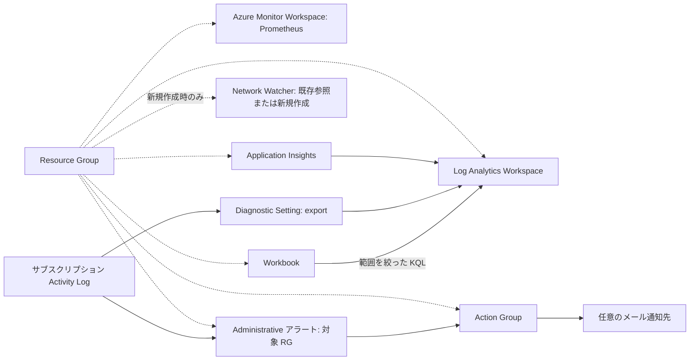

## 概要

既定では Azure に **Resource Group だけ**を作成します。8 つの機能フラグは
すべて `false` で、依存機能を暗黙に有効化しません。Azure リソースと data source は
シナリオ直下ではなく、再利用可能な [Azure モジュール](../../modules/azure/)に定義します。

| `features` フラグ | リソース / 用途 | 必須フラグ |
| --- | --- | --- |
| `azure_monitor` | managed Prometheus 用 Azure Monitor Workspace | なし |
| `log_analytics` | ログ用 Log Analytics Workspace | なし |
| `application_insights` | workspace-based のアプリケーション telemetry | `log_analytics` |
| `network_watcher` | 既存 Network Watcher の参照、または明示的な新規作成 | なし |
| `activity_log` | サブスクリプション Activity Log を `AzureActivity` へ export | `log_analytics` |
| `action_group` | 0 個以上のメール通知先を持つ Action Group | なし |
| `alert_rules` | Resource Group の Administrative Activity Log Alert | `action_group` |
| `workbook` | Log Analytics をクエリする Workbook | `log_analytics` |

不正な組み合わせは plan 時の変数 validation で拒否します。Azure Monitor Workspace は
managed Prometheus 用、Log Analytics Workspace はログ保存用の**別リソース**です。
このシナリオでは Prometheus collector や計装済みアプリケーションを構築しません。

Activity Log 自体は Azure が提供しています。作成するのはサブスクリプション scope の
export 用 Diagnostic Setting です。アラートはイベント駆動・stateless であり、
定期的な KQL / Log Search Alert 評価を行わず、export や Log Analytics にも依存しません。



実線はデータ・クエリ・通知の経路、点線は所属を示します。図のオブザーバビリティ機能は
すべて任意です。既存 Network Watcher は通常、シナリオの Resource Group ではなく
`NetworkWatcherRG` に存在します。

## 前提条件と初期化

構成には Terraform `>= 1.6.0`、mock テストには新しい Terraform
（CI は `1.16.4`）を使用します。provider は AzureRM `~> 5.7.0`、random `3.9.1` です。
[Azure 認証](../../../docs/tips/provider-authentication.ja.md)、
[Terraform 手順](../../../docs/tips/terraform-workflow.ja.md)、
[共有 state ガイド](../../../docs/tips/azure-blob-backend.ja.md)を参照してください。
backend、state、変数ファイル、資格情報は同梱しません。

実行主体には、有効にしたリソースの作成権限と、明示的に列挙した namespace
（`Microsoft.Resources`、`Microsoft.Monitor`、`Microsoft.OperationalInsights`、
`Microsoft.Insights`、`Microsoft.Network`）の登録権限が必要です。
Activity Log export には subscription scope の diagnostic settings 書き込み権限、
既存 Network Watcher 参照には対象リソースの読み取り権限も必要です。
自動 provider registration は無効です。

認証とサブスクリプション選択後、リポジトリ内で実行します。

```bash
cd "$(git rev-parse --show-toplevel)/infra/scenarios/azure_observability"
export ARM_SUBSCRIPTION_ID=$(az account show --query id --output tsv)
terraform init -backend=false -lockfile=readonly
terraform validate
terraform test
terraform plan
# 任意: 既定の Resource Group のみの構成を apply します。
terraform apply
```

`terraform test` は mock provider と plan のみを使い、Azure 認証は不要です。
テスト外の `terraform plan` / `apply` は実際のサブスクリプションに接続します。
apply の承認前には必ず plan を確認してください。

## 機能の有効化

同じシェルで `TF_VAR_features` を設定すると、plan、apply、destroy に同じ選択を渡せます。
以下の各代入は、それ以前の選択を置き換えます。

```bash
# 独立した機能:
export TF_VAR_features='{"azure_monitor":true}'
export TF_VAR_features='{"log_analytics":true}'
export TF_VAR_features='{"network_watcher":true}'
export TF_VAR_features='{"action_group":true}'

# 依存フラグを明示する機能:
export TF_VAR_features='{"log_analytics":true,"application_insights":true}'
export TF_VAR_features='{"log_analytics":true,"activity_log":true}'
export TF_VAR_features='{"log_analytics":true,"workbook":true}'
export TF_VAR_features='{"action_group":true,"alert_rules":true}'

terraform plan
terraform apply
```

全機能を検証する場合:

```bash
export TF_VAR_features='{"azure_monitor":true,"log_analytics":true,"application_insights":true,"network_watcher":true,"activity_log":true,"alert_rules":true,"action_group":true,"workbook":true}'
# 任意: 自分の通知先を指定します。既定では通知先なしです。
# export TF_VAR_action_group_email_addresses='["operator@example.com"]'
terraform plan
terraform apply
terraform output
```

### Network Watcher: 既存参照と新規作成

Network Watcher は 1 subscription・1 region に 1 インスタンスのみ作成できます。
有効化する前に既存インスタンスを確認してください。

```bash
az network watcher list --query "[].{name:name,resourceGroup:resourceGroup,location:location}" -o table
```

既定は**既存参照のみ**で、既定リージョンでは
`NetworkWatcherRG/NetworkWatcher_japaneast`、別リージョンでは
`NetworkWatcher_<location>` を参照します。既存インスタンスが異なる場合は上書きします。

```bash
export TF_VAR_network_watcher='{"create":false,"name":"NetworkWatcher_japaneast","resource_group_name":"NetworkWatcherRG"}'
```

参照対象がない場合は plan が失敗し、自動で新規作成には切り替わりません。
対象リージョンにインスタンスが存在しない場合のみ、新規作成を指定します。

```bash
export TF_VAR_network_watcher='{"create":true}'
terraform plan
terraform apply
```

新規作成時はシナリオの Resource Group と生成名（任意で `name` を上書き可能）を使います。
`resource_group_name` は既存参照時だけ使用します。packet capture、flow logs、
connection monitor は有効化しません。destroy は参照した既存インスタンスを削除しませんが、
このシナリオで新規作成したインスタンスは削除します。管理中のインスタンスのモードを
変更する際は、置換・削除の plan を必ず確認してください。

## 全機能デプロイ後の検証

上記の全機能選択を保持します。対象 Resource Group の一時タグを変更して
Administrative イベントを発生させます。

```bash
RG=$(terraform output -raw resource_group_name)
RG_ID=$(terraform output -raw resource_group_id)
az tag update --resource-id "$RG_ID" --operation Merge --tags observability_probe=manual
az monitor activity-log list --resource-group "$RG" --offset 1h --max-events 10 -o table
az monitor diagnostic-settings subscription list -o json
```

export は過去のイベントを遡及転送しません。新規イベントの取り込みには時間がかかります。
Workspace の **Logs** 画面、または Azure CLI（`log-analytics` 拡張機能が必要な場合が
あります）から確認します。

```bash
az monitor log-analytics query \
  --workspace "$(terraform output -raw log_analytics_workspace_id)" \
  --analytics-query 'AzureActivity | where TimeGenerated > ago(1h) | summarize Events=count() by CategoryValue' \
  -o table
```

```kusto
AzureActivity
| where TimeGenerated > ago(1h)
| summarize Events=count()

AzureActivity
| where TimeGenerated > ago(1h)
| project TimeGenerated, CategoryValue, OperationNameValue, ActivityStatusValue, ResourceGroup
| top 20 by TimeGenerated desc
```

**Azure Monitor → Workbooks** で `terraform output -raw workbook_id` の Workbook を
開きます。概要、件数、category ごとの集計、直近イベントの各セクションが、設定した
Log Analytics Workspace を時間範囲・結果件数を制限してクエリします。
`activity_log` なしでも Workbook は作成できますが、`AzureActivity` のクエリには別の
export でテーブルへデータを取り込む必要があります。空・未作成テーブルは
デプロイ失敗ではありません。

**Azure Monitor → Alerts → Alert rules** で `terraform output -raw alert_rule_name` を
確認します。Administrative category、シナリオ RG の scope/filter、
`terraform output -raw action_group_id` の Action Group との連携を確認してください。
ルール有効化後にタグを再変更し、発火したアラートを確認します。
**Action groups** で通知先を確認し、メールを設定した場合は **Test** を利用します。
通知先が空でも Action Group とルールの連携は存在しますが、**メールは送信されません**。
通知・取り込みには遅延があり得ます。リソースの設定だけでは Application Insights の
telemetry や Prometheus のサンプルは発生しません。

確認後に一時タグを削除します。

```bash
az tag update --resource-id "$RG_ID" --operation Delete --tags observability_probe
```

## 入力と出力

| 入力 | 既定値 / 意味 |
| --- | --- |
| `name`、`location`、`tags` | `observability`、`japaneast`、`{}`。リソース名は共通のランダム suffix を使用 |
| `features` | 機能一覧の全フラグが `false` |
| `network_watcher` | `{create=false, name=null, resource_group_name="NetworkWatcherRG"}` |
| `log_analytics_sku` | `PerGB2018` |
| `log_analytics_retention_in_days` | `30` |
| `log_analytics_daily_quota_gb` | `0.5`。共通モジュールの既定値は従来どおり `-1`（無制限） |
| `application_insights_sampling_percentage` | `25` |
| `activity_log_categories` | Administrative、Security、ServiceHealth、Alert、Recommendation、Policy、Autoscale、ResourceHealth |
| `action_group_email_addresses` | 空の set。各通知先は common alert schema を使用 |

`resource_group_id` と `resource_group_name` は常に返します。各任意機能は
`<prefix>_id` と `<prefix>_name` を公開し、prefix は `azure_monitor`、
`log_analytics`、`application_insights`、`network_watcher`、`activity_log`、
`action_group`、`alert_rule`、`workbook` です。追加の出力は
`log_analytics_workspace_id`（クエリ用 Workspace GUID）と
`network_watcher_created`（新規作成か既存参照か）です。
無効な機能は `null` を返します（Terraform CLI では null の出力を省略する場合があります）。
telemetry のキーは公開しません。

## コストと削除

検証向けの既定値であり、無料を保証しません。Log Analytics / Application Insights の
取り込み・保持、Activity Log export と送信先、managed Prometheus の取り込み・query、
通知チャネルの利用には従量課金が発生する可能性があります。日次上限は厳密な予算上限ではなく、
ログ収集を中断させる場合があります。sampling もすべての telemetry を制限するものでは
ありません。[Azure Monitor の料金](https://azure.microsoft.com/pricing/details/monitor/)を
確認してください。Activity Log Alert は定期課金の Log Search 評価を行いません。

同じシナリオディレクトリで、デプロイ時と**同じ機能・Network Watcher の設定**を保持して
実行します。

```bash
terraform plan -destroy
terraform destroy
unset TF_VAR_features TF_VAR_network_watcher TF_VAR_action_group_email_addresses
```

destroy は管理対象リソースを削除し、この export・アラート構成を停止します。
参照した既存 Network Watcher と Azure 標準の Activity Log は残ります。
削除完了まで state を保持してください。
