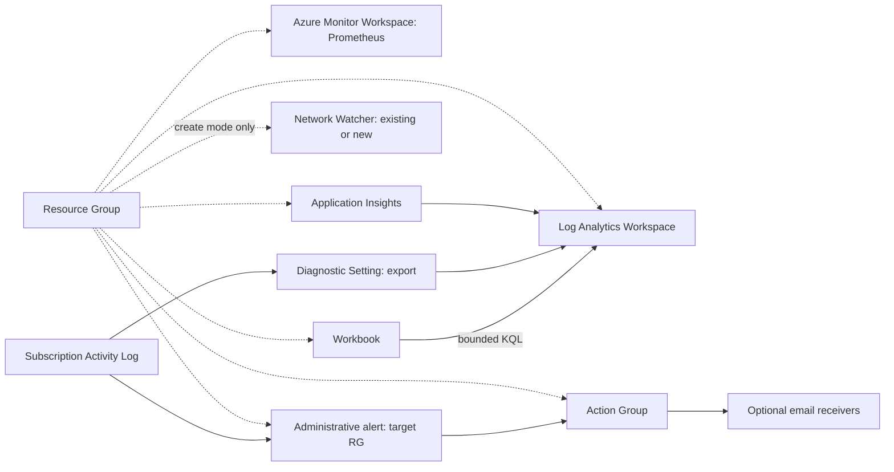

## Overview

By default, this scenario creates **only a Resource Group** in Azure. All eight
observability features default to `false`; dependencies are never enabled
implicitly. Azure resources and data sources live in reusable
[Azure modules](../../modules/azure/), not in the scenario itself.

| `features` flag | Resource / purpose | Required flag |
| --- | --- | --- |
| `azure_monitor` | Azure Monitor Workspace for managed Prometheus | None |
| `log_analytics` | Log Analytics Workspace for logs | None |
| `application_insights` | Workspace-based application telemetry | `log_analytics` |
| `network_watcher` | Create a Network Watcher, or explicitly reference an existing one | None |
| `activity_log` | Subscription Activity Log export to `AzureActivity` | `log_analytics` |
| `action_group` | Action Group with zero or more email receivers | None |
| `alert_rules` | Resource Group Administrative Activity Log Alert | `action_group` |
| `workbook` | Workbook querying Log Analytics | `log_analytics` |

Invalid combinations fail variable validation during plan. Azure Monitor Workspace
and Log Analytics Workspace are **different resources**: the former is for managed
Prometheus, the latter stores logs. This scenario configures neither a Prometheus
collector nor an instrumented application.

Activity Log already exists in Azure. The scenario creates a subscription-scoped
Diagnostic Setting to export it, not an Activity Log resource. The alert is
event-driven and stateless; it does not use scheduled KQL/Log Search Alert
evaluation and does not depend on the export or Log Analytics.



Solid arrows show data/query/notification paths; dotted arrows show containment.
All depicted observability components are optional. By default, Network Watcher
is created in the scenario's Resource Group.

## Prerequisites and initialization

Use Terraform `>= 1.6.0` for configuration; mock tests need a newer Terraform
(CI uses `1.16.4`). Providers are AzureRM `~> 5.7.0` and random `3.9.1`.
Follow [Azure authentication](../../../docs/tips/provider-authentication.md),
[Terraform workflow](../../../docs/tips/terraform-workflow.md), and the
[shared state guide](../../../docs/tips/azure-blob-backend.md).
No backend, state, variable files, or credentials are included.

The deployment principal needs permission to create the selected resources and
register the explicitly listed namespaces (`Microsoft.Resources`,
`Microsoft.Monitor`, `Microsoft.OperationalInsights`, `Microsoft.Insights`,
`Microsoft.Network`). Activity Log export needs subscription-scope diagnostic
settings write permission; existing Network Watcher mode needs read permission
on that resource. Automatic provider registration is disabled.

After authenticating and choosing the subscription, run from the repository root:

```bash
export ARM_SUBSCRIPTION_ID=$(az account show --query id --output tsv)
terraform -chdir=infra/scenarios/azure_observability init -backend=false -lockfile=readonly
terraform -chdir=infra/scenarios/azure_observability validate
terraform -chdir=infra/scenarios/azure_observability test
terraform -chdir=infra/scenarios/azure_observability plan
# Optional: apply the default Resource Group-only configuration.
terraform -chdir=infra/scenarios/azure_observability apply
```

`terraform test` uses mock providers and plan-only runs, without Azure credentials.
`terraform plan` / `apply` outside tests use your real subscription. Review every
plan before approving an apply.

## Enable features

Pass the selected features directly to the Terraform CLI. The following command
enables every feature:

```bash
terraform -chdir=infra/scenarios/azure_observability apply \
  -var='features={azure_monitor=true,log_analytics=true,application_insights=true,network_watcher=true,activity_log=true,alert_rules=true,action_group=true,workbook=true}'
```

To send Action Group notifications, append
`-var='action_group_email_addresses=["operator@example.com"]'`. Omit unwanted
features from the object; explicitly include dependencies such as
`log_analytics=true` for Application Insights, Activity Log, and Workbook, or
`action_group=true` for alert rules.

### Network Watcher: create or reference

Azure allows only one Network Watcher per subscription per region. Before enabling
it, inspect existing instances:

```bash
az network watcher list --query "[].{name:name,resourceGroup:resourceGroup,location:location}" -o table
```

The default is to create a scenario-owned instance in the scenario's Resource
Group. This makes a subscription with no automatically provisioned Network
Watcher work without additional variables.

If the selected region already has an instance, reference it explicitly and
provide its exact name and Resource Group:

```bash
terraform -chdir=infra/scenarios/azure_observability apply \
  -var='features={network_watcher=true}' \
  -var='network_watcher={create=false,name="NetworkWatcher_japaneast",resource_group_name="NetworkWatcherRG"}'
```

Reference mode fails when the specified instance does not exist; there is no
automatic fallback. To customize the name of a newly created instance:

```bash
terraform -chdir=infra/scenarios/azure_observability apply \
  -var='features={network_watcher=true}' \
  -var='network_watcher={create=true,name="dedicated-watcher"}'
```

Creation uses the scenario's Resource Group and generated name (or the optional
`name` override); `resource_group_name` is used only in reference mode. No packet
capture, flow logs, or connection monitors are enabled. Destroy never deletes a
referenced instance, but does delete one created by this scenario. Do not switch
creation mode for a managed instance without reviewing the replacement/deletion plan.

## Verify the full deployment

Keep the all-features selection above. To generate an Administrative event on the
target Resource Group, change a temporary tag:

```bash
RG=$(terraform -chdir=infra/scenarios/azure_observability output -raw resource_group_name)
RG_ID=$(terraform -chdir=infra/scenarios/azure_observability output -raw resource_group_id)
az tag update --resource-id "$RG_ID" --operation Merge --tags observability_probe=manual
az monitor activity-log list --resource-group "$RG" --offset 1h --max-events 10 -o table
az monitor diagnostic-settings subscription list -o json
```

Export is not a historical backfill. Allow time for newly generated events to
arrive. In the workspace's **Logs** blade, or using Azure CLI (the `log-analytics`
extension may be required), query the exported events:

```bash
az monitor log-analytics query \
  --workspace "$(terraform -chdir=infra/scenarios/azure_observability output -raw log_analytics_workspace_id)" \
  --analytics-query 'AzureActivity | where TimeGenerated > ago(1h) | summarize Events=count() by CategoryValue' \
  -o table
```

```kusto
AzureActivity
| where TimeGenerated > ago(1h)
| summarize Events=count()

AzureActivity
| where TimeGenerated > ago(1h)
| project TimeGenerated, CategoryValue, OperationNameValue, ActivityStatusValue, ResourceGroup
| top 20 by TimeGenerated desc
```

Open **Azure Monitor → Workbooks** and select the workbook identified by
`terraform -chdir=infra/scenarios/azure_observability output -raw workbook_id`.
Its overview, count, category breakdown, and
recent-event sections query the configured Log Analytics workspace with bounded
time windows/results. Without `activity_log`, the workbook still deploys, but its
`AzureActivity` queries require that table to be populated by another export;
an empty/missing table is not a deployment failure.

Open **Azure Monitor → Alerts → Alert rules** and inspect
`terraform -chdir=infra/scenarios/azure_observability output -raw alert_rule_name`:
Administrative category, scenario RG scope/filter, and the Action Group ID from
`terraform -chdir=infra/scenarios/azure_observability output -raw action_group_id`.
Generate another tag update after the rule is active, then inspect fired alerts.
In **Action groups**, inspect receivers and use **Test** if you supplied an email.
With no email receivers, the Action Group and alert linkage exist but **no email
is sent**. Delivery/ingestion can be delayed; configuring the resources alone
does not produce Application Insights telemetry or Prometheus samples.

Remove the temporary tag after inspection:

```bash
az tag update --resource-id "$RG_ID" --operation Delete --tags observability_probe
```

## Inputs and outputs

| Input | Default / meaning |
| --- | --- |
| `name`, `location`, `tags` | `observability`, `japaneast`, `{}`; resource names share a random suffix |
| `features` | All flags in the feature table are `false` |
| `network_watcher` | `{create=true, name=null, resource_group_name="NetworkWatcherRG"}` |
| `log_analytics_sku` | `PerGB2018` |
| `log_analytics_retention_in_days` | `30` |
| `log_analytics_daily_quota_gb` | `0.5`; shared module default remains `-1` (unlimited) |
| `application_insights_sampling_percentage` | `25` |
| `activity_log_categories` | Administrative, Security, ServiceHealth, Alert, Recommendation, Policy, Autoscale, ResourceHealth |
| `action_group_email_addresses` | Empty set; each receiver uses common alert schema |

`resource_group_id` and `resource_group_name` are always returned. Each optional
feature exposes `<prefix>_id` and `<prefix>_name`, using prefixes `azure_monitor`,
`log_analytics`, `application_insights`, `network_watcher`, `activity_log`,
`action_group`, `alert_rule`, and `workbook`. Additional outputs are
`log_analytics_workspace_id` (workspace GUID for queries) and
`network_watcher_created` (created vs. referenced). Disabled features return
`null` (Terraform CLI may omit null outputs). No telemetry keys are exposed.

## Costs and cleanup

These are evaluation defaults, not a guarantee of zero cost. Log Analytics and
Application Insights ingestion/retention, Activity Log export and its destination,
managed Prometheus ingestion/query, and notification channels may incur usage
charges. A daily cap is not a hard billing budget and can interrupt logging;
sampling does not cap all telemetry sources. See
[Azure Monitor pricing](https://azure.microsoft.com/pricing/details/monitor/).
The Activity Log Alert does not perform periodically billed Log Search evaluation.

From the repository root, pass the **same feature and Network Watcher settings**
used for deployment:

```bash
terraform -chdir=infra/scenarios/azure_observability destroy \
  -var='features={azure_monitor=true,log_analytics=true,application_insights=true,network_watcher=true,activity_log=true,alert_rules=true,action_group=true,workbook=true}'
```

Destroy removes managed resources, including the default scenario-owned Network
Watcher, and stops this export/alert configuration. An explicitly referenced
Network Watcher and Azure's native Activity Log remain. Preserve state until
cleanup is complete.
