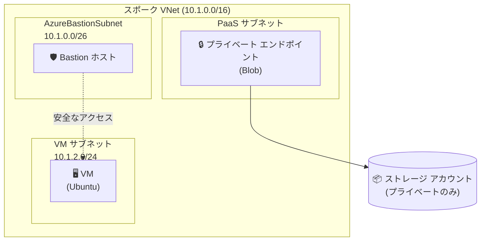

# Azure スポーク ネットワーク

このシナリオでは、Azure ハブ スポーク アーキテクチャ用のスポーク ネットワーク構成をデプロイします。

## アーキテクチャ

この構成では、次のリソースを作成します。

- **仮想ネットワーク (VNet)**: アドレス空間を構成できるスポーク VNet
- **サブネット**:
  - `AzureBastionSubnet`: Azure Bastion 用 (/26 以上)
  - `snet-paas-*`: PaaS プライベート エンドポイント用
  - `snet-vm-*`: 仮想マシン用
- **ストレージ アカウント**: 共通 Storage モジュールを使用し、パブリック ネットワーク アクセスを無効化して Blob 用プライベート エンドポイントを構成
- **プライベート DNS**: `privatelink.blob.core.windows.net` を作成し、スポーク VNet にリンク
- **仮想マシン**: SSH キー認証を使用する Ubuntu 24.04 LTS
- **Azure Bastion**: パブリック IP を使用せずに VM へ安全にアクセス

## ネットワーク図



## 前提条件

- Azure サブスクリプション

共通の [Azure 認証](../../../docs/tips/provider-authentication.ja.md)、
[Terraform ワークフロー](../../../docs/tips/terraform-workflow.ja.md)、および必要に応じて
[Azure Blob Storage バックエンド](../../../docs/tips/azure-blob-backend.ja.md)のガイダンスに従ってください。
リポジトリの Makefile を使用する場合は、`SCENARIO=azure_spoke_network` を設定します。

## 使用方法

共通ワークフローと `SCENARIO=azure_spoke_network` を使用してインフラストラクチャをデプロイし、
続いて、このシナリオ固有の操作を実行します。

### SSH 秘密キーの取得

```bash
terraform output -raw vm_ssh_private_key > vm_key.pem
chmod 600 vm_key.pem
```

### Bastion 経由での VM への接続

Azure portal を使用して Bastion 経由で VM に接続するか、Azure CLI を使用します。

```bash
az network bastion ssh \
  --name <bastion-name> \
  --resource-group <resource-group> \
  --target-resource-id <vm-id> \
  --auth-type ssh-key \
  --username azureuser \
  --ssh-key vm_key.pem
```

### プライベート エンドポイント接続の確認

Bastion 経由で VM に接続した後、次のコマンドを実行し、ストレージ アカウントへプライベート エンドポイント経由でアクセスできることを確認します。

```bash
# Terraform の出力からストレージ アカウント名を取得する
STORAGE_ACCOUNT=$(terraform output -raw storage_account_name)

# 1. DNS 解決でプライベート IP が返されることを確認する (10.1.1.x が返される想定)
nslookup ${STORAGE_ACCOUNT}.blob.core.windows.net

# 2. プライベート エンドポイントの IP が一致することを確認する
terraform output private_endpoint_blob_ip

# 3. Blob エンドポイントへの接続をテストする (ポート 443 で接続される想定)
curl -v https://${STORAGE_ACCOUNT}.blob.core.windows.net/ 2>&1 | head -20
```

**VM 内**で次のコマンドを実行し、プライベート エンドポイントが動作していることを確認します。

```bash
# DNS がパブリック IP ではなくプライベート IP に解決されることを確認する
nslookup <storage-account-name>.blob.core.windows.net

# 想定される出力には、次のようなプライベート IP が表示される
# Address: 10.1.1.4

# HTTPS 接続をテストする
curl -I https://<storage-account-name>.blob.core.windows.net/

# VM に Azure CLI がインストールされている場合、コンテナーを一覧表示する (認証が必要)
az storage container list --account-name <storage-account-name> --auth-mode login
```

**確認用の短いコマンド (VM から実行)**:

```bash
# <storage-account-name> を実際の名前に置き換える
nslookup <storage-account-name>.blob.core.windows.net | grep -E "Address|Name" && \
echo "✅ DNS resolves to private IP if address is 10.x.x.x"
```

## 変数

| 名前                               | 説明                         | 既定値                |
|------------------------------------|------------------------------|-----------------------|
| `name`                             | リソースの基本名             | `azurespokenetwork`   |
| `location`                         | Azure リージョン             | `japaneast`           |
| `tags`                             | 適用するタグ                 | variables.tf を参照   |
| `vnet_address_space`               | VNet のアドレス空間          | `["10.1.0.0/16"]`    |
| `subnet_bastion_address_prefixes`  | Bastion サブネットの CIDR    | `["10.1.0.0/26"]`    |
| `subnet_paas_address_prefixes`     | PaaS サブネットの CIDR       | `["10.1.1.0/24"]`    |
| `subnet_vm_address_prefixes`       | VM サブネットの CIDR         | `["10.1.2.0/24"]`    |
| `storage_account_tier`             | ストレージ層                 | `Standard`            |
| `storage_account_replication_type` | レプリケーションの種類       | `LRS`                 |
| `vm_size`                          | VM サイズ                    | `Standard_B2s`        |
| `vm_admin_username`                | VM 管理者ユーザー            | `azureuser`           |
| `vm_os_disk_size_gb`               | OS ディスク サイズ           | `30`                  |
| `vm_os_disk_type`                  | OS ディスクの種類            | `Standard_LRS`        |
| `bastion_sku`                      | Bastion の SKU               | `Basic`               |

## 出力

| 名前                       | 説明                                   |
|----------------------------|----------------------------------------|
| `resource_group_name`      | リソース グループ名                    |
| `vnet_id`                  | スポーク VNet ID                       |
| `vnet_name`                | スポーク VNet 名                       |
| `storage_account_name`     | ストレージ アカウント名                |
| `private_endpoint_blob_ip` | Blob 用プライベート エンドポイント IP |
| `vm_name`                  | VM 名                                  |
| `vm_private_ip`            | VM のプライベート IP                   |
| `vm_ssh_private_key`       | SSH 秘密キー (機密)                    |
| `bastion_name`             | Bastion ホスト名                       |
| `bastion_public_ip`        | Bastion のパブリック IP                |

## ハブ スポーク構成への拡張

このスポークをハブ VNet に接続するには、VNet ピアリングを追加します。

```hcl
variable "hub_vnet_id" {
  description = "ID of the hub VNet for peering"
  type        = string
  default     = ""
}

resource "azurerm_virtual_network_peering" "spoke_to_hub" {
  count                     = var.hub_vnet_id != "" ? 1 : 0
  name                      = "peer-spoke-to-hub"
  resource_group_name       = azurerm_resource_group.this.name
  virtual_network_name      = azurerm_virtual_network.spoke.name
  remote_virtual_network_id = var.hub_vnet_id
  allow_forwarded_traffic   = true
  allow_gateway_transit     = false
  use_remote_gateways       = false
}
```

## 参考資料

- [Azure のハブ スポーク ネットワーク トポロジ](https://learn.microsoft.com/azure/architecture/networking/architecture/hub-spoke)
- [Azure Bastion のドキュメント](https://learn.microsoft.com/azure/bastion/)
- [Azure Storage のプライベート エンドポイント](https://learn.microsoft.com/azure/storage/common/storage-private-endpoints)
