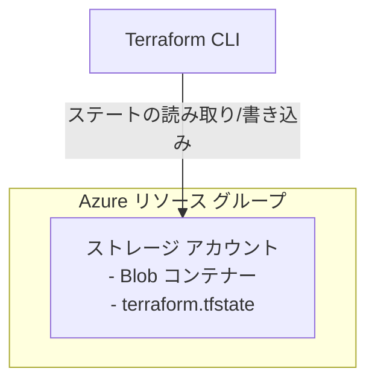

# Azure Terraform バックエンド シナリオ

Terraform バックエンド用の Azure Storage アカウントを作成します。このシナリオでは、作成対象のバックエンドに依存しないように、
ローカル ステートを使用してバックエンド ストレージをブートストラップします。

## アーキテクチャ



## 前提条件

- Azure サブスクリプション

共通の [Azure 認証](../../../docs/tips/provider-authentication.ja.md)と
[Terraform ワークフロー](../../../docs/tips/terraform-workflow.ja.md)に従ってください。リポジトリの Makefile を使用する場合は、
`SCENARIO=azure_terraform_backend` を設定します。このブートストラップ シナリオは、デプロイ中にローカル ステートを使用し続ける必要があります。

## 使用方法

標準ワークフローとローカル ステートを使用してシナリオをデプロイします。
[Azure Blob Storage バックエンド ガイド](../../../docs/tips/azure-blob-backend.ja.md)で必要な 3 つの値を取得します。

```bash
terraform output -raw resource_group_name
terraform output -raw storage_account_name
terraform output -raw storage_container_name
```

別のシナリオが Blob コンテナーにステートを保存している間は、このシナリオを破棄しないでください。
バックエンド ストレージを削除できるようになったら、`SCENARIO=azure_terraform_backend` を指定して共通ワークフローに従います。
