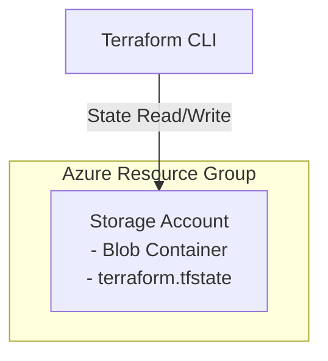

# Azure Terraform Backend Scenario

Create an Azure Storage Account for Terraform backend. This scenario bootstraps
the backend storage using local state so it does not depend on the backend it
creates.

## Architecture


```mermaid
flowchart TB
    subgraph Azure["Azure Resource Group"]
        SA["Storage Account<br/>- Blob Container<br/>- terraform.tfstate"]
    end

    TF["Terraform CLI"] -->|"State Read/Write"| SA
```

## Prerequisites

- Azure subscription

Follow the shared [Azure authentication](../../../docs/tips/provider-authentication.md)
and [Terraform workflow](../../../docs/tips/terraform-workflow.md). Set
`SCENARIO=azure_terraform_backend` when using the repository Makefile. This
bootstrap scenario must remain on local state during deployment.

## How to use

Deploy the scenario with the standard workflow and local state. Retrieve the
three values required by the
[Azure Blob Storage backend guide](../../../docs/tips/azure-blob-backend.md):

```bash
terraform output -raw resource_group_name
terraform output -raw storage_account_name
terraform output -raw storage_container_name
```

Do not destroy this scenario while another scenario stores state in its Blob
container. Follow the shared workflow with `SCENARIO=azure_terraform_backend`
when the backend storage can be removed.
