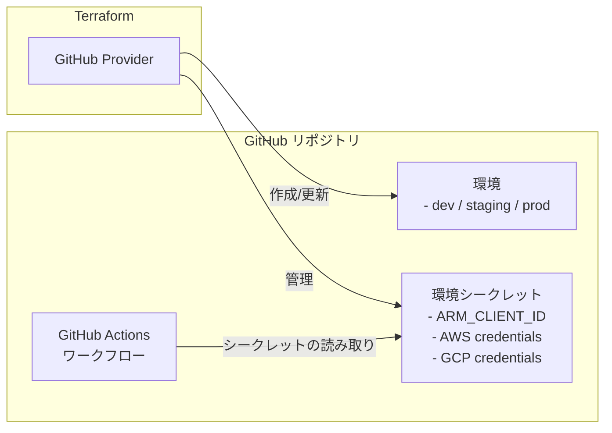

# GitHub シークレットと環境のセットアップ

この Terraform シナリオでは、GitHub Provider を使用して GitHub リポジトリ環境のシークレットを作成および管理する方法を示します。指定した GitHub リポジトリ環境にシークレットを設定し、GitHub Actions ワークフローから使用できるようにします。

## アーキテクチャ



## 前提条件

- GitHub アカウント
- [Provider の認証](../../../docs/tips/provider-authentication.ja.md)に従って、`GITHUB_TOKEN` と、値を収集する対象のクラウド Provider を構成する

## 使用方法

次の `terraform.tfvars` を作成した後、`SCENARIO=github_secrets` を指定して
[Terraform ワークフロー](../../../docs/tips/terraform-workflow.ja.md)に従います。

```bash
# 認証済みの Azure CLI セッションから Azure の値を収集する

APPLICATION_NAME="template-terraform_dev"
APPLICATION_ID=$(az ad sp list --display-name "$APPLICATION_NAME" --query "[0].appId" --output tsv)
SUBSCRIPTION_ID=$(az account show --query id --output tsv)
TENANT_ID=$(az account show --query tenantId --output tsv)
AWS_ID="YOUR_AWS_ACCOUNT_ID" # 置き換える
AWS_ROLE_NAME="GitHubActionsRole"

# Google Cloud の設定 (google_github_oidc シナリオの出力から取得する)
# infra/scenarios/google_github_oidc で `terraform output` を実行して、これらの値を取得する
GCP_PROJECT_ID="YOUR_PROJECT_NUMBER" # 置き換える
GCP_WORKLOAD_IDENTITY_PROVIDER="projects/${GCP_PROJECT_ID}/locations/global/workloadIdentityPools/github-actions/providers/github"
GCP_SERVICE_ACCOUNT="github-actions@${GCP_PROJECT_ID}.iam.gserviceaccount.com"

cat <<EOF > terraform.tfvars
github_owner = "ks6088ts"
repository_name = "template-terraform"
environment_name = "dev"
actions_environment_secrets = [
  {
    name  = "ARM_CLIENT_ID"
    value = "$APPLICATION_ID"
  },
  {
    name  = "ARM_SUBSCRIPTION_ID"
    value = "$SUBSCRIPTION_ID"
  },
  {
    name  = "ARM_TENANT_ID"
    value = "$TENANT_ID"
  },
  {
    name  = "ARM_USE_OIDC"
    value = "true"
  },
  {
    name  = "AWS_ID"
    value = "$AWS_ID"
  },
  {
    name  = "AWS_ROLE_NAME"
    value = "$AWS_ROLE_NAME"
  },
  {
    name  = "GCP_WORKLOAD_IDENTITY_PROVIDER"
    value = "$GCP_WORKLOAD_IDENTITY_PROVIDER"
  },
  {
    name  = "GCP_SERVICE_ACCOUNT"
    value = "$GCP_SERVICE_ACCOUNT"
  }
]
EOF
```
