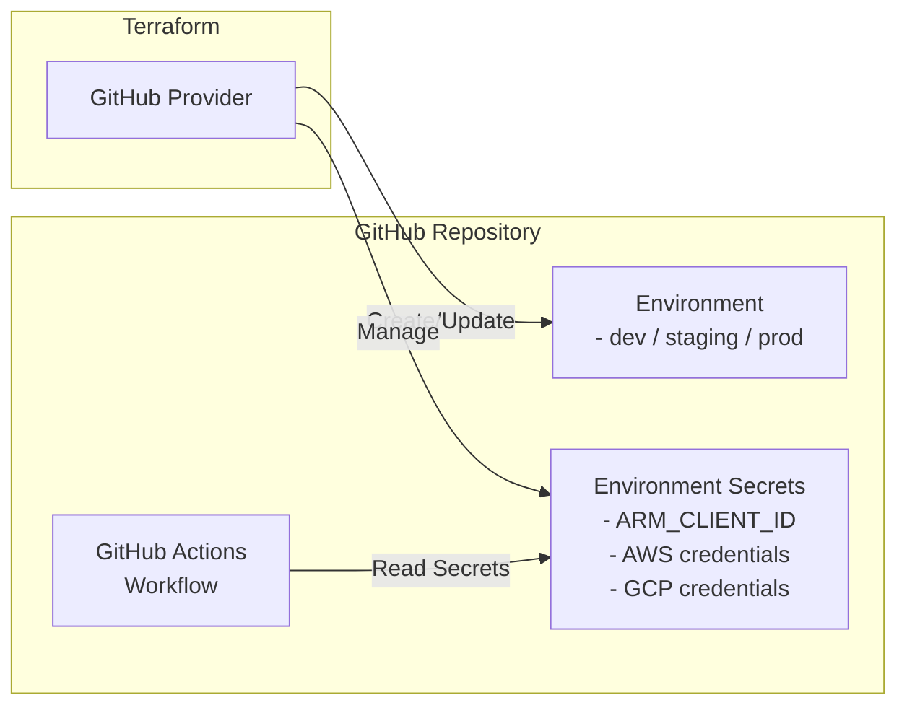

# GitHub Secrets and Environment Setup

This Terraform scenario demonstrates how to create and manage GitHub repository environment secrets using the GitHub provider. It sets up secrets for a specified GitHub repository environment, which can be used in GitHub Actions workflows.

## Architecture



## Prerequisites

- GitHub account
- Configure `GITHUB_TOKEN` and the cloud providers whose values you collect by following [provider authentication](../../../docs/tips/provider-authentication.md)

## How to use

Follow the [Terraform workflow](../../../docs/tips/terraform-workflow.md) with
`SCENARIO=github_secrets` after creating `terraform.tfvars` below.

```bash
# Collect Azure values from the authenticated Azure CLI session

APPLICATION_NAME="template-terraform_dev"
APPLICATION_ID=$(az ad sp list --display-name "$APPLICATION_NAME" --query "[0].appId" --output tsv)
SUBSCRIPTION_ID=$(az account show --query id --output tsv)
TENANT_ID=$(az account show --query tenantId --output tsv)
AWS_ID="YOUR_AWS_ACCOUNT_ID" # replace me
AWS_ROLE_NAME="GitHubActionsRole"

# Google Cloud settings (get from google_github_oidc scenario outputs)
# Run `terraform output` in infra/scenarios/google_github_oidc to get these values
GCP_PROJECT_ID="YOUR_PROJECT_NUMBER" # replace me
GCP_WORKLOAD_IDENTITY_PROVIDER="projects/${GCP_PROJECT_ID}/locations/global/workloadIdentityPools/github-actions/providers/github"
GCP_SERVICE_ACCOUNT="github-actions@${GCP_PROJECT_ID}.iam.gserviceaccount.com"

cat <<EOF > terraform.tfvars
github_owner = "ks6088ts"
repository_name = "template-terraform"
environment_name = "dev"
actions_environment_secrets = [
  {
    name  = "ARM_CLIENT_ID"
    value = "$APPLICATION_ID"
  },
  {
    name  = "ARM_SUBSCRIPTION_ID"
    value = "$SUBSCRIPTION_ID"
  },
  {
    name  = "ARM_TENANT_ID"
    value = "$TENANT_ID"
  },
  {
    name  = "ARM_USE_OIDC"
    value = "true"
  },
  {
    name  = "AWS_ID"
    value = "$AWS_ID"
  },
  {
    name  = "AWS_ROLE_NAME"
    value = "$AWS_ROLE_NAME"
  },
  {
    name  = "GCP_WORKLOAD_IDENTITY_PROVIDER"
    value = "$GCP_WORKLOAD_IDENTITY_PROVIDER"
  },
  {
    name  = "GCP_SERVICE_ACCOUNT"
    value = "$GCP_SERVICE_ACCOUNT"
  }
]
EOF
```
