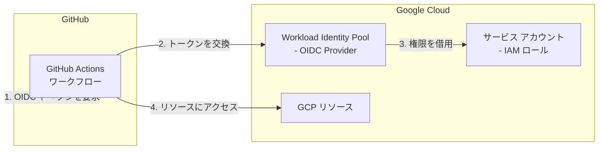

# Google GitHub OIDC

この Terraform シナリオでは、Workload Identity Federation 経由の OpenID Connect (OIDC) を使用して GitHub Actions が Google Cloud で認証するために必要な Google Cloud リソースを作成します。これにより、有効期間の長いサービス アカウント キーを GitHub シークレットとして保存する必要がなくなります。

## アーキテクチャ



## 作成されるリソース

- **Workload Identity Pool**: 外部 ID 用のプールを作成
- **Workload Identity Pool Provider**: GitHub を OIDC Provider として構成
- **サービス アカウント**: GitHub Actions が権限を借用するサービス アカウント
- **IAM バインディング**: 指定したロールをサービス アカウントに付与し、GitHub Actions がその権限を借用できるようにする

## 前提条件

- 次の API が有効になっている Google Cloud プロジェクト:
  - IAM API (`iam.googleapis.com`)
  - IAM Service Account Credentials API (`iamcredentials.googleapis.com`)
- プロジェクトで IAM リソースを作成するための適切なアクセス許可
- Google Cloud の [Provider の認証](../../../docs/tips/provider-authentication.ja.md)を完了する

## 必要な API の有効化

```shell
gcloud services enable iam.googleapis.com iamcredentials.googleapis.com --project=YOUR_PROJECT_ID
```

## 使用方法

このシナリオに必要なプロジェクト ID を設定します。

```bash
export TF_VAR_project_id="your-project-id"
```

`SCENARIO=google_github_oidc` を指定して
[Terraform ワークフロー](../../../docs/tips/terraform-workflow.ja.md)に従います。

### 省略可能な GCS バックエンド

GCS バックエンドを使用するには、このシナリオ ディレクトリに `backend.tf` を作成します。

```bash
cat <<EOF > backend.tf
terraform {
  backend "gcs" {
    bucket = "YOUR_GCS_BUCKET_NAME"
    prefix = "google_github_oidc/terraform.tfstate"
  }
}
EOF
```

## 変数

| 名前                                           | 説明                                      | 既定値                           |
|------------------------------------------------|-------------------------------------------|----------------------------------|
| `project_id`                                   | Google Cloud プロジェクト ID              | (必須)                           |
| `region`                                       | Google Cloud リージョン                   | `asia-northeast1`                |
| `github_organization`                          | GitHub Organization 名                    | `ks6088ts`                       |
| `github_repository`                            | GitHub リポジトリ名                       | `template-terraform`             |
| `workload_identity_pool_id`                    | Workload Identity Pool の ID              | `github-actions-pool`            |
| `workload_identity_pool_display_name`          | Workload Identity Pool の表示名           | `GitHub Actions Pool`            |
| `workload_identity_pool_provider_id`           | Workload Identity Pool Provider の ID     | `github`                         |
| `workload_identity_pool_provider_display_name` | Workload Identity Pool Provider の表示名  | `GitHub`                         |
| `service_account_id`                           | サービス アカウントの ID                  | `github-actions`                 |
| `service_account_display_name`                 | サービス アカウントの表示名               | `GitHub Actions Service Account` |
| `roles`                                        | サービス アカウントに付与する IAM ロール  | `["roles/viewer"]`               |

## 出力

| 名前                              | 説明                                 |
|-----------------------------------|--------------------------------------|
| `workload_identity_pool_name`     | Workload Identity Pool の完全な名前  |
| `workload_identity_pool_id`       | Workload Identity Pool の ID         |
| `workload_identity_provider_name` | Workload Identity Pool Provider の完全な名前 |
| `service_account_email`           | サービス アカウントのメール アドレス |
| `service_account_id`              | サービス アカウントの ID             |
| `project_id`                      | Google Cloud プロジェクト ID         |

## GitHub Actions での Workload Identity の使用

このシナリオをデプロイした後、Workload Identity Federation による OIDC 認証を使用するように GitHub Actions ワークフローを構成します。

```yaml
name: Google Cloud OIDC Example

on:
  push:
    branches:
      - main

permissions:
  id-token: write  # OIDC に必要
  contents: read

jobs:
  deploy:
    runs-on: ubuntu-latest
    steps:
      - name: Checkout
        uses: actions/checkout@v4

      - name: Authenticate to Google Cloud
        uses: google-github-actions/auth@v2
        with:
          workload_identity_provider: 'projects/YOUR_PROJECT_NUMBER/locations/global/workloadIdentityPools/github-actions-pool/providers/github'
          service_account: 'github-actions@YOUR_PROJECT_ID.iam.gserviceaccount.com'

      - name: Set up Cloud SDK
        uses: google-github-actions/setup-gcloud@v2

      - name: Use gcloud CLI
        run: gcloud info
```

## Workload Identity Provider パスの取得

Terraform 構成を適用した後、GitHub Actions で使用する Workload Identity Provider の完全なパスを取得できます。

```shell
# Workload Identity Provider 名を取得する
terraform output workload_identity_provider_name

# サービス アカウントのメール アドレスを取得する
terraform output service_account_email
```

## 参考資料

- [Workload Identity Federation](https://cloud.google.com/iam/docs/workload-identity-federation)
- [Google Cloud での GitHub Actions OIDC](https://cloud.google.com/blog/products/identity-security/enabling-keyless-authentication-from-github-actions)
- [google-github-actions/auth](https://github.com/google-github-actions/auth)
