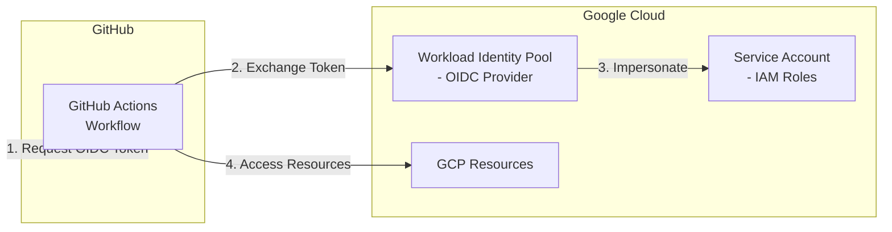

# Google GitHub OIDC

This Terraform scenario creates the necessary Google Cloud resources to enable GitHub Actions to authenticate with Google Cloud using OpenID Connect (OIDC) via Workload Identity Federation. This eliminates the need for storing long-lived service account keys as GitHub secrets.

## Architecture



## Resources Created

- **Workload Identity Pool**: Creates a pool for external identities
- **Workload Identity Pool Provider**: Configures GitHub as an OIDC provider
- **Service Account**: Service account for GitHub Actions to impersonate
- **IAM Bindings**: Grants the service account specified roles and allows GitHub Actions to impersonate it

## Prerequisites

- Terraform CLI installed
- Google Cloud SDK (gcloud) installed and configured
- Google Cloud project with the following APIs enabled:
  - IAM API (`iam.googleapis.com`)
  - IAM Service Account Credentials API (`iamcredentials.googleapis.com`)
- Appropriate permissions to create IAM resources in the project

## Enable Required APIs

```shell
gcloud services enable iam.googleapis.com iamcredentials.googleapis.com --project=YOUR_PROJECT_ID
```

## How to use

```shell
# Create backend.tf if you want to use GCS backend (optional)
cat <<EOF > backend.tf
terraform {
  backend "gcs" {
    bucket = "YOUR_GCS_BUCKET_NAME"
    prefix = "google_github_oidc/terraform.tfstate"
  }
}
EOF

# Or use local backend for testing
cat <<EOF > backend.tf
terraform {
  backend "local" {
    path = "terraform.tfstate"
  }
}
EOF

# Configure Google Cloud credentials
gcloud auth application-default login
# Or set environment variable
export GOOGLE_APPLICATION_CREDENTIALS="/path/to/service-account-key.json"

# Set your project ID
export TF_VAR_project_id="your-project-id"

# Initialize Terraform
terraform init

# Plan the deployment
terraform plan

# Apply the deployment
terraform apply -auto-approve

# Confirm the output
terraform output

# Destroy the deployment
terraform destroy -auto-approve
```

## Variables

| Name | Description | Default |
|------|-------------|---------|
| `project_id` | Google Cloud project ID | (required) |
| `region` | Google Cloud region | `asia-northeast1` |
| `github_organization` | GitHub organization name | `ks6088ts` |
| `github_repository` | GitHub repository name | `template-terraform` |
| `workload_identity_pool_id` | ID for the Workload Identity Pool | `github-actions-pool` |
| `workload_identity_pool_display_name` | Display name for the Workload Identity Pool | `GitHub Actions Pool` |
| `workload_identity_pool_provider_id` | ID for the Workload Identity Pool Provider | `github` |
| `workload_identity_pool_provider_display_name` | Display name for the Workload Identity Pool Provider | `GitHub` |
| `service_account_id` | ID for the service account | `github-actions` |
| `service_account_display_name` | Display name for the service account | `GitHub Actions Service Account` |
| `roles` | List of IAM roles to grant to the service account | `["roles/viewer"]` |

## Outputs

| Name | Description |
|------|-------------|
| `workload_identity_pool_name` | Full name of the Workload Identity Pool |
| `workload_identity_pool_id` | ID of the Workload Identity Pool |
| `workload_identity_provider_name` | Full name of the Workload Identity Pool Provider |
| `service_account_email` | Email of the service account |
| `service_account_id` | ID of the service account |
| `project_id` | Google Cloud project ID |

## Using the Workload Identity in GitHub Actions

After deploying this scenario, configure your GitHub Actions workflow to use OIDC authentication with Workload Identity Federation:

```yaml
name: Google Cloud OIDC Example

on:
  push:
    branches:
      - main

permissions:
  id-token: write  # Required for OIDC
  contents: read

jobs:
  deploy:
    runs-on: ubuntu-latest
    steps:
      - name: Checkout
        uses: actions/checkout@v4

      - name: Authenticate to Google Cloud
        uses: google-github-actions/auth@v2
        with:
          workload_identity_provider: 'projects/YOUR_PROJECT_NUMBER/locations/global/workloadIdentityPools/github-actions-pool/providers/github'
          service_account: 'github-actions@YOUR_PROJECT_ID.iam.gserviceaccount.com'

      - name: Set up Cloud SDK
        uses: google-github-actions/setup-gcloud@v2

      - name: Use gcloud CLI
        run: gcloud info
```

## Getting the Workload Identity Provider Path

After applying the Terraform configuration, you can get the full workload identity provider path for use in GitHub Actions:

```shell
# Get the workload identity provider name
terraform output workload_identity_provider_name

# Get the service account email
terraform output service_account_email
```

## References

- [Workload Identity Federation](https://cloud.google.com/iam/docs/workload-identity-federation)
- [GitHub Actions OIDC with Google Cloud](https://cloud.google.com/blog/products/identity-security/enabling-keyless-authentication-from-github-actions)
- [google-github-actions/auth](https://github.com/google-github-actions/auth)
