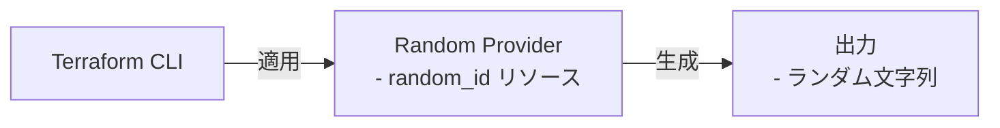

# Hello World シナリオ

Random Provider を使用してランダム文字列を生成します。

## アーキテクチャ



## 前提条件

- [Terraform ワークフロー](../../../docs/tips/terraform-workflow.ja.md)に記載されている前提条件を満たす
- [Provider の認証](../../../docs/tips/provider-authentication.ja.md)を確認する。このシナリオでは Provider の資格情報は不要

## 使用方法

このシナリオの変数定義を作成します。

```bash
# 変数定義ファイルを作成する
cat > terraform.tfvars <<EOF
byte_length = 2
EOF
```

`SCENARIO=hello_world` を指定して
[Terraform ワークフロー](../../../docs/tips/terraform-workflow.ja.md)に従います。

デプロイ後に生成された値を確認します。

```bash
terraform output
```
