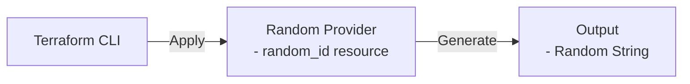

# Hello World Scenario

Use random provider to generate random string.

## Architecture



## Prerequisites

- Terraform CLI installed

## How to use

```shell
# Create variable definitions file
cat > terraform.tfvars <<EOF
byte_length = 2
EOF

# create backend.tf if needed
cat <<EOF > backend.tf
terraform {
  backend "azurerm" {
    resource_group_name  = "YOUR_RESOURCE_GROUP_NAME"
    storage_account_name = "YOUR_STORAGE_ACCOUNT_NAME"
    container_name       = "YOUR_CONTAINER_NAME"
    key                  = "hello_world.dev.tfstate"
  }
}
EOF

# Initialize Terraform
terraform init

# Plan the deployment
terraform plan -out=tfplan

# Apply the deployment
terraform apply tfplan
# or simply
terraform apply -auto-approve

# Confirm the output
terraform output

# Confirm the state file
cat terraform.tfstate

# Destroy the deployment
terraform destroy -auto-approve
```
