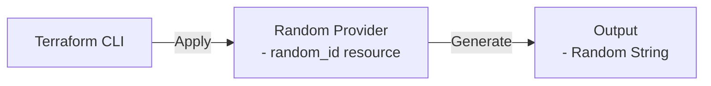

# Hello World Scenario

Use random provider to generate random string.

## Architecture


```mermaid
flowchart LR
    TF["Terraform CLI"] -->|"Apply"| RP["Random Provider<br/>- random_id resource"]
    RP -->|"Generate"| OUT["Output<br/>- Random String"]
```

## Prerequisites

- Complete the prerequisites in the [Terraform workflow](../../../docs/tips/terraform-workflow.md)
- Review [provider authentication](../../../docs/tips/provider-authentication.md); this scenario does not require provider credentials

## How to use

Create the variable definition for this scenario:

```bash
# Create variable definitions file
cat > terraform.tfvars <<EOF
byte_length = 2
EOF
```

Follow the [Terraform workflow](../../../docs/tips/terraform-workflow.md) with
`SCENARIO=hello_world`.

Verify the generated value after deployment:

```bash
terraform output
```
