# inclusive_ai_labs

このTerraformシナリオは、Azure Container Apps上にinclusive_ai_labsアプリケーションをデプロイします。音声認識（STT）、AI対話（GenAI）、音声合成（TTS）を組み合わせた**インクルーシブなAI対話システム**を構築できます。

## 🎯 このシナリオでできること

- **音声からテキストへの変換**（Speech-to-Text）: ユーザーの音声をテキストに変換
- **AIとの対話**（Generative AI）: テキストを元にAIが応答を生成
- **テキストから音声への変換**（Text-to-Speech）: AIの応答を音声で読み上げ

これにより、視覚障害者や手を使えない方でも、音声でAIと対話できるアクセシブルなシステムを実現します。

## 📦 デプロイされるコンポーネント

| コンポーネント | 役割 | 外部アクセス |
|---------------|------|-------------|
| **inclusive_ai_labs** | メインAPIサーバー（対話処理の司令塔） | ✅ 可能 |
| **voicevox** | 日本語音声合成エンジン | ❌ 内部のみ |
| **ollama** | ローカルLLM実行エンジン | ❌ 内部のみ（設定で変更可） |

## 🏗️ システムアーキテクチャ

### 全体構成図

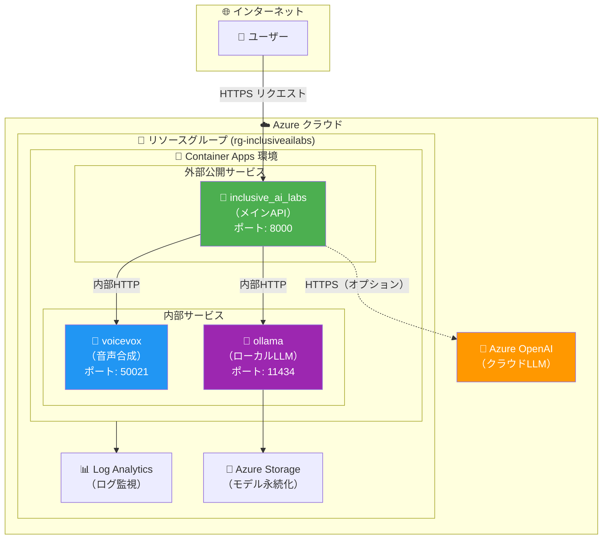

### Azure リソース構成図

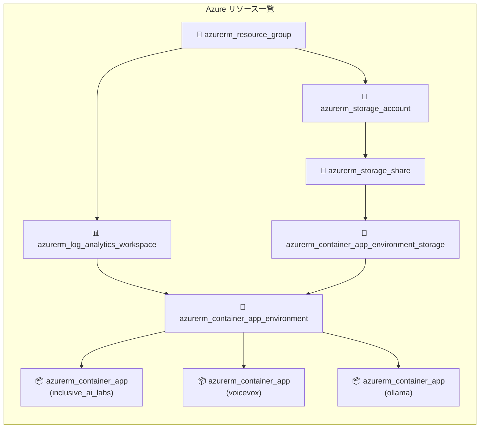

## 🔄 処理フロー

### 音声対話の流れ

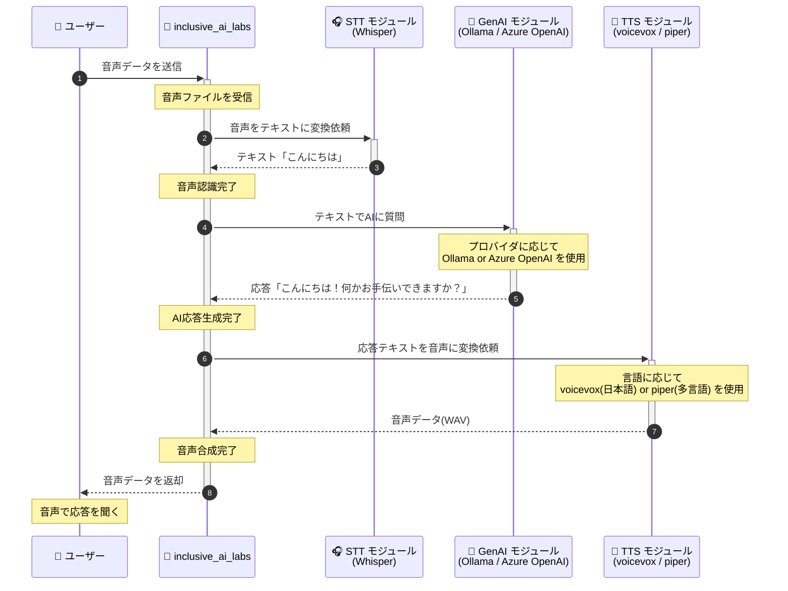

### APIリクエスト処理の詳細

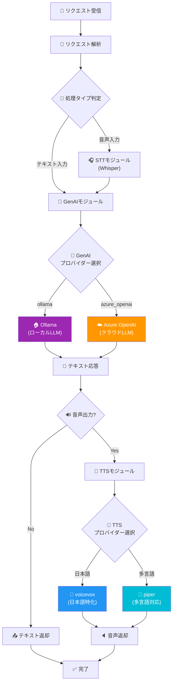

## � マルチプロバイダ対応

inclusive_ai_labs は **STT（音声認識）**、**GenAI（生成AI）**、**TTS（音声合成）** の各モジュールで**複数のプロバイダを切り替え可能**な設計になっています。用途や要件に応じて最適なプロバイダを選択できます。

### プロバイダ対応一覧

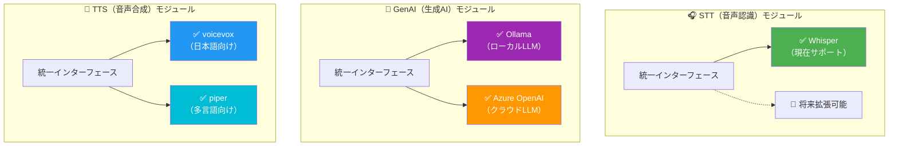

### 各モジュールの詳細

| モジュール | プロバイダ | 対応言語・用途 | 特徴 |
|-----------|-----------|--------------|------|
| **STT** | Whisper | 多言語（100言語以上） | OpenAI開発の高精度音声認識モデル |
| **GenAI** | Ollama | 多言語 | ローカル実行、データが外部に出ない、無料 |
| **GenAI** | Azure OpenAI | 多言語 | GPT-4o等の高性能モデル、エンタープライズ対応 |
| **TTS** | voicevox | 🇯🇵 **日本語特化** | 高品質な日本語音声、キャラクター音声対応 |
| **TTS** | piper | 🌍 **多言語対応** | 英語・ドイツ語・フランス語等、軽量で高速 |

### プロバイダ選択のフロー

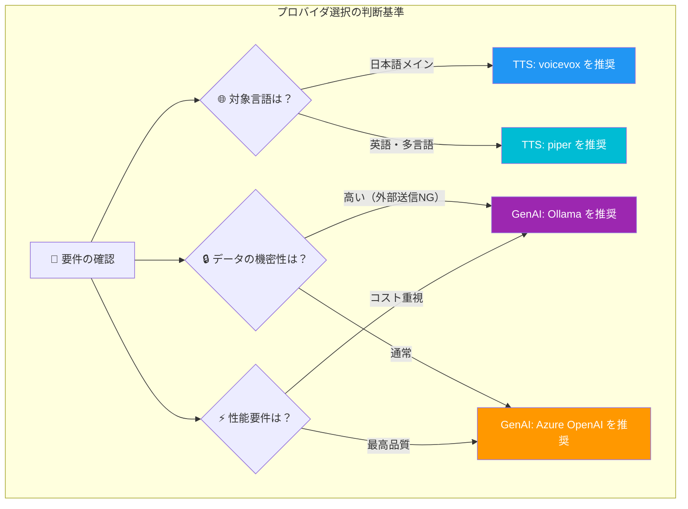

### 環境変数によるプロバイダ切り替え

| 環境変数 | 設定値 | 説明 |
|---------|-------|------|
| `GENAI_DEFAULT_PROVIDER` | `ollama` / `azure_openai` | 使用するLLMプロバイダ |
| `TTS_DEFAULT_PROVIDER` | `voicevox` / `piper` | 使用する音声合成プロバイダ |
| `STT_DEFAULT_PROVIDER` | `whisper` | 使用する音声認識プロバイダ |

## 🔗 コンテナ間通信

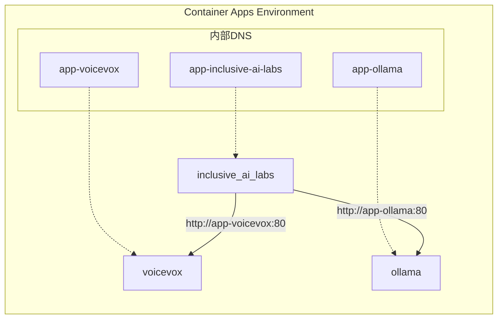

同じContainer Apps環境内では、アプリ名で直接通信できます。

- `http://app-voicevox` → voicevoxコンテナ
- `http://app-ollama` → ollamaコンテナ

## 📊 監視とログ

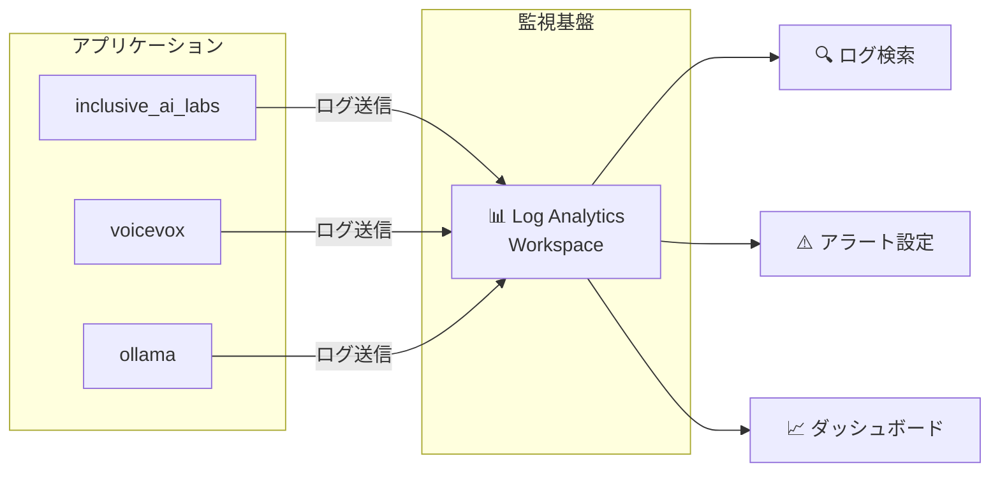

## ⚙️ 前提条件

- Azure サブスクリプション
- Terraform >= 1.6.0
- Azure CLI（ログイン済み）
- Azure OpenAI リソース（デプロイ済みモデル付き）※ Azure OpenAI を利用する場合

## 🚀 クイックスタート

1. **Terraformの初期化**

   ```bash
   terraform init
   ```

2. **`terraform.tfvars` ファイルを作成**

   ```hcl
   name     = "inclusiveailabs"
   location = "japaneast"

   # Azure OpenAI 設定（Azure OpenAI を使用する場合は必須）
   genai_azure_openai_endpoint = "https://your-openai-resource.openai.azure.com/"
   genai_azure_openai_api_key  = "your-api-key-here"
   genai_azure_openai_deployment_name = "gpt-4o"

   # ローカルLLM（Ollama）をデフォルトで使用する場合
   genai_default_provider = "ollama"
   ollama_model = "gemma3:270m"  # デフォルトモデル
   ```

3. **デプロイ**

   ```bash
   terraform plan
   terraform apply
   ```

4. **アプリケーションへのアクセス**

   デプロイ完了後、URLが出力されます：

   ```bash
   terraform output inclusive_ai_labs_url
   ```

## 📋 変数一覧

### 必須変数

| 名前 | 説明 |
|------|------|
| `genai_azure_openai_api_key` | Azure OpenAI APIキー（機密情報） |

### 基本設定

| 名前 | デフォルト値 | 説明 |
|------|-------------|------|
| `name` | `inclusiveailabs` | リソースの基本名 |
| `location` | `japaneast` | Azureリージョン |

### inclusive_ai_labs コンテナ設定

| 名前 | デフォルト値 | 説明 |
|------|-------------|------|
| `inclusive_ai_labs_image` | `ks6088ts/inclusive-ai-labs:latest` | Dockerイメージ |
| `inclusive_ai_labs_cpu` | `2.0` | CPUコア数 |
| `inclusive_ai_labs_memory` | `4Gi` | メモリ |
| `inclusive_ai_labs_min_replicas` | `1` | 最小レプリカ数 |
| `inclusive_ai_labs_max_replicas` | `3` | 最大レプリカ数 |

### voicevox コンテナ設定

| 名前 | デフォルト値 | 説明 |
|------|-------------|------|
| `voicevox_image` | `voicevox/voicevox_engine:cpu-ubuntu20.04-latest` | Dockerイメージ |
| `voicevox_cpu` | `2.0` | CPUコア数 |
| `voicevox_memory` | `4Gi` | メモリ |
| `voicevox_min_replicas` | `1` | 最小レプリカ数 |
| `voicevox_max_replicas` | `3` | 最大レプリカ数 |

### Ollama コンテナ設定

| 名前 | デフォルト値 | 説明 |
|------|-------------|------|
| `ollama_image` | `ollama/ollama:latest` | Dockerイメージ |
| `ollama_model` | `gemma3:270m` | 起動時にダウンロードするモデル |
| `ollama_cpu` | `2.0` | CPUコア数 |
| `ollama_memory` | `4Gi` | メモリ |
| `ollama_storage_quota_gb` | `10` | ストレージ容量(GB) |
| `ollama_external_enabled` | `false` | 外部公開するか |

### AI/音声処理設定

| 名前 | デフォルト値 | 説明 |
|------|-------------|------|
| `genai_default_provider` | `ollama` | LLMプロバイダー（`ollama` または `azure_openai`） |
| `genai_azure_openai_endpoint` | `` | Azure OpenAI エンドポイントURL |
| `genai_azure_openai_deployment_name` | `gpt-4o` | デプロイメント名 |
| `stt_default_provider` | `whisper` | 音声認識プロバイダー |
| `stt_whisper_model_size` | `small` | Whisperモデルサイズ |
| `tts_default_provider` | `voicevox` | 音声合成プロバイダー |
| `tts_voicevox_default_speaker` | `1` | voicevoxスピーカーID |

詳細は [variables.tf](variables.tf) を参照してください。

## 📤 出力値

| 名前 | 説明 |
|------|------|
| `inclusive_ai_labs_url` | inclusive_ai_labs APIの公開URL |
| `inclusive_ai_labs_fqdn` | Container AppのFQDN |
| `voicevox_internal_fqdn` | voicevoxの内部FQDN |
| `ollama_internal_fqdn` | ollamaの内部FQDN |
| `ollama_url` | ollamaのURL（外部/内部） |

## 🔗 内部通信の仕組み

`inclusive_ai_labs` コンテナは、Container Apps環境内の内部DNSを使用して他のコンテナと通信します：

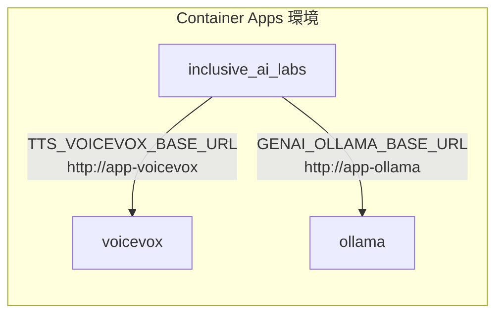

環境変数で自動設定されます：

- `TTS_VOICEVOX_BASE_URL=http://app-voicevox`
- `GENAI_OLLAMA_BASE_URL=http://app-ollama`

## 🗑️ リソースの削除

```bash
terraform destroy
```

## 💡 ユースケース

### ユースケース 1: アクセシブルなAIアシスタント

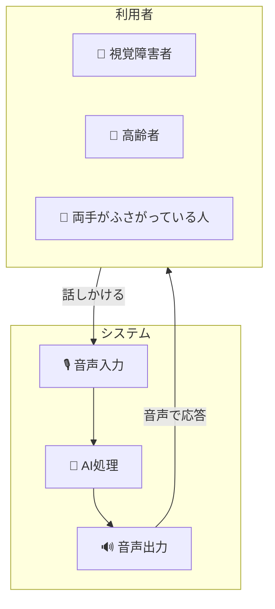

### ユースケース 2: 多言語対話システム

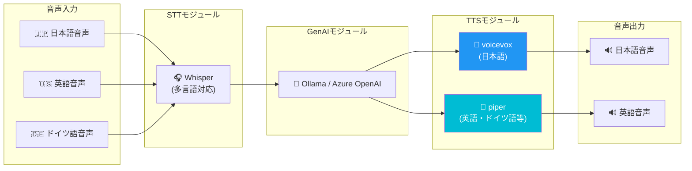

## ⚠️ 注意事項

- **voicevox** は言語モデルをロードするため、起動に1〜2分かかることがあります
- **ollama** は最初の起動時にモデルをダウンロードするため、追加の時間がかかります
- コールドスタートを避けるため、最小レプリカ数は1に設定されています
- 開発環境でコストを最適化する場合は、`min_replicas` を 0 に設定できます
- Ollamaのモデルデータは Azure Storage に永続化されるため、コンテナ再起動後も保持されます

## 📚 関連リソース

- [Azure Container Apps ドキュメント](https://learn.microsoft.com/ja-jp/azure/container-apps/)
- [voicevox エンジン](https://github.com/VOICEVOX/voicevox_engine)
- [Ollama](https://ollama.ai/)
- [OpenAI Whisper](https://github.com/openai/whisper)
- [Azure OpenAI Service](https://learn.microsoft.com/ja-jp/azure/ai-services/openai/)

## 🔧 トラブルシューティング

### コンテナが起動しない場合

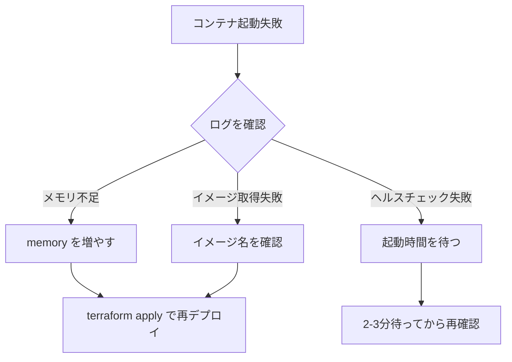

### ログの確認方法

```bash
# Azure CLIでログを確認
az containerapp logs show \
  --name app-inclusive-ai-labs \
  --resource-group rg-inclusiveailabs \
  --type console
```
